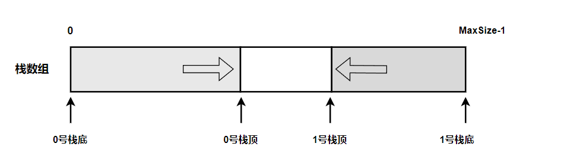
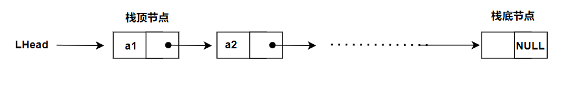

## 1. 栈

### 1.1 基本概念

- 栈顶: Top, 只允许插入和删除的那一端
- 栈底: Bottom,固定的，不允许插入和删除的另一端
- 空栈: 没有任何元素的栈


当 n 个不同元素入栈时，出栈元素的不同排列的个数为 $\frac{1}{n+1} $


### 1.2 基本操作

- InitStack(&s): 初始化一个空栈
- StackEmpty(S): 判断栈空
- Push(&S, x): 入栈
- Pop(&S, &x): 出栈
- GetTop(S, &x):读取栈顶元素
- DestoryStack(&s):销毁栈，并释放s占用的空间


### 1.3 栈的顺序存储结构

**1. 顺序栈的实现**

```cpp
#define MaxSize 50

typedef struct{
    Elemtype data[MaxSize];
    int top;
}SqStack;
```

- 栈顶指针: S.top, 初始时，设置S.top = -1;
- 入栈操作: 在栈不满时, S.data[++S.top] = x;
- 出栈操作: 栈非空时, x = S.data[S.top--];
- 判断栈空: S.top == -1
- 判断栈满: S.top == MaxSize -1;
- 栈长: S.top+1


另一个常见的方式是: 

- 初始设置栈顶指针 S.top == 0;
- 入栈操作: S.data[S.top ++] = x;
- 出栈操作: x = S.data[--S.top];
- 判断栈空: S.top == 0;
- 判断栈满: S.top == MaxSize;
- 栈长: S.top;

- 顺序栈的入栈操作受到数组上界的约束，当栈的最大使用空间不足时，会发生栈溢出


 **2. 顺序栈的基本操作**

初始化

```cpp
void InitStack(SqStack &s)
{
    s.top == -1;
}
```

判断栈空

```cpp
bool StackEmpty(SqStack s)
{
    if(s.top == -1)
        return true;
    else
    	return false;
}
```

入栈操作

```cpp
bool Push(SqStack &s, Elemtype x)
{
    if(s.top == MaxSize -1)
        return false;
    s.data[++s.top] == x;
    return true;
}
```

出栈操作

```cpp
bool Pop(SqStack &s, Elemtype &x)
{
    if(s.top == -1)
        return false;
    x = s.data[s.top--];
    return true;
}
```

读取栈顶元素

```cpp
bool GetTop(SqStack S, Elemtype &x)
{
    if(s.top == -1)
        return fasle;
    x = s.data[s.top];
    return true;
}
```


**3. 共享栈**

利用栈底位置相对不变的特性，可以让两个顺序栈共享一个一维数组空间。




- 0号栈判空：top0 == -1
- 1号栈判空: top1 == MaxSize
- 判断栈满: top1 - top0 == 1
- 0号入栈: s0.data[++s0.top] = x
- 1号入栈: s1.data[--s1.top] = x
- 0号出栈: x= s0.data[s0.top--]
- 1号出栈: x = s1.data[s1.top++]


### 1.4 栈的链式存储结构



定义:

```cpp
typedef struct Linknode
{
    Elemtype data;
    struct Linknode *next;
}LiStack;
```

要求:

- 所有操作在表头进行
- 没有头节点，LHead指向栈顶元素.

优点:

- 没有栈溢出的情况.


## 2. 队列

操作受限的线性表，先进先出(FIFO)

- 队头：front，允许删除的一端
- 队尾：rear，允许插入的一端


### 2.1 队列的顺序存储结构

**1. 顺序队列**

```cpp
#define MaxSize 50
typedef struct{
    ElemType data[MaxSize];
    int front;  //队首指针
    int rear;   //队尾指针
}
```


**2. 循环队列**

为了解决假溢出问题，引入了循环队列的概念。

### 2.2 队列的链式存储结构


### 2.3 双端队列