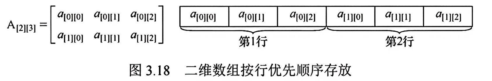
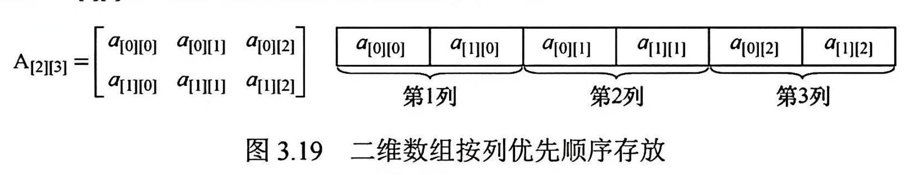
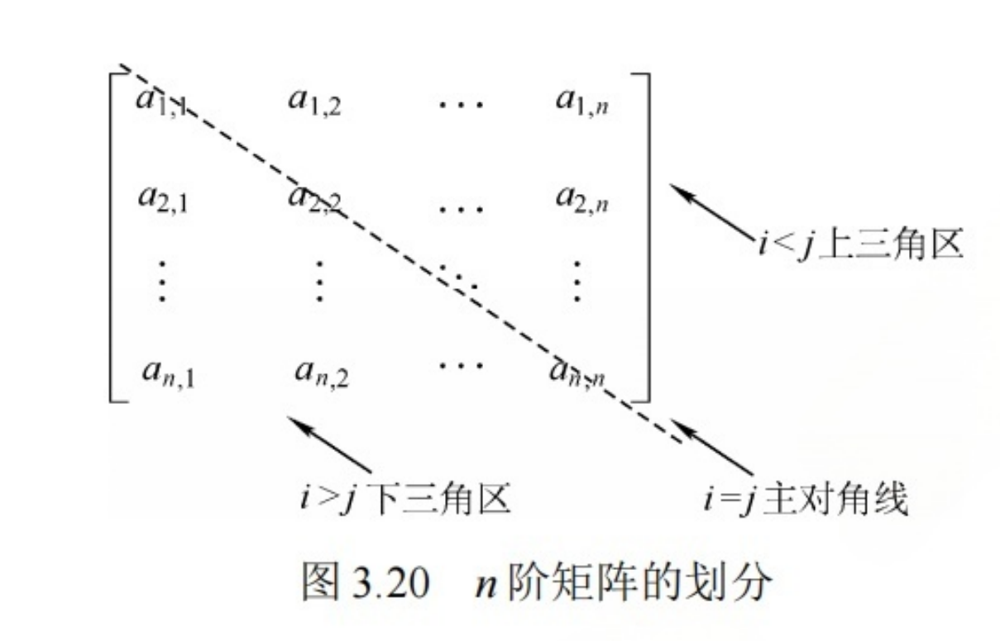

## 1. 数组

### 1.1 定义

定义: 

- 数组是由 n(>=1) 个相同类型的数据元素构成的有限序列

- 每个数据元素称为一个数组元素
- 每个元素在n个线性关系中的序号称为该元素的下标.
- 下标的取值范围称为数组的维界

注意:

- 数组可以视为线性表的推广
- 一维数组视为一个线性表
- 二维数组可视为其元素是定长数组的线性表.

### 1.2 存储结构

一维数组 A[n]为例.其存储关系式为(L是每个数据元素占用的内存大小):
$$
LOC(a_i) = LOC(a_0) + i * L (0 <= i < n)
$$

对于二维数组:

- 按行优先存储

  

假设数组A\[h1][h2]
$$
LOC(a[i][j]) = LOC(a[0][0]) + (i*h2 + j) * sizeof(ElemType)
$$

- 按列优先存储

  

假设数组A\[h1][h2]：

则 A\[i][j] = Loc(A\[0][0]) + (j*h1 + i) * sizeof(ElemType)

## 2. 特殊矩阵

相关概念:

- 压缩存储: 为多个相同的元素只分配一个存储空间, 对0元素不分配存储空间
- 特殊矩阵: 指具有许多相同元素或0元素, 并且这些元素或0元素分布具有一定规律, 比如
  - 上三角、下三角矩阵.
  - 对角矩阵
  - 对称矩阵

### 2.1 对称矩阵

 对于n阶对称矩阵:

- 只需要用数组存储 上三角或者下三角元素即可.

- 数组大小为 $n + \dfrac{n^2-n}{2} = \dfrac{n(n+1)}{2}$

  - n为对角线元素数量
  - n^2^为矩阵元素总数量

  

   

