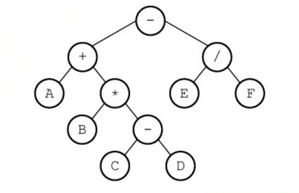
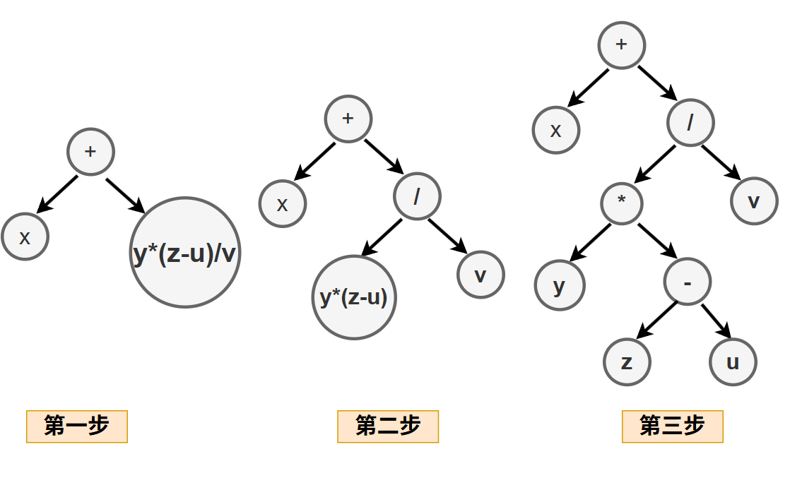
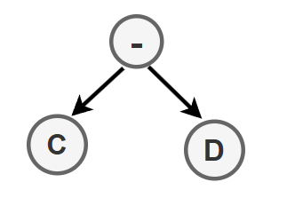
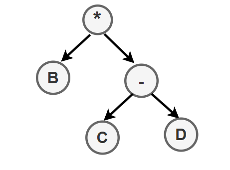
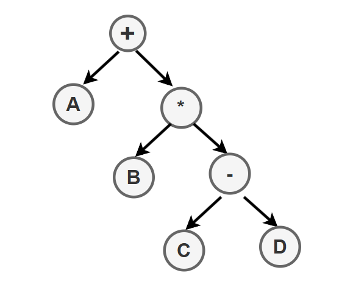
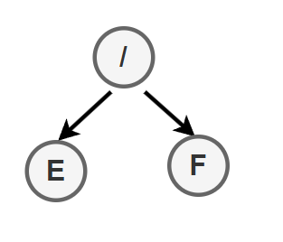
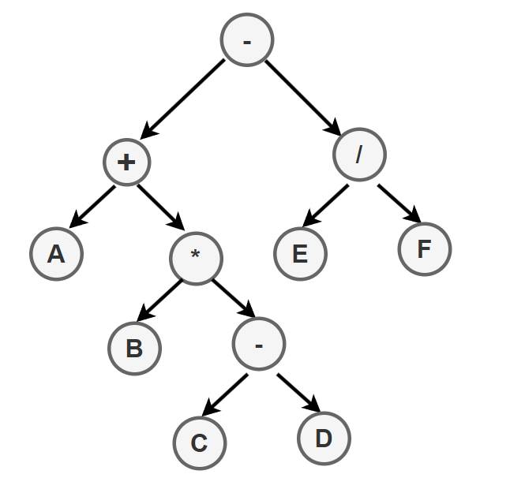

## 1. 栈在括号匹配中的应用

## 2. 栈在表达式求值中的应用

表达式求值是程序设计语言编译中一个最基本的问题, 它是栈应用的典型范例.

中缀表达式 A+B*(C-D)-E/F 对应的后缀表达式为 ABCD-\*+EF/-

后缀表达式与该式的表达式树的后序遍历一致.

中缀表达式转化为后缀表达式的手算方法:

- :one:按照运算优先级对整个表达式逐层加括号.
- :two:将每个运算符移移送到对应的右括号之后, 形成左操作数, 右操作数, 运算符的结构.
- :three:删除所有括号,得到后缀表达式

### 2.1 由中缀表达式画出表达式树

规则如下:

- 叶子是操作数, 根是运算符

- 将最后被计算的运算符作为根结点.

- exp1 \<op> exp2
- 将 op作为根节点, exp1放在左子树, exp2 放在右子树

以 x + y*(z-u)/v 为例:

- \+号是最后运算的运算符, 所以它是根节点.

  - x在左子树, y*(z-u)/v 在右子树

- y*(z-u)/v中

  - /号最后运算, 所以是根节点

- y*(z-u)中
  - \*号最后运算, 所以是根节点

- (z-u)中
  - -号最后运算,所以是根结点.
  
  
  
  
  
  
  
   

  

  ### 2.2 中缀表达式转后缀表达式

中缀表达式转换成后缀表达式需要借助一个栈, 用来保存暂时还不能确定运算顺序的运算符.

从左到右依次扫描中缀表达式的每一项。

- 遇到操作数, 直接加入后缀表达式
- 遇到界限符
  - 若为 '(', 直接入栈.
  - 若为 ')', 则不入栈, 且依次弹出栈中的运算符并加入后缀表达式, 直到遇到'('为止, 并直接删除'('
- 遇到运算符
  - 若其优先级高于栈顶运算符, 或者栈顶为'(',则直接入栈.
  - 若其优先级低于或等于栈顶运算符, 则依次弹出栈顶运算符并加入后缀表达式, 直到遇到一个运算符低于它或者遇到'('或栈空为止,之后将当前运算符入栈.

### 2.3 后缀表达式求值

步骤:

- 从左到右依次扫描表达式每一项
- 若该项是操作数, 则压入栈中
- 若该项是操作符\<op>, 则从栈中退出两个操作数Y和X,形成运算指令 X\<op>Y, 并将结果压入栈中.
- 当所有项都扫描处理完后, 即得最终结果.

**可以根据上面步骤生成表达式树.**

例子: ABCD-*+EF/-

- 从左到右扫描ABCD依次入栈

- 扫描到-减号操作符, DC出栈, C为左孩子,D是右孩子, -是根，得到res1子树, 压入栈中

  

- 扫描到*， res1子树和B出栈, B是左孩子, res1子树是右子树, *是根结点, 得到res2子树, 压入栈中

  

- 扫描到+， res2子树和A出栈, A是左孩子, res2子树是右子树, +是根结点, 得到res3子树, 压入栈中. 

  

- 扫描到EF, 依次压入栈中, 此时栈中数据从栈顶到栈底依次为 F、E、res3

- 扫描到/， FE出栈, E是左孩子, F是右孩子. /是根结点， 得到res4子树.

  

- 扫描到-， res4和res3出栈, res3是左子树, res4是右子树, -是根结点.

  

  

## 3. 栈在递归中的应用

## 4. 队列在层次遍历中的应用

## 5. 队列在计算机系统中的应用

