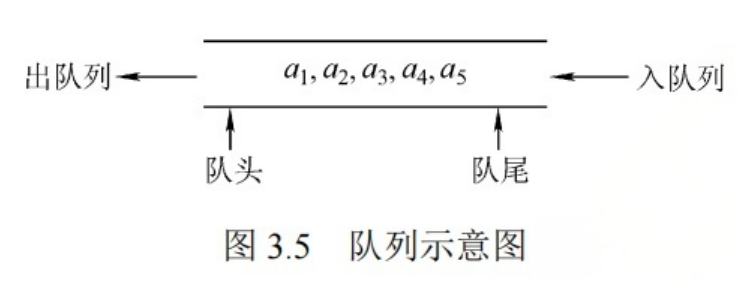
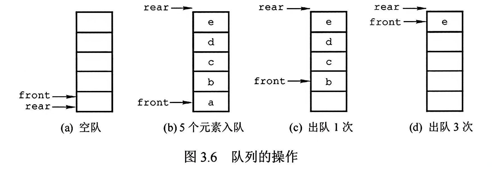

## 1. 基本概念



- 先进先出(FIFO)

- 队头：front，允许删除的一端
- 队尾：rear，允许插入的一端


## 2. 基本操作


- InitQueue(&Q)
- QueueEmpty(Q)
- EnQueue(&Q, x)
- DeQueue(&Q, &x)
- GetHead(Q, &x)


栈和队列是操作受限的线性表, 不是任何对线性表的操作都可以在栈和队列上进行, 比如随便读取栈和队列中间的某个数据.


## 3. 队列的顺序存储结构

### 3.1 顺序队列


- 分配一块连续的内存存放队列中的元素
- 附设两个指针
  - 队首指针front
  - 队尾指针rear


```cpp
#define MaxSize 50
typedef struct{
    ElemType data[MaxSize];
    int front;  //队首指针
    int rear;   //队尾指针
}
```

- 初始时， `Q.front = Q.rear = 0`
- 入队操作: 若队不满, 则先送值到队尾, 队尾指针 rear+1
- 出队操作: 若队不空, 先取队首元素值, 队首指针 front+1




问题: 能否用 Q.rear == MAX_SIZE 来判断队列满了?

不能， 上图(d)中, 队列中只有一个元素, 也满足 Q.rear == MAX_SIZE; 这种现象叫做"上溢出". 这种溢出不是真正的溢出, **而是一种假溢出.**


### 3.2 循环队列

上面的顺序队列存在假溢出问题，循环队列可以解决这个问题。


## 4. 队列的链式存储结构


### 2.3 双端队列