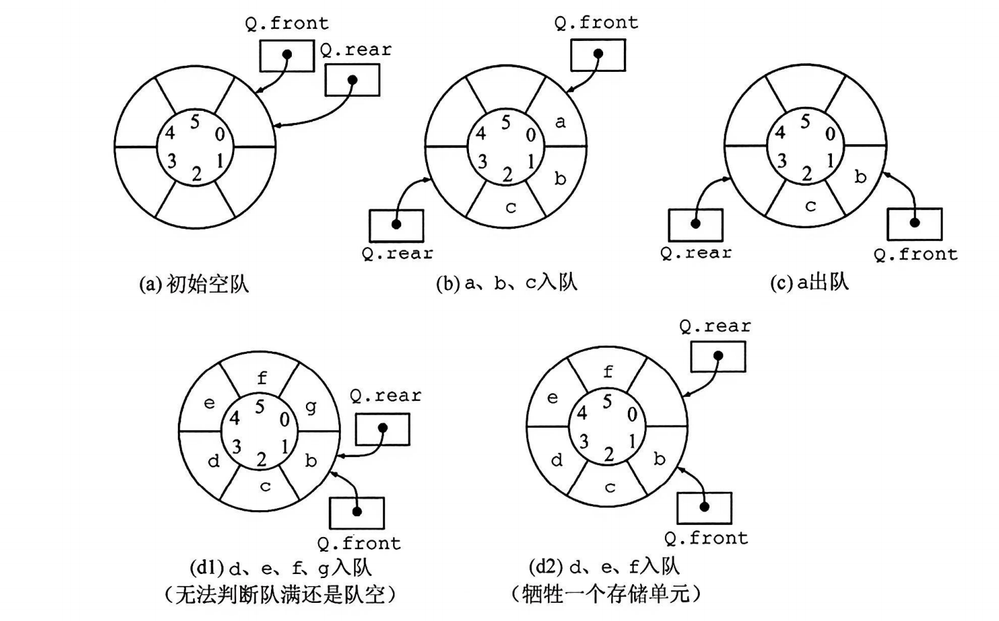
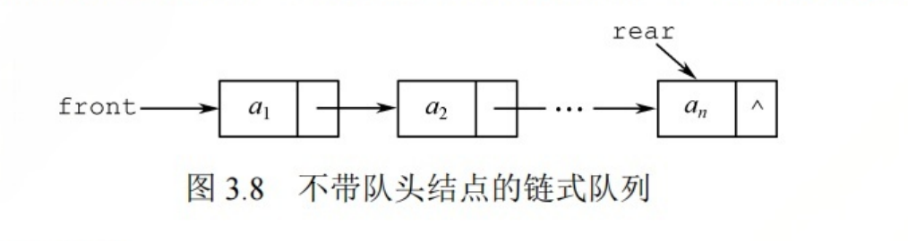
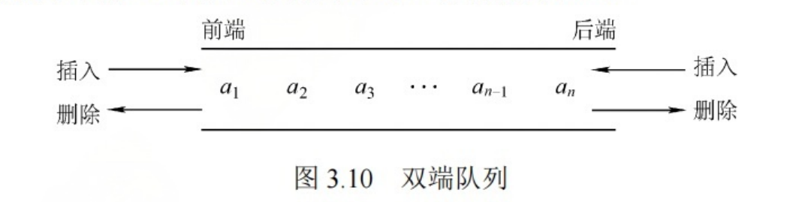
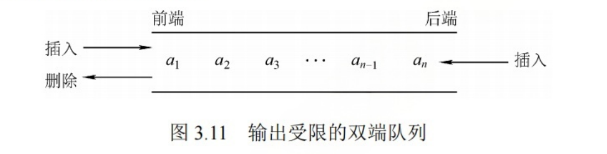
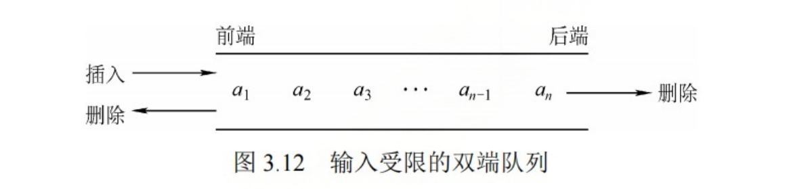

## 1. 基本概念


- 先进先出(FIFO)

- 队头：front，允许删除的一端
- 队尾：rear，允许插入的一端


## 2. 基本操作


- InitQueue(&Q)
- QueueEmpty(Q)
- EnQueue(&Q, x)
- DeQueue(&Q, &x)
- GetHead(Q, &x)


栈和队列是操作受限的线性表, 不是任何对线性表的操作都可以在栈和队列上进行, 比如随便读取栈和队列中间的某个数据.


## 3. 队列的顺序存储结构

### 3.1 顺序队列


- 分配一块连续的内存存放队列中的元素
- 附设两个指针
  - 队首指针front
  - 队尾指针rear


```cpp
#define MaxSize 50
typedef struct{
    ElemType data[MaxSize];
    int front;  //队首指针
    int rear;   //队尾指针
}
```

- 初始时， `Q.front = Q.rear = 0`
- 入队操作: 若队不满, 则先送值到队尾, 队尾指针 rear+1
- 出队操作: 若队不空, 先取队首元素值, 队首指针 front+1


问题: 能否用 Q.rear == MAX_SIZE 来判断队列满了?

不能， 上图(d)中, 队列中只有一个元素, 也满足 Q.rear == MAX_SIZE; 这种现象叫做"上溢出". 这种溢出不是真正的溢出, **而是一种假溢出.**


### 3.2 循环队列

上面的顺序队列存在假溢出问题，循环队列可以解决这个问题。

- 将顺序队列臆造为一个环状空间
- 把存储队列元素的表从逻辑上视为一个环
- 当队首指针Q.front = MaxSize-1, 再前进一个位置就自动到0.
- 通过取余运算%来实现这个过程.





 


- 初始时: Q.front  = Q.rear = 0.
- 入队操作: 队尾指针+1，  Q.rear = (Q.rear + 1) % MaxSize.
- 出队操作: 队首指针+1,   Q.front = (Q.front +1) % MaxSize.
- 队列长度: (Q.rear + MaxSize - Q.front) % MaxSize.

- 出入队: 指针都按顺时针方向进1.


**问: 如何进行判空和判满? **

- 显然, Q.rear = Q.front 时, 队列空
- 但是, (d1)中, 队满时也有 Q.rear = Q.front


**为了区分队空还是队满,  有三种处理方式**

- 牺牲一个单元来区分队空和队满. 图(d2)所示. 当队首指针队尾指针的下一位置作为队满的标志.
  - 队满条件: (Q.rear + 1) % MaxSize = Q.front
  - 队空条件: Q.rear = Q.front
  - 队列中元素个数. (Q.rear + MaxSize -Q.front) % MaxSize.


- 类型中增加size数据成员, 表示元素个数
  - 出队时, size-1
  - 入队时, size+1
  - 队满时, size = MaxSize
  - 队空时, size = 0.


- 类型中, 增设 tag 标志
  - 出队时, tag置为0
  - 入队时, tag置为1
  - 根据 tag 来判断是入队操作还是出队操作导致 Q.rear = Q.front 


## 4. 队列的链式存储结构



链式队列实际上是一个同时有队首指针和队尾指针的单链表.

- 队首指针front指向头节点
- 队尾指针rear指向最后一个结点

代码描述如下

```cpp
typedef struct LinkNode
{
    ElemType data;
    struct LinkNode *next;
}LinkNode;


typedef struct
{
    LinkNode *front;
    LinkNode *rear;
}LinkQueue;
```


### 4.1 链式队列的基本操作


下面代码都是针对带头节点的链式队列编写的.

**1. 初始化**

```cpp
void InitQueue(LinkQueue &Q)
{
    Q.front = Q.rear = (LinkNode*)malloc(sizeof(LinkNode));
    Q.front->next = NULL;
}
```


**2. 判断空**

```cpp
bool isEmpty(LinkQueue Q)
{
    if(Q.front == Q.rear)
        return true;
    else
        return false;
}
```


**3. 入队**

```cpp
void EnQueue(LinkQueue &Q, ElemType x)
{
    LinkNode *s = (LinkNode*)malloc(sizeof(LinkNode));
    s->data = x;
    s->next = NULL;
    Q.rear->next = s;
    Q.rear = s;
}
```


**4. 出队**

```cpp
bool DeQueue(LinkQueue &Q, ElemType &x)
{
    if(Q.front == Q.rear)
        return false;
    
    LinkNode *p = Q.front->next;
    x = p->data;
    Q->front->next = p->next;
    if(Q.rear == p)
        	Q.rear = Q.front;
    free(p);
}
```


### 4.2 双端队列


- 普通队列只能在队尾rear插入, 在队首front删除.
- 双端队列可以在两头进行插入删除操作.




**思考: 如何由入队序列 A B C D 得到出队序列 D C A B ?**

- 在前端插入 ABCD.
- 内存中顺序是 DCBA
- 在前端出队 DC.
- 在后端出队AB
- 得到 DCAB


### 4.3 操作受限的双端队列




- 允许在一端进行插入和删除
- 允许在另一端插入, 但是不准删除(出队操作), 叫做**输出受限**的双端队列




- 允许在一端进行插入和删除
- 允许在另一端删除(出队操作),但是不允许插入(入队操作), 叫做**输入受限**的双端队列


**思考: 假设有一个双端队列, 输入序列是 1, 2, 3, 4, 试着分别求下面的输出序列**


- 能由输入受限的双端队列得到, 但是不能由输出受限的双端队列得到
- 能由输出受限的双端队列得到, 但是不能由输入受限的双端队列得到
- 既不能由输入受限得到, 也不能由输出受限得到


///// 待补充


