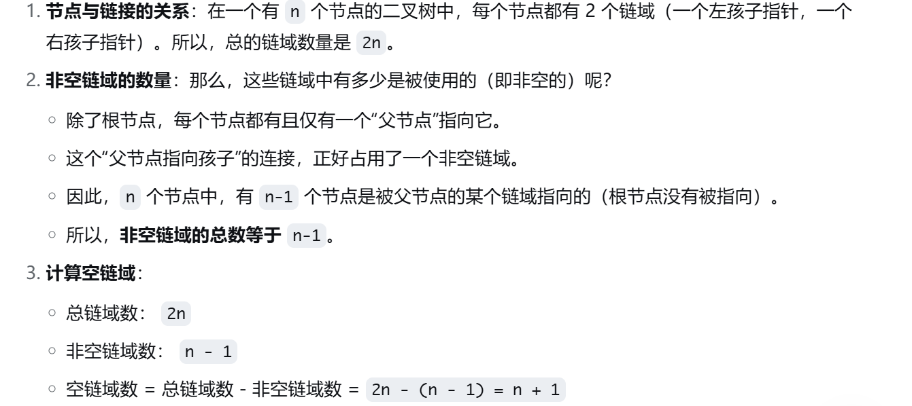

几个概念


- 满二叉树
- 完全二叉树
- 二叉排序树
- 平衡二叉树
- 正则二叉树


二叉树的存储结构： 一般采用链式存储

```cpp
typedef struct BiNode{
  ElemType data;
  struct BiNode *lchild;
  struct BiNode *rchild;
} BiTNode, *BiTree;
```


性质：

在含有n个节点的二叉链表中，含有 n+1 个空链域

