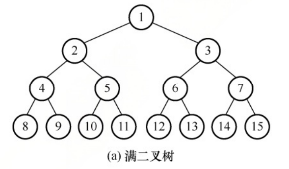
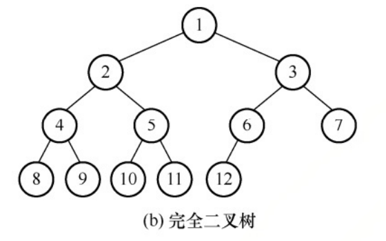
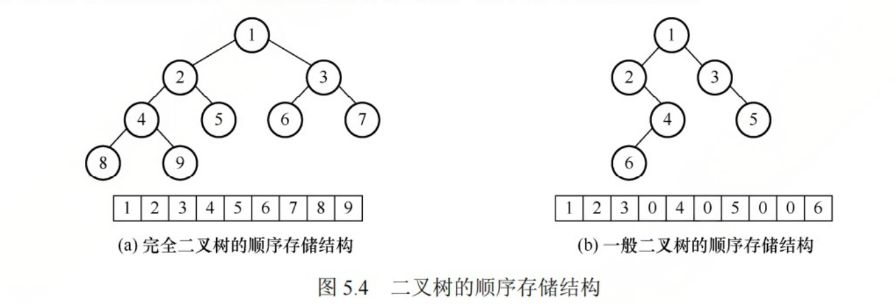

## 1. 相关概念


二叉树是 n(n>=0)个节点的有限集合:

-  可以为空二叉树, 即n=0
- 或者由一个根节点和两个互不相交的被称为左子树和右子树组成. 左右子树又分别是一颗二叉树.
  - 每个节点至多只有两个子树
  - 左右子树不能颠倒(二叉树是有序树)


几个概念

- 满二叉树
  - 高度为h, 且刚好有 2^h-1^个节点.




- 完全二叉树
  - 从上到下, 从左到右; 一一对应



- 二叉排序树
  - 左子树上所有节点的关键字均小于根节点的关键字
  - 右子树上所有节点的关键字均大于根节点的关键字
  - 左右子树又都是一颗二叉排序树


- 平衡二叉树
  - 任意节点的左子树和右子树的高度之差的绝对值不超过1.


- 正则二叉树
  - 树中每个分支节点都有2个孩子, 即树中只有度为0或2的节点


## 2. 相关性质


## 3. 存储结构

### 3.1 顺序存储结构

二叉树的顺序存储是指**用一组连续的存储单元依次从上到下, 从左到右存储完全二叉树上的节点元素.**

即将完全二叉树上编号为i的节点元素存储在一维数组下标为i-1的分量中.


特点:

- 完全二叉树和满二叉树采用顺序存储比较合适,树中节点的序号可以唯一的反映节点之间的逻辑关系.

- 对于一般二叉树，需要插入空节点使其和对应的完全二叉树一致.





### 3.2 链式存储结构


在二叉树中, 节点结构通常包含若干数据域和若干指针域.

二叉链表至少包含3个域：

- 数据域 data
- 左指针域: lchild
- 右指针域: rchild


二叉树的链式存储描述如下

```cpp
typedef struct BiTNode{
    ElemType data;
    struct BiTNode *lchild, 
    struct BiTNode *rchild;
}BiTNode, *BiTree;
```


性质： 在含有n个节点的二叉链表中，含有 n+1 个空链域。

- 每个节点都有2个链域, n个节点一共2n个链域. (所谓的链域, 就是两个节点之间的连线)
- 除了根节点外, 每个节点只有父节点指向它, n个节点, 一共n-1个指向
- 非空链域为n-1; 空链域为n+1;


