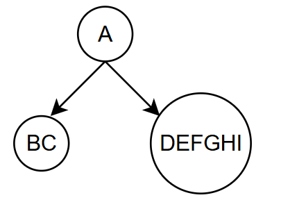
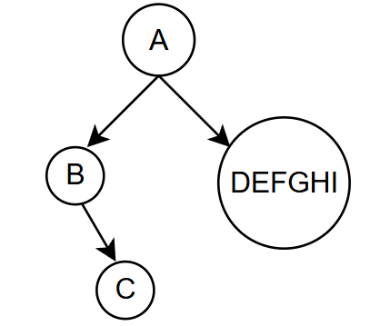
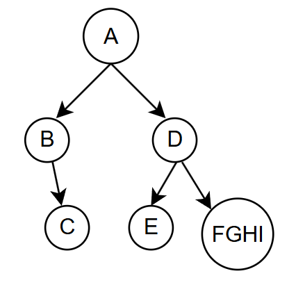
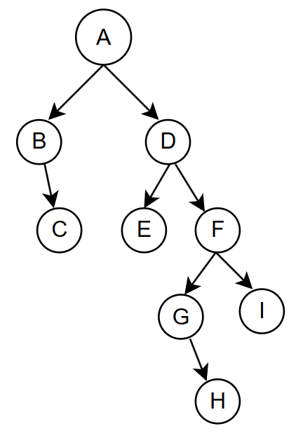

## 1. 先序遍历

若二叉树为空，什么也不做.

- 先访问根节点
- 先序遍历左子树
- 先序遍历右子树


```cpp
void PreOrder(BiTree T)
{
    if(T != NULL)
    {
        visit(T);
        PreOrder(T->lchild);
        PreOrder(T->rchild);
	}
}
```


## 2. 中序遍历

若二叉树为空, 什么也不做

- 中序遍历左子树
- 访问根节点
- 中序遍历右子树


```cpp
void InOrder(BiTree T)
{
	if(T != NULL)
    {
        InOrder(T->lchild);
        visit(T);
        InOrder(T->rchild);
    }
}
```


## 3. 后序遍历

若二叉树为空, 什么也不做.

- 后序遍历左子树
- 后续遍历右子树
- 访问根节点


```cpp
void PostOrder(BiTree T)
{
    if(T != NULL)
    {
        PostOrder(T->lchild);
        PostOrder(T->rchild);
        visit(T);
    }
}
```


## 4. 层次遍历

- 自上而下
- 从左到右
- 对二叉树的各个节点依次访问.

层次遍历算法思想：

- :one::先将根节点入队

- :two:若队列非空，队头节点出队，访问该节点，若它有左孩子，则入队，若它有右孩子，则入队
- :three:重复步骤:two:

```cpp
void LevelOrder(BiTree T)
{
    InitQueue(Q); //初始化队列
    BiTree p; //中间变量，保存当前访问的节点
    EnQueue(Q, T);
    
    while(!IsEmpty(Q))
    {
     	Dequeue(Q, p);
        visit(p);
        if(p->lchild != NULL)
            Enqueue(Q, p->lchild);
        if(p->rchild != NULL)
            EnQueue(Q, p->rchild);
    }
}
```


## 5. 由遍历序列构造二叉树


**若已知中序遍历, 再给出其它三种遍历中的任何一种，都可以唯一确定一颗二叉树.**

#### 5.1 先序 & 中序

先来几个分析， 假设先序 `ABCDEFGHI`, 中序`BCAEDGHFI`;

- A是根节点.
- 中序是先遍历左子树, 再到根节点. 说明BC是A的左子树, DEFGHI是A的右子树.




- 专门分析左子树, 先序是BC， 中序也是BC
- 说明B是根节点, C是B的右子树, 因为C如果是左子树的话, 中序应该是CB.




- 最后分析A的右子树, 右子树的先序遍历是DEFGHI, 中序遍历是EDGHFI
- D是右子树的根节点, 由中序遍历ED可知, E是D的左孩子.




- 再来分析FGHI,  F是根节点, 中序遍历GHFI, 说明GH是F的左子树, I是F的右孩子.
- 中序是GH, 先序也是GH, 说明H是G的右孩子. G是F的左孩子.




总结:

已知先序 ABCDEFGHI, 中序 BCAEDGHFI

- 先序中, A是根节点, 中序被根节点划分成左子树BC， 右子树EDGHFI

- 先序BC, 中序BC
  - B是根节点, C是B的右孩子.

- 先序DEFGHI,中序EDGHFI
  - D是根节点, E是D的左孩子, GHFI是D的右子树
- 先序FGHI, 中序GHFI
  - F是根节点, GH是F的左子树, I是F的右孩子.
- 先序GH, 中序GH
  - G是根节点, H是G的右孩子.


#### 5.2 后序 & 中序


已知后序序列 CBEHGIFDA, 中序序列BCAEDGHFI

- 由后序知: A是根节点, 由中序知: BC是A的左子树, EDGHFI是A的右子树
- 后序CB, 中序BC
  - 知B是根节点, C是B的右孩子
  - 至此, A的左子树BC分析完成
- 后序EHGIFD, 中序EDGHFI
  - 知D是根节点, E是D的左孩子, GHFI是D的右子树
    - 后序HGIF, 中序GHFI
      - 知F是根节点, GH是F的左子树, I是F的右孩子.
        - 后序HG, 中序GH
          - 知道G是根节点, H是G的右孩子.
  - 至此, A的右子树分析完成.


#### 5.3 层次 & 中序

已知层次遍历 ABDCEFGIH， 中序遍历BCAEDGHFI

- 由层次遍历知: A是根节点, 由中序遍历知 BC是A的左子树, EDGHFI是A的右子树.
- BC中, B是根节点.C是D的右孩子.
  - A的左子树分析完成.
- 层次ABD， 说明D是右子树的根节点.
- 中序ED,且D是根节点, 说明E是D的左孩子.
- 层次, ABDCEF, 说明F是E的兄弟, F是D的右孩子.
- 中序FI, 说明I是F的右孩子
- .....


