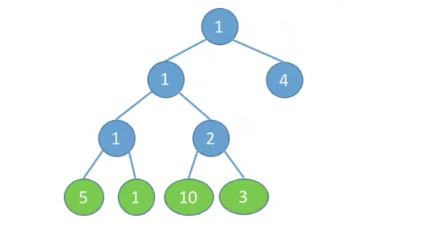
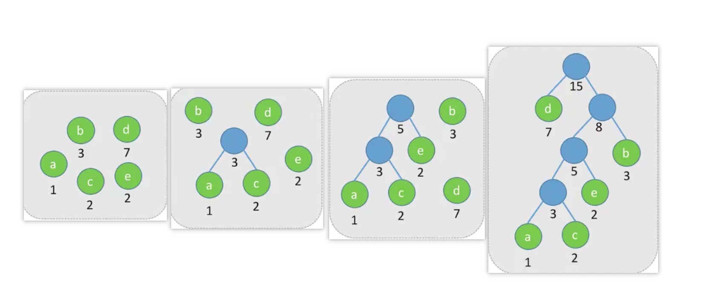
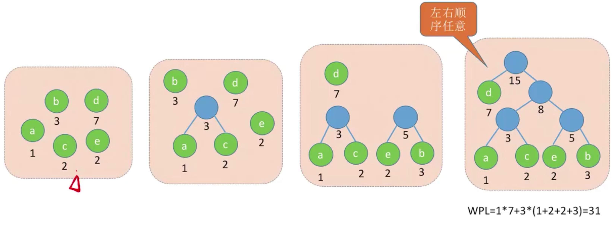
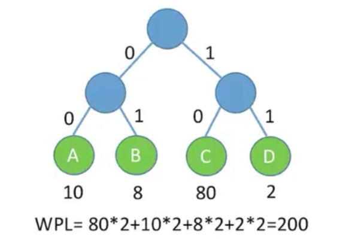
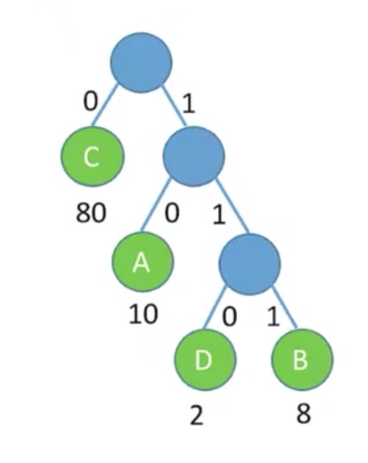

## 1. 相关概念

- 结点的权
  - 有某种现实含义的数值.例如表示结点的重要性等等.

- 带权路径长度
  - 从树的根到该结点的路径长度(经过的边数)与该结点上权值的乘积.
  - 结点4的带权路径长度是 4 * 1 = 4
  - 结点5的带权路径长度是 5 * 3 = 15

- 树的带权路径长度:
  - 树中所有叶子结点的带权路径长度之和 (WPL, Weight Path Length)
  - WPL = $\sum_{i=1}^n(w_il_i)$
  - 注意，**只计算叶子结点**
  - 上面树的带权路径长度是 5*3 + 1\*3 + 10\*3 + 3\*3 + 4\*1 = 61

- 哈夫曼树:
  - 在含有n个带权叶结点的二叉树中, 其中带权路径长度(WPL)最小的二叉树称为哈夫曼树, 也叫最优二叉树.

## 2. 哈夫曼树的构造

给定n个权值分别为 W~1~，W~2~....W~n~的结点, 构造哈夫曼树的算法如下:

- :one:将这n个结点分别作为n棵仅含一个结点的二叉树, 构成森林F.
- :two:构造一个新结点, 从F中选取两颗根结点权值最小的数作为新结点的左右子树，并将新结点的权值置为左右子树上根结点的权值之和.
- :three:从F中删除刚才选出的两颗树, 同时将新得到的树加入F中.
- :four:重复步骤:two::three:,直到F中只剩下一颗树为止.

特点如下:

- 每个初始结点最终都会成为叶子结点, 且权值越小的结点到根结点的路径长度越大.
- 哈夫曼树的结点总数为2n-1.
- 哈夫曼树中不存在度为1的结点.
- 哈夫曼树并不唯一, 但是WPL必然相同且为最优.
  - 看看上面图, e和ac的根节点成为兄弟结点.
  - 看看下面图, e和b结合, 成为一颗独立的子树.

## 3. 哈夫曼编码

在数据通信的过程中, 每个字符采用等长度的二进制位表示, 这种编码方式 叫做**固定长度编码**

例如 ABCD四个字符, 采用ASCII编码来传递:

- A 0100 0001
- B 0100 0010
- C 0100 0011
- D 0100 0100

假设要传递 100个字符, C出现了80次, A出现了10次, B出现了8次, D出现了2次， 一共要传递 100*8 = 800bit的信息

现在优化一下，ABCD4个字符,只需要2bit就能全部表示.

- A 00
- B 01
- C 10
- D 11

传递100个字符, 此时一共要传递 100 * 2 = 200bit信息.

我们用二叉树来表示。

- 从根节点 往左走表示0
- 从根结点 往右走表示1

实际上计算的是树的带权路径长度.那还有没有比这种方案更优的方案呢? 答案是哈夫曼树.

- C 0
- A 10
- D 110
- B 111

这样WPL = 80*1 + 10\*2 + 2\*3 + 8\*3 = 130

上面编码没有一个编码是另一个编码的前缀, 这样的编码叫做**前缀编码**

