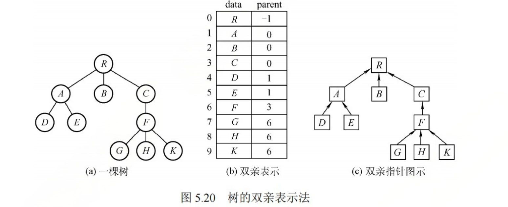
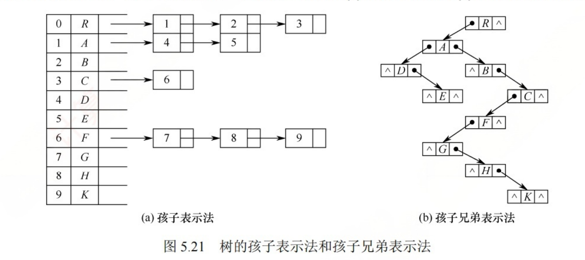
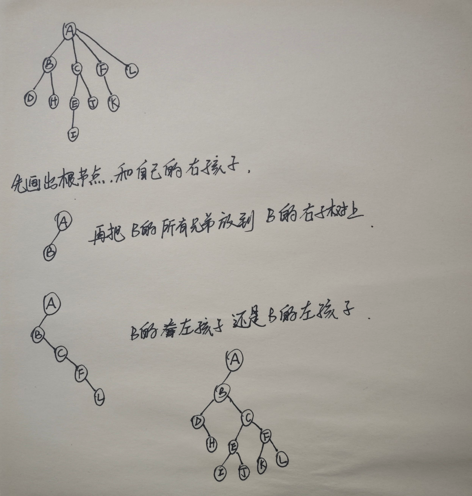
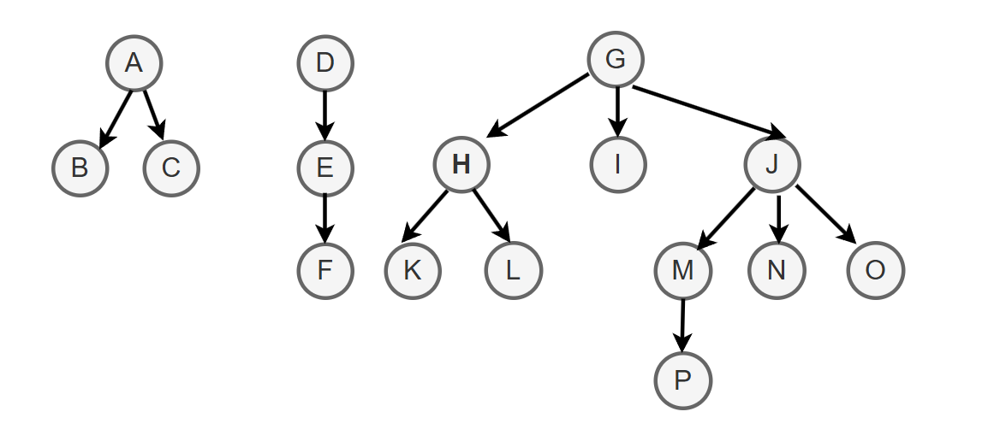
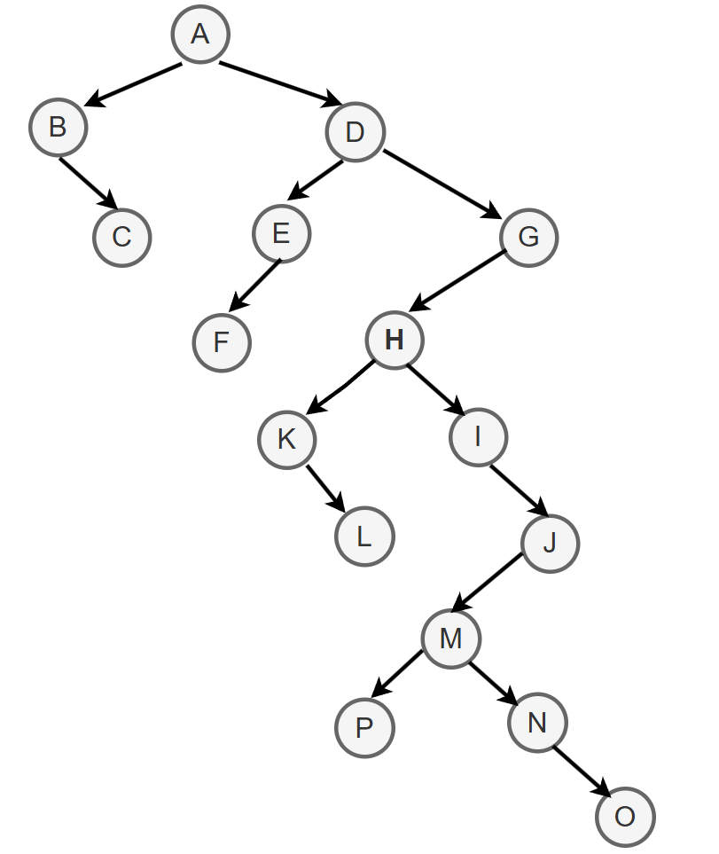

## 1. 树的存储结构

### 1.1 双亲表示法


```cpp
#define MAX_TREE_SIZE 100

typedef struct
{
    ElemType data;  //数据域
    int parent;     //双亲节点的下标
}PTNode;

typedef struct
{
	PTNode nodes[MAX_TREE_SIZE];   //存放节点的数组
    int n; //节点数量
}PTree;
```


- 已知一个节点, 找它的双亲很容易
- 已知一个节点, 找他的子节点,需要遍历整个数组.



### 1.2 孩子表示法

采用顺序存储+链式存储相结合

```cpp
struct CTNode
{
    int child;  //孩子节点在数组中的位置
    struct CTNode *next;
};

typedef struct
{
	ElemType data;
    struct CTNode * firstChild;   //第一个孩子
}CTBox;

typedef struct
{
    CTBox nodes[MAX_TREE_SIZE];
    int n, r;  //节点数和根的位置
}CTree;
```


- CTree中 nodes数组存储当前树中所有节点.
- 节点类型是CTBox.
  - data存储数据
  - CTNode 存储孩子信息.



### 1.3 孩子兄弟表示法


```cpp
typedef struct CSNode
{
    ElemType data;  // 数据域
    struct CSNode * firstchild;//第一个孩子
    struct CSNode * nextsibling; //右兄弟指针
}CSNode, * CSTree;
```


- nextsibling是存储右边第一个兄弟; 沿此指针域可以找到所有兄弟.

### 1.4 总结

- 双亲表示法
  - 顺序存储结点数据,结点中保存父节点在数组中的下标
  - 优点: 找父节点方便;
  - 缺点: 找孩子不方便;
- 孩子表示法
  - 顺序存储节点数据, 节点中保存孩子链表头指针(顺序 + 链式存储)
  - 优点: 找孩子方便;
  - 缺点: 找父节点不方便;
- 孩子兄弟表示法
  - 用二叉链表存储节点---> 左孩子右兄弟
  - 用于存储森林时, 将森林中每个树的根节点视为平级的兄弟关系.
  - 从存储视角来看形态上和二叉树类似.

## 2. 树、森林与二叉树之间的转换


### 2.1 树转化为二叉树

树转化为二叉树本质上采用孩子兄弟法.

- 先在二叉树中,画出根节点
- 按照树的层序, 依次处理每个节点.
- 处理节点的方法是: 如果当前节点在树中有孩子, 就把所有孩子节点用右指针串成糖葫芦, 并在二叉树中把第一个孩子挂在当前节点的左指针下方.




### 2.2 森林转化为二叉树


森林中各颗树的根节点可以视为平级的兄弟关系.

森林转化为二叉树的技巧:

- 先把所有树的根节点画出来, 在二叉树中用右指针传承糖葫芦.
- 按照森林的层序依次处理每个节点

处理的方法是:如果当前处理的节点在树种有孩子, 就把所有孩子节点用右指针传承糖葫芦, 并在二叉树中把第一个孩子挂在当前节点的左指针下方.







- 先将三棵树的Root节点视为兄弟关系， 通过右指针串起来. A-->D-->G
- 再分别处理每棵树, 注意C和E和H不能视为兄弟关系, 要单独处理.
- 每个节点的右兄弟通过右指针链接.

### 2.3 二叉树转化为森林


