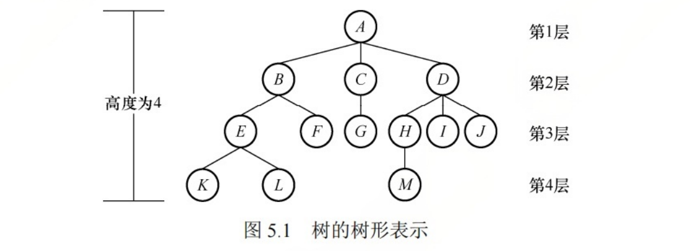

## 1. 相关定义

- 度
  - 一个节点它的孩子的数量称为该节点的度. C只有一个孩子, C的度是1.
  - 树中节点最大的度数称为该树的度, A和D的度最大, 有3个孩子, 该树的度为3
- 节点的层次

  - 根节点是第一层, 根节点的孩子处于第二层, 依次类推.

- 节点的深度

  - 节点的深度就是层次

- 树的高度

  - 就是树中节点的最大层数.

- 分支节点

  - 度大于0称为分支节点.

- 叶节点

  - 度为0的节点称为叶子节点.

- 路径和路径长度

  - 两个节点的路径是由这两个节点之间所经过的节点序列构成的.
  - 路径长度是路径上所经过的边的个数.

## 2. 相关性质

- 树的节点数 = 所有节点的度数 + 1
  - 所有节点的度数, 就包含了除根节点的所有节点.

- 度为 m 的树中第 i 层上至多有 m i-1 个节点。

- 高度为h的m叉树,最多有 （mh-1）/(m-1)个节点

- 具有n个节点的m叉树的最小高度是 $\lceil log_m(n*(m-1)+1)\rceil$

  

**一个问题: 度为m的树和m叉树有何区别?**

- 度为m的树:
  - 一定是非空树, 至少有 m+1 个节点
  - 至少有一个节点度=m
- m叉树:
  - 允许所有节点的度都<m
  - 可以是空树

### 补充

**1. 等比数列求和公式**

- 设等比数列: $S_n = a_1 + a_1q + a_1q^2 + ..... + a_1q^{n-1}$

- 两边乘以q: $qS_n = a_1q + a_1q^2 + ..... + a_1q^{n}$

- 两式相减: 

  - $S_n - qS_n = a_1 - a_1q^n$
  - $S_n(1-q) = a_1(1-q^n)$
  - $S_n = a_1 * \frac{1-q^n}{1-q}$

  

