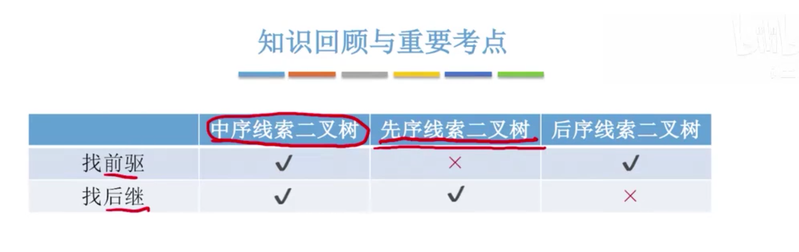

## 1. 概念和定义

遍历完二叉树后，会得到一个线性序列，这个序列中除了第一个和最后一个,都有一个直接前驱和直接后继.

传统的二叉链表只能体现一种父子关系，不能直接得到结点在遍历中的前驱和后继。

在含有n个节点的二叉树中，有n+1个空指针。充分利用这些空指针，存放指向其前驱或后继的指针, 可以创造线索二叉树，这样就可以像遍历单链表那样遍历二叉树.


线索二叉树定义如下:

```cpp
typedef struct ThreadNode
{
    ElemType data;
    struct ThreadNode *lchild;
    struct ThreadNode *rchild;
    int ltag;
    int rtag;
}ThreadNode, *ThreadTree;
```

- ltag
  - 0, lchild指向左孩子
  - 1，lchild指向该结点的前驱
- rtag
  - 0, rchild指向右孩子
  - 1，rchild指向该结点的后继


## 2. 先序线索二叉树

### 2.1 先序线索二叉树的构造


```cpp
void PreThread(ThreadTree T)
{
    if(T != NULL)
    {
        visit(T);       //先访问根节点
        if(T->ltag = 0) //lchild不是前驱线索
            PreThread(T->lchild);
        PreThread(T->rchild);
    }
}

void visit(ThreadNode *q)
{
    if(q->lchild == NULL)
    {
        q->lchild = pre;
        q->ltag = 1;
	}
    if(pre != NULL && pre->rchild == NULL)
    {
        pre->rchild = q;
        pre->rtag = 1;
	}
}

// 全局变量 pre, 指向当前访问节点的前驱.
ThreadNode *pre = NULL;
void CreatePreThread(ThreadTree T)
{
    pre = NULL;
    if(T != NULL)
    {
        PreThread(T);
        if(pre->rchild == NULL)
            pre->tag = 1;
	}
}
```


注意:

PreThread函数中的`if(T->ltag == 0)`判断非常有必要, 它要避免死循环.


### 2.2 先序线索找前驱

算法思想:

- 若p->ltag == 1; 则next = p->lchild;
- 若p->ltag == 0;

### 2.3 先序线索找后继

算法思想:

- 若p->rtag == 1; 则 next = p->rchild;
- 若p->rtag == 0;
  - 若 p有左孩子; 则 next = p->lchild;
  - 若p没有左孩子; 则 next = p->rchild;  (p一定有右孩子, 因为p->rtag == 0)


## 3. 中序线索二叉树

### 3.1 中序线索二叉树的构造

算法思想:

- 设指针pre指向上一次访问的节点.
- 设指针p为当前正在访问的节点.
- 在遍历过程中, 检查p的左指针是否为空, 为空就指向pre.
- 检查pre的右指针是否为空, 为空就指向p.


```cpp

ThreadNode *pre = NULL;

void InThread(ThreadTree T)
{
    if(T != NULL)
    {
        InThread(T->lchild);  //中序遍历左子树
        visit(T);             //访问根节点
        InThread(T->rchild);  //中序遍历右子树
	}
}


void visit(ThreadNode *q)
{
    if(q->lchild ==NULL)   //左子树为空, 建立前驱线索
    {
        q->lchild = pre;
        q->ltag = 1;
    }
    
    if(pre!=NULL && pre->rchild == NULL) 建立前驱的后继线索
    {
        pre->rchild = q;
        pre->rtag = 1;
    }
    pre = q;
}

//中序线索化二叉树T
void CreateInThread(ThreadTree T)
{
    pre = NULL;
    if(T!= NULL)
    {
        InThread(T);
        if(pre->rchild == NULL)  //处理遍历的最后一个节点.
            pre->rtag = 1;
    }
}
```


### 3.2 中序线索找后继


算法思想:

- 若p->ltag == 1; 则next = p->lchild
- 若p->ltag == 0; 则next = p右子树最左下节点.
  - 中序是左根右
  - p->ltag == 0; 说明有右子树
  - 中序遍历一个树中,最先被访问的是最左下节点.


```cpp
ThreadNode *Firstnode(ThreadNode *p)
{
    // 循环找到最坐下节点; 不一定是叶子节点, 它可能还有右子树;
    while(p->ltag == 0) 
        p = p->lchild;
    return p;
}


//在中序线索二叉树中找到节点p的后继节点.
ThreadNode *Nextnode(ThreadNode *p)
{
    //右子树中最左下节点
    if(p->rtag == 0)
        return Firstnode(p->rchild);
    else
        return p->rchild
}

// 遍历中序线索二叉树
void InOrder(ThreadNode *T)
{
    for(ThreadNode *p = Firstnode(T); p != NULL; p = Nextnode(p))
        visit(p);
}
```


### 3.3 中序线索找前驱

算法思想:

- 若 p->ltag == 1; 则 pre = p->lchild
- 若 p->ltag == 0; 则 pre = p的左子树中最右下节点.


```cpp
// 找到以P为根节点的子树中, 最后一个中序遍历的节点
ThreadNode *Lastnode(Thread *p)
{
    // 循环找到最右下节点; 不一定是叶子节点, 因为它可能有左子树
    while(p->rtag == 0)
        p = p->rchild;
    return p;
}

// 在中序线索二叉树中找到节点P的前驱节点
ThreadNode *Prenode(ThreadNode *p)
{
    // 左子树最右下节点
    if(p->ltag == 0)
        return Lastnode(p->lchild);
    else
        return p->lchild;  //ltag == 1直接返回前驱线索.
}

//对中序线索二叉树进行逆向遍历
void RevInorder(ThreadNode *T)
{
    for(ThreadNode *p=Lastnode(T); p!=NULL; p=Prenode(p))
        visit(p);
}

```


## 4. 后序线索二叉树




### 4.1 后序线索二叉树的构造


```cpp
void PostThread(ThreadTree T)
{
    if(T != NULL)
    {
        PostThread(T->lchild);
        PostThread(T->rchild);
        visit(T);
	}
}


void visit(ThreadNode *q)
{
    if(q->lchild == NULL)
    {
        q->lchild = pre;
        q->ltag = 1;
	}
    
    if(pre != NULL && pre->rchild == NULL)
    {
        pre->rchild = q;
        pre->rtag = 1;
	}
    pre = q;
}


void CreatePostThread(ThreadTree T)
{
    pre = NULL;
    if(T != NULL)
    {
        PostThread(T);
        if(pre->rchild == NULL)  //处理遍历的最后一个节点.
            pre->rtag = 1;
    }
}
```

