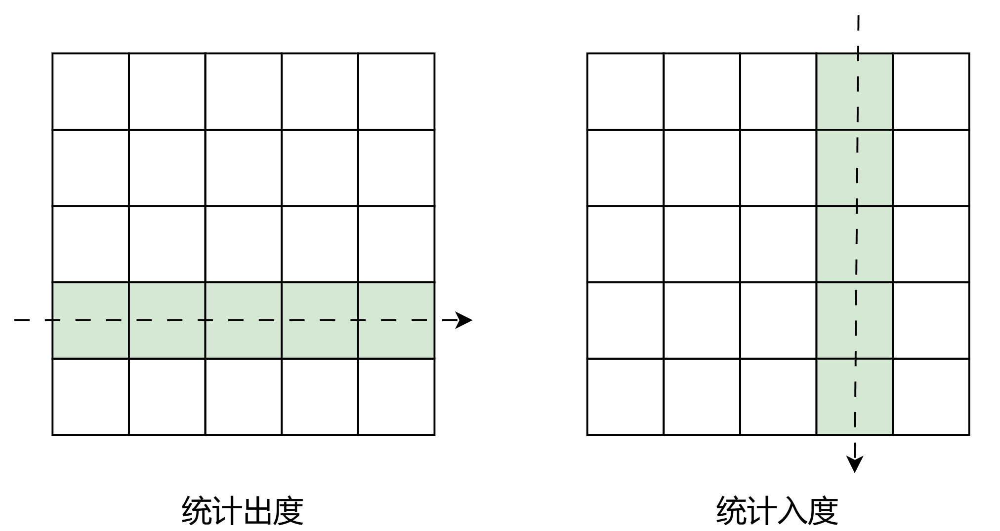
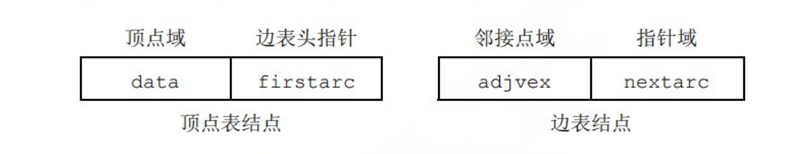
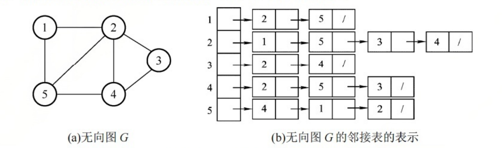
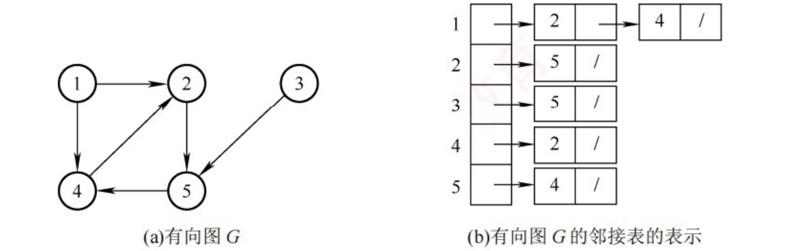

## 1. 邻接矩阵法

### 1.1 相关概念

- 用一个一维数组存储顶点信息
- 用一个二维数组存储图中边的信息, 这个二维数组叫做**邻接矩阵**.


顶点数为n的图G=(V, E)的邻接矩阵A是n*n的, 将G的顶点编号为v~1~, v~2~,....v~n~,则
\[
A[i][j] =
\begin{cases}
1, & (v_i, v_j)或<v_i, v_j>是E(G)中的边 \\
0, & (v_i, v_j)或<v_i, v_j>不是E(G)中的边\\

\end{cases}
\]


对于带权图而言, 矩阵中的元素应该是边的权值.


\[
A[i][j] =
\begin{cases}
w_{ij}, & (v_i, v_j)或<v_i, v_j>是E(G)中的边 \\
0或\infty, & (v_i, v_j)或<v_i, v_j>不是E(G)中的边\\
\end{cases}
\]


### 1.2 存储结构定义


```cpp
#define MAXVertexnum 100

typedef char VertexType;
typedef int EdgeType;

typedef struct{
    VertexType vex[MAXVertexnum]; // 顶点表
    EdgeType edge[MAXVertexnum][MAXVertexnum]; //边表
    int vexnum, arcnum; //图当前的顶点数和边数
}MGraph;
```


特点:

- 邻接矩阵中, 行和列代表图的顶点； 矩阵的元素表示顶点之间是否有边, 或者边的权重.

- 无向图的矩阵一定是一个对称矩阵, 对规模较大的矩阵可采用压缩存储.
- 邻接矩阵表示法的空间复杂度是O(n^2^)
- 稠密图适合用邻接矩阵存储.


- 对于无向图, 矩阵的第i行或第i列非0元素的个数正好是顶点i的度TD(v~i~).
- 对于有向图
  - 矩阵第i行非0元素的个数,表示的是元素v~i~的出度OD(v~i~).
  - 矩阵第i列非0元素的个数,表示的是元素v~i~的入度ID(v~i~).





## 2. 邻接表法

### 2.1 相关概念

- 当一个图是稀疏图时, 使用邻接矩阵会浪费大量的存储空间.

- 邻接表法集合了顺序存储和链式存储, 大大减少了这种不必要的浪费





- 顶点表结点存放在一个一维数组里面
- 顶点表的数据包含 data 和 firsarc 两个部分
  - data 存放顶点v~i~的相关信息.
  - firstarc 指向第一条边的边表结点


- 边表结点
  - adjvex:  存放与v~i~邻接的顶点编号
  - nextarc: 指向下一条边的边表结点.





- 上面竖着的12345其实是存放在一个数组里面
- 从左到右是 firstarc 和 nextarc 串接起来了.





### 2.2 代码实现


```cpp
#define MaxVertexNum 100

typedef struct ArcNode   //边表结点
{
    int adjvex;
    struct ArcNode * nextarc;
}ArcNode;

typedef struct VNode  //顶点表结点
{
    VertexType data;
    ArcNode * firstarc;
}VNode, AdjList[MaxVertexNum];   //AdjList = VNode[100]


typedef struct
{
   AdjList vertices;    //邻接表 等价于 VNode vertices[100];
   int vexnum, arcnum;  //顶点数和边数
}ALGraph;
```


邻接表特点如下:

- G是无向图, 所需的存储空间是 O(|V| + 2|E|)
- G是有向图, 所需的存储空间是 O(|V| + |E|).


- 图的邻接表的表示并不唯一, 因为每个顶点对应的边表中, 各边结点的链接次序可以是任意的.


## 3. 十字链表


## 4. 邻接多重表

