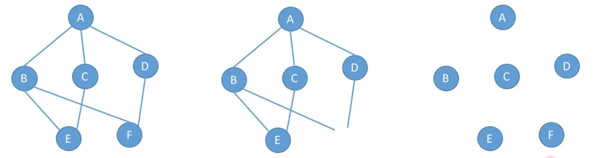
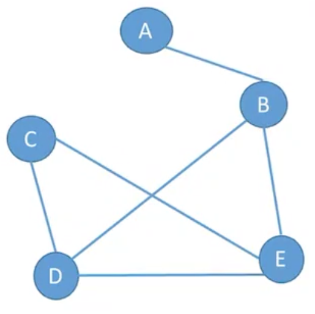
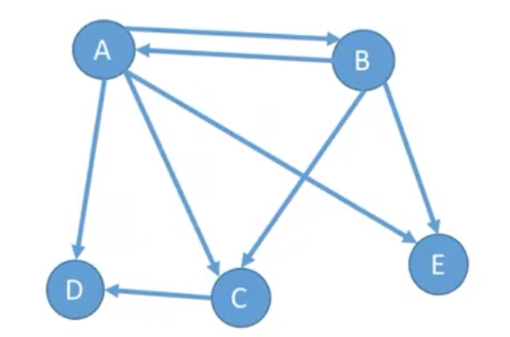
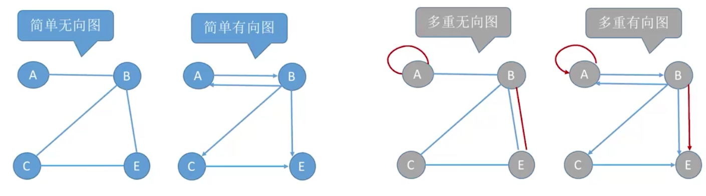
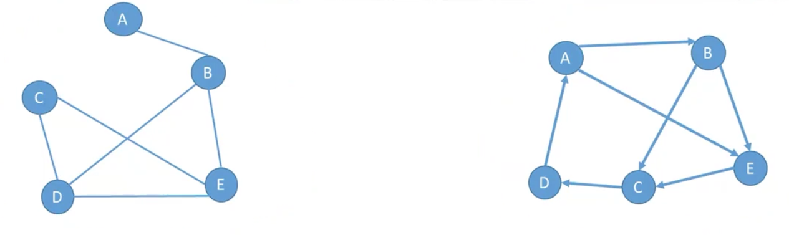

## 1. 图的定义

- 图G由 `顶点集V` 和 `边集E` 组成, 记作`G=(V, E)`.

- V(G)表示图G中顶点的有限非空集

  - 若V={v1, v~2~, v3,,,, v~n~},则 `|V|`表示图G中顶点的个数, 也叫做图G的阶

  

- E(G)表示图G顶点之间的关系(边)的集合

  - E = {(u, v) | $u\in V, v\in V$}, 用|E|表示图G中边的条数.

注意:

- 线性表可以是空, 树可以是空, 图不可以是空, 即 V一定是非空.
- 上面三个图中, 第一个和第三个是图, 第二个不是.

## 2. 无向图和有向图

- 若E是`无向边`的有限集合时, 图G为`无向图`.
- 边是顶点的无序对, 记作 `(v, w)`或者`(w, v)`.这两者等价.
- 在上图中
  - G~1~ = (V~1~, E~1~)
  - V~1~ = (A, B, C, D, E)
  - E~1~ = ((A,B), (B, D), (B, E), (C, D), (C, E), (D, E)).

- 若E是`有向边`(也叫`弧`)的有限集合时, 则图G为`有向图`.
- 弧是顶点的有序对, 记作`<v, w>`, 其中v是`弧尾`, w是`弧头`
- <v, w>称为从顶点v到顶点w的弧. 也称v邻接到w, 或者w邻接自v
- 注意`<v, w> != <w, v>`

- 上面图中
  - G~2~ = (V~2~, E~2~)
  - V~2~ = {A, B, C, D, E}
  - E~2~ = {<`A, B`>, <A, C>, <A, D>, <A, E>, <`B, A`>, <B, C>, <B, E>, <C, D>} 

- **<A, B>表示有向图中, A指向B**

## 3. 简单图和多重图

- 简单图
  - 不存在重复边
  - 不存在顶点到自身的边
- 多重图
  - 图G中某两个结点之间的边数多余一条
  - 也允许顶点通过同一条边和自己相连

## 4. 顶点的度、入度、出度

- 顶点的度(Degree): 指与该顶点相邻的边的数量
  - 在无向图中, 顶点的度就是与该顶点相邻的边的数量
  - 在有向图中, 顶点的度分为入度和出度, 分别表示指向该顶点的边的数量和从该顶点出发的边的数量的总和

- 入度(In-Degree)：指有向图中, 箭头指向该顶点的边的数量.
- 出度(Out-Degree): 指有向图中, 从某个顶点出发的边的数量.

- 上面有向图中, B的度是3
- 下面有向图中, B的度是4
  - 出度是3
  - 入度是1

## 5. 顶点和顶点之间的关系描述

- 路径: 顶点v~p~到顶点v~q~之间的一条路径是指顶点序列, v~p~, v~i1~, v~i2~,,,,v~in~, v~q~

- 回路: 第一个顶点和最后一个顶点相同的路径叫做回路或者环

- 简单路径: 在路径序列中, 顶点不重复出现的路径叫做简单路径

- 简单回路: 除第一个顶点和最后一个顶点外, 其余顶点不重复出现的回路叫做简单回路 

- 路径长度: 路径上边的数目

- 顶点到顶点的距离: 从顶点u出发到顶点v的最短路径若存在, 则此路径的长度称为从u到v的距离

  - 若从u到v不存在路径, 则记该距离为无穷$\infty$

s

- 无向图中, 从顶点v到顶点w有路径存在, 则称v和w是连通的
- 有向图中, 从顶点v到w有路径存在, 且从w到v也有路径存在, 则称这两个顶点是强连通的.

    

## 6. 连通图和强连通图

- 若`无向图G`中任意两个顶点都是连通的, 则称图G是`连通图`, 否则称为`非连通图`
  - 对于n个顶点的无向图G
  - 若G是连通图, 则最少有 n-1 条边
  - 若G是非连通图, 则最多可能有 $C_{n-1}^2$ 条边

- 若`有向图G`中任意两个顶点都是强连通的, 则称此图是`强连通图`.
  - 对于n个顶点的有向图G
  - 若G是强连通图, 则最少有 n 条边(形成回路)

## 7. 子图

