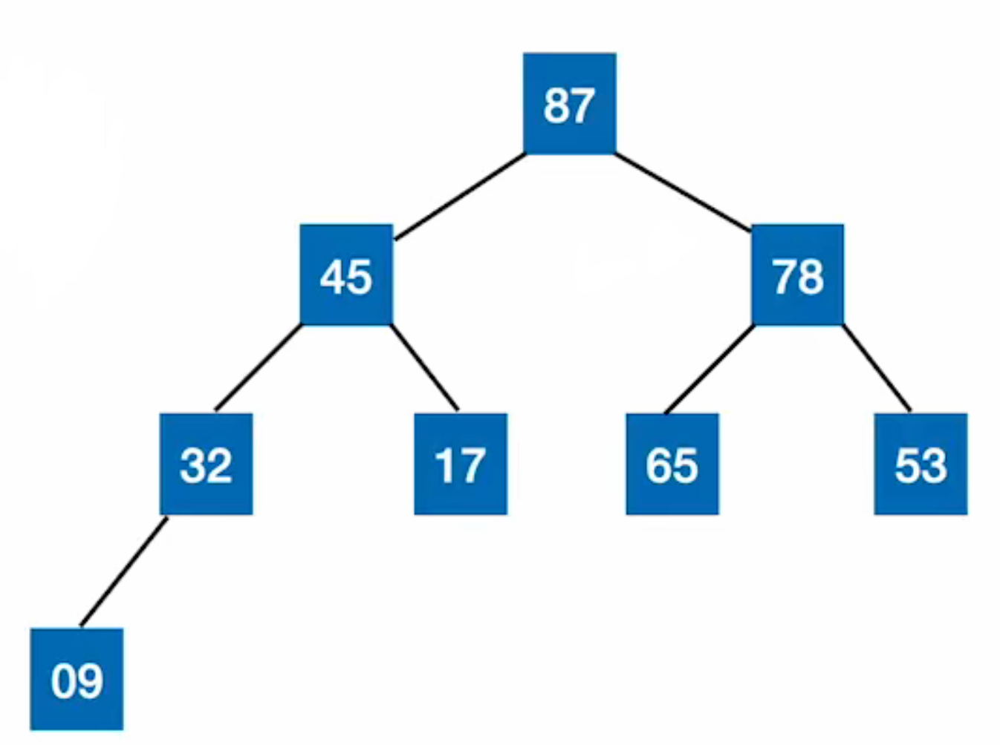
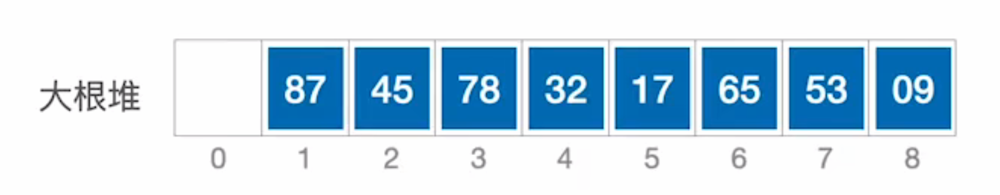
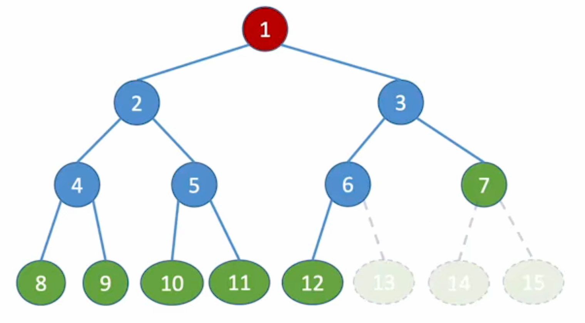

## 1. 堆的定义


n个关键字序列L[1,,,,n],若满足下面性质则称为堆.

大根堆: L[i] >= L[2i] 且 L[i]>= L[2i+1], **即根结点大于左右子树的值**





小根堆: L[i] <= L[2i] 且 L[i]<= L[2i+1]   **根结点的值始终小于左右子树的值**


## 2. 完全二叉树的顺序存储





上图中是一颗完全二叉树.

- i 的左孩子: 2i
- i 的右孩子: 2i+1
- i 的父节点: $\lfloor i/2\rfloor$

假设完全二叉树有n个结点:

- 判断i是否有左孩子: 2i <= n ? true : fasle
- 判断i是否有右孩子: 2i+1 <=n ? true : false
- 判断i是否是叶子结点: i > $\lfloor n/2\rfloor$ ? true : false
- 最后一个非叶子结点: $\lfloor n/2\rfloor$ 


## 3. 建立大根堆

给定一个序列,假如是一个int类型的数组A[n],  如何使用代码建立大根堆? 


```cpp
// 向下调整, 将以i根的子树调整为大根堆
void Heapify(int A[], int n, int i)
{
	int largest = i; //初始化最大值位置为父节点.
	int lchild = 2 * i + 1;  //左孩子下标.
	int rchild = 2 * i + 2; //右孩子下标.


	//如果左孩子存在且大于其父节点, 则更新
	if (lchild <= n - 1 && A[largest] < A[lchild])
		largest = lchild;

	//如果右孩子存在且大于其父节点, 则更新
	if (rchild <= n - 1 && A[largest] < A[rchild])
		largest = rchild;

	//如果largest发生变化, 说明发生交换, 则继续向下调整被影响的子树.
	if (largest != i)
	{
		std::swap(A[largest], A[i]);
		// 递归调整所有受影响的子树
		Heapify(A, n, largest);
	}
}

// 建立大根堆, 自底向上.
void BuildMaxHeap(int A[], int n)
{
	for (int i = n / 2 - 1; i >= 0; i--)
		Heapify(A, n, i);
}
```


注意:

- 在C++数组A[n]中
  - A[i]的左孩子结点: A[2*i+1]
  - A[i]的右孩子结点: A[2*i+2]
- 最后一个非叶子结点是 A[n/2 - 1];


复杂度分析:

- 时间复杂度: `buildMaxHeap` 调用 `heapify` 共 `n/2` 次，但每次调整的代价与子树高度相关，整体时间复杂度为 **O(n)**（注意不是O(nlog~2~n))
- 空间复杂度: O(log~2~n)

使用迭代而不是递归来实现heapify函数, 可以是空间复杂度为O(1).

```cpp
void heapify(int A[], int n, int i) {
    while (1) {
        int largest = i;
        int left = 2 * i + 1;
        int right = 2 * i + 2;

        if (left < n && A[left] > A[largest])
            largest = left;
        if (right < n && A[right] > A[largest])
            largest = right;

        // 若当前节点已是最大值，则堆已满足，退出循环
        if (largest == i)
            break;

        swap(&A[i], &A[largest]);
        i = largest;  // 继续向下调整受影响的子树
    }
}
```


## 4. 基于大根堆进行排序

假设给定一个数组 A[N], 如何实现堆排序算法?

思路:

- 首先将A[N]建立大根堆.
- 这样A[0]一定是A[N]数组中最大的元素. 将A[0]与A[N-1]交换. 最大元素到末尾.
- 此时 A[N]还剩下N-1个元素未排序, 将N-1个元素继续构建大根堆, 重复上述步骤, 直到剩下一个元素


```cpp 
void heapify(int arr[], int n, int i) 
{
    while (1) {
        int largest = i;      // 假设当前节点最大
        int left = 2 * i + 1; // 左孩子
        int right = 2 * i + 2;// 右孩子

        // 找出父、左、右三者中的最大值下标
        if (left < n && arr[left] > arr[largest])
            largest = left;
        if (right < n && arr[right] > arr[largest])
            largest = right;

        // 如果当前节点已经是最大值，调整结束
        if (largest == i)
            break;

        // 否则交换，并继续向下检查被交换的子节点
        swap(&arr[i], &arr[largest]);
        i = largest; // 移动指针到子节点，进入下一轮循环
    }
}

// 构建大根堆(自底向上) 
void buildMaxHeap(int arr[], int n) 
{
    // 从最后一个非叶子节点开始，逐个向前调整
    for (int i = n / 2 - 1; i >= 0; i--) 
    {
        heapify(arr, n, i);
    }
}


//堆排序主函数（升序排列）
void heapSort(int arr[], int n) 
{
    if (n <= 1) return; // 空或单元素无需排序

    // 1. 建立大根堆
    buildMaxHeap(arr, n);

    // 2. 排序过程：每次将堆顶（最大）放到数组末尾
    for (int i = n - 1; i > 0; i--) 
    {
        // 将当前堆顶（最大值）与末尾元素交换
        swap(&arr[0], &arr[i]);
        
        // 堆大小减 1（即忽略已排好的末尾最大值），
        // 然后从堆顶开始向下调整，使剩余部分重新成为大根堆
        heapify(arr, i, 0); // 注意这里堆大小传入 i
    }
}

// 测试示例
int main() 
{
    int A[] = {4, 10, 3, 5, 1, 2, 8, 7, 6, 9};
    int N = sizeof(A) / sizeof(A[0]);

    printf("排序前: ");
    for (int i = 0; i < N; i++) 
    {
        printf("%d ", A[i]);
    }
    printf("\n");

    heapSort(A, N);

    printf("排序后(升序): ");
    for (int i = 0; i < N; i++) 
    {
        printf("%d ", A[i]);
    }
    printf("\n");
    return 0;
}
```


效率分析:

- 最好时间复杂度: O(nlog~2~N)
- 最坏时间复杂度: O(nlog~2~N)
- 空间复杂度: O(1)
- 算法稳定性: 不稳定排序


## 5. 堆的插入和删除分析

以大根堆为例子.

堆的插入操作:

- 首先将数据data放在A[N]末尾, 让data不断与其父节点比较.
- 使其不断上升.


堆的删除操作:

-  先是直接删除元素, 空出来的位置让 末尾元素data补上.
-  然后将data和左右孩子对比, 使其不断下降.


注意, 删除操作不用和父节点比较, 因为末尾元素一定比上层元素小, 只需要和左右孩子比较就可以了.

