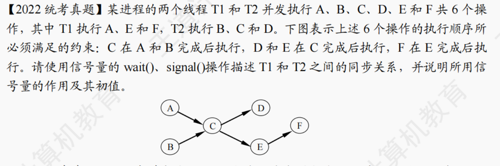
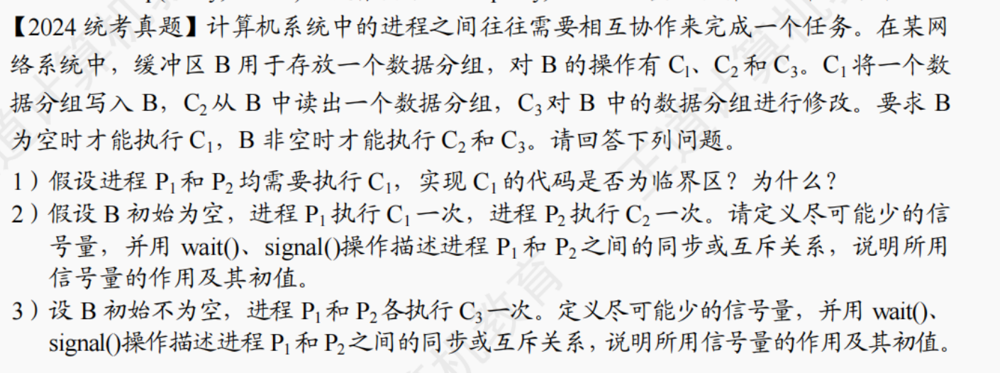

```cpp
semaphore AC = CE =  0;

void T1()
{
    while(1)
    {
        执行A操作；
        V(AC);
        P(CE);
        执行E操作;
        执行F操作;
    }
}

void T2()
{
    while(1)
    {
        执行B操作;
        P(AC); 
        执行C操作;
        V(CE);
        执行D操作;
    }
}
```





1. 是临界区，因为C1对B执行写操作， 且P1和P2需要对B互斥执行C1操作，因此C1是临界区


2.

```cpp
semaphore S = 0;  //实现进程P1和P2之间的同步

P1：
    ...
    C1;
	Signal(S);

P2:
	...
    Wait(S);
	C2;
	...
```


3. 

```cpp
semaphore mutex = 1; //实现进程P1和P2互斥执行C3

P1：
    ...
    Wait(mutex);
	C3;
	Signal(mutex);
	...
        
P2:
	...
    Wait(mutex);
	C3;
	signal(mutex);
	...
```

