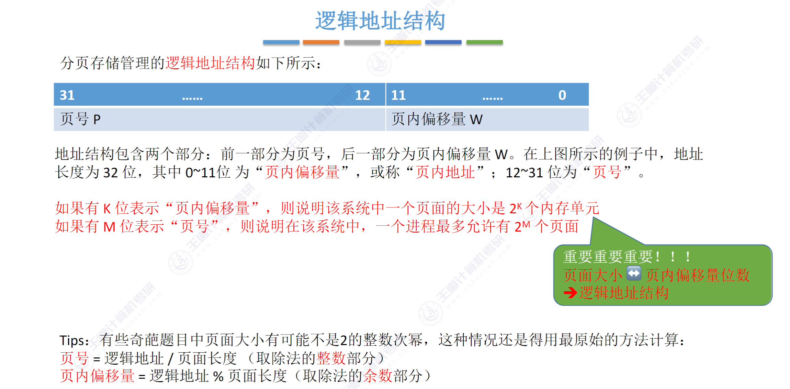

## 0. 导论

内存管理的概念

- 内存空间的分配与回收
- 地址转换
- 内存空间的扩充
- 存储保护

## 1. 内存空间的分配与回收

- 连续分配 ： 为用户分配的内存必须在物理上也是连续的一块内存
  - 单一连续分配
  - 固定分区分配
  - 动态分配
- 基本分页存储

 

**1. 单一连续分配**

内存被分为系统区和用户区，用户区中只有一道程序，独占整个用户区内存， 

特点：

- 无外部碎片，有内部碎片，内存利用率极低
- 不需要进行内存保护
- 只能用于单用户、单任务的操作系统

**2. 固定分区分配**

最简单的多道程序存储管理方式，将用户空间分为若干固定大小的分区，每个分区只装入一道作业，

分区办法：

- 分区大小相等： 程序太小造成浪费，程序太大又放不进去
- 分区大小不相等：划分为多个较小分区，适量中等分区和少量大分区

系统建立一张分区使用表来对分区进行管理

特点：

- 程序太大放不进任何一个分区
- 程序太小也会独占整个分区，从而产生内部碎片
- 无外部碎片
- 不能实现多进程共享一个主存区
- 内存利用率低

**3. 动态分区分配 **

动态分区分配也叫可变分区分配

关于动态分区分配的几个问题：

- 系统用什么样的数据结构来记录内存的使用情况?
- 当系统中有多个分区都满足要求时，应该选择哪个分区进行分配?
- 如何进行分区的分配和回收操作?

用什么样的数据结构记录内存的使用情况：

- 空闲分区表
- 空闲分区链

当系统中有多个分区满足要求时，应该选择哪个分区进行分配?

- 首次适应算法（First Fit）
  - 思想：每次都从低地址开始查找，找到第一个能满足大小的分区
  - 实现：把空闲分区按照地址递增的次序排列，每次顺序查找空闲分区表，找到第一个满足大小的分区
  - 评价：有利于后续大作业的装入，但是会在内存低地址部分产生许多小碎片，每次分配查找时都会经过这些碎片，从而降低了效率
- 邻近适应算法 （Next Fit） 循环首次适应算法
  - 实现：空闲分区按照地址递增的顺序排列，形成一个循环链表，每次分配内存从上次查找结束的位置查找空闲分区链，找到第一个能满足要求的分区
  - 评价：它让内存低、高地址以同等概率被分配，划分为小分区，导致内存高地址没有大分区可用，通常比首次适应算法更差
- 最佳适应算法 （Best Fit）
  - 实现：空闲分区按照容量递增的次序链接，每次分配内存顺序查找空闲分区链，找到第一个大小能满足要求的分区
  - 评价：有利于大作业的装入，但是会产生最多的外部碎片，性能很差
- 最坏适应算法：（Worst Fit)
  - 实现：与最佳适应相反，空闲分区按照容量递减次序排列，每次分配内存时顺序查找空闲分区链，找到大小能满足要求的第一个空闲分区
  - 评价：不容易产生内存碎片，但是不利于大作业的装入

**4. 基本分页存储管理**

几个基本概念：

- 页框、页帧、内存块、物理块
  - 指的是被划分的系统的物理内存
- 页、页面
  - 指的是被划分的进程的虚拟地址空间

思考几个问题：

- 每个页表项要占多少字节

- 如何实现进程的虚拟地址到操作系统的物理地址的转换？
  - 如何确定一个虚拟地址对应的页号和页内偏移量
  - 为什么页面大小要取2的整数幂

