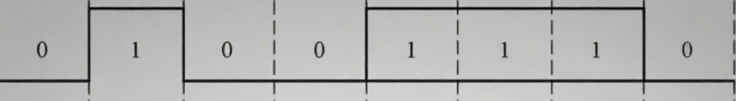
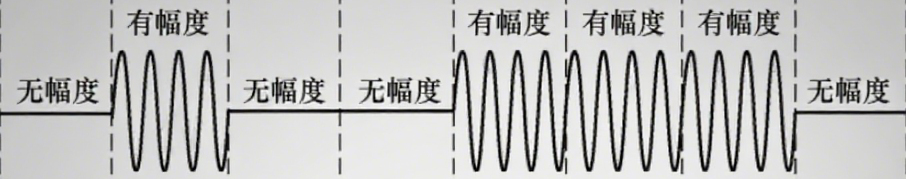
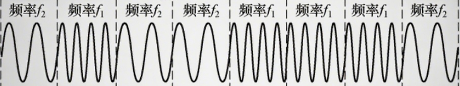
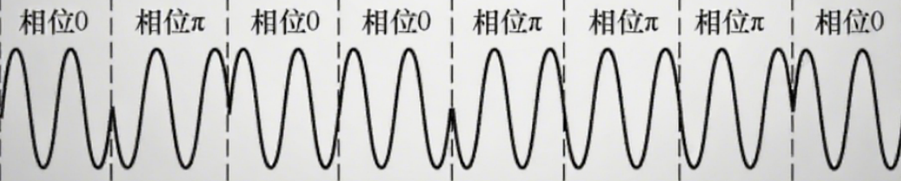

**1. 数字数据编码成数字信号**

- 原始数据

  

- 非归0编码：NRZ

  - 低0高1 中不变
  - 无自同步

- 归0编码: RZ

  - 低0高1, 中归0
  - 自同步，抗干扰弱

- 反向非归0编码: NRZI

  - 跳0不跳1， 看起点， 中不变
  - 可支持自同步，抗干扰弱

- 曼彻斯特编码:

  - 跳0反跳1， 看中间， 中必变
  - 自同步，抗干扰强

- 差分曼彻斯特编码

  - 跳0不跳1， 看起点， 中必变
  - 自同步， 抗干扰强

  

 **2. 数字数据调制成模拟信号**

- 原始基带信号
  - 

- 调幅(AM)或幅移键控(ASK)。通过改变载波的振幅表示数字1和0.

  - y = 0 * sinx

  - y = 1 * sinx

    

- 调频(FM)或频移键控(FSK),通过改变载波的频率表示1和0. 此种方式抗干扰能力强

  - y = sin(1 * x)
  - y = sin(2 * x)

  

- 调相(PM)或者相移键控(PSK)，通过改变载波的相位来表示数字0和1. 

  - 比如相位0 表示 1 ; y = sin(x+0)
  - 相位π表示 0；  y = sin(x+π)
  
  
  
  
  
- 正交幅度调制(QAM).在频率相同的前提下，将AM和PM结合起来，形成叠加信号

  - 波特率为 B, 采用 m 个相位，每个相位有 n 个振幅。
  - 传输速率 R = B * log2(mn)
  - 解释：m个相位和n个振幅， 一共可以表示 mn 种状态，即mn种码元， 而 mn 种状态只需要 log2mn bit 二进制数据就可以表示
  - QAM-16：采用QAM调制，有16种码元。
  - QAM-32: 采用QAM调制，有32种码元

- 差分相移键控(DPSK).通过相邻码元的相位变化传递信息
  - //待补充