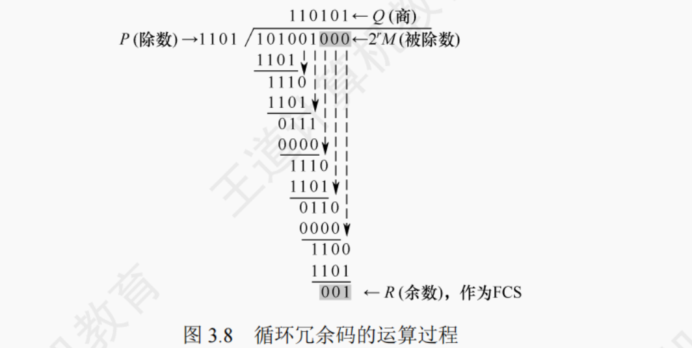

- 检错编码
  - 奇偶校验码
  - 循环冗余码

- 纠错编码

**1. 奇偶校验码**

//待补充

**2. 循环冗余码**

假设要发送数据为`101001`,生成多项式为 X3 + X2 + 1,即被除数`1101`

**(1)** 取被除数的前 4 位 `1010`，与 `1101` 比较，看是否够除（只看最高位，是 1 就商 1，否则商 0）。
`1010` 最高位是 1，所以商 1，然后用 `1010` XOR `1101`：

1010⊕1101=01111010⊕1101=0111

把被除数的下一位（第 5 位）`0` 拖下来，得到 `1110`。

**(2)** `1110` 最高位是 1，商 1，

1110⊕1101=00111110⊕1101=0011

拖下一位（第 6 位）`1`，得到 `0111`。

**(3)** `0111` 最高位是 0，商 0，
此时相当于 `0111` XOR `0000`（因为商 0 时不减除数） = `0111`。
拖下一位（第 7 位）`0`，得到 `1110`。

**(4)** `1110` 最高位是 1，商 1，

1110⊕1101=00111110⊕1101=0011

拖下一位（第 8 位）`0`，得到 `0110`。

**(5)** `0110` 最高位是 0，商 0，
结果还是 `0110`，拖下一位（第 9 位）`0`，得到 `1100`。

**(6)** `1100` 最高位是 1，商 1，

1100⊕1101=00011100⊕1101=0001

没有更多位可拖，所以余数 `001`（其实是 `0001` 去掉前导 0 到 3 位？这里 FCS 取 3 位，因为除数是 4 位，余数位数 = 除数位数 - 1 = 3 位）。

所以最后余数 **R = 001**，这就是 FCS。