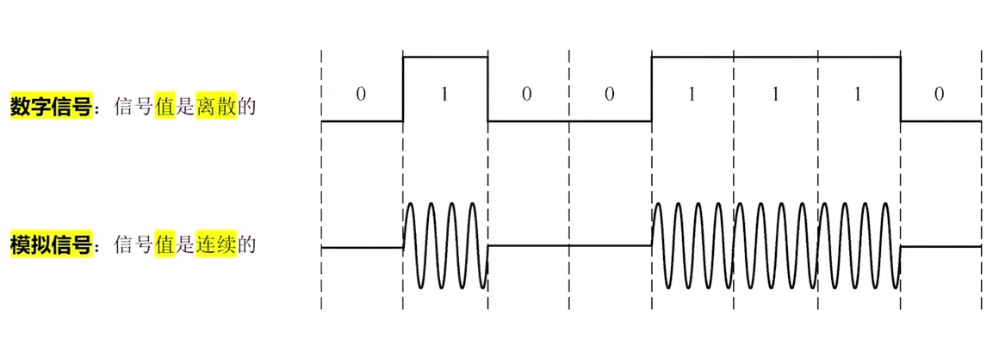
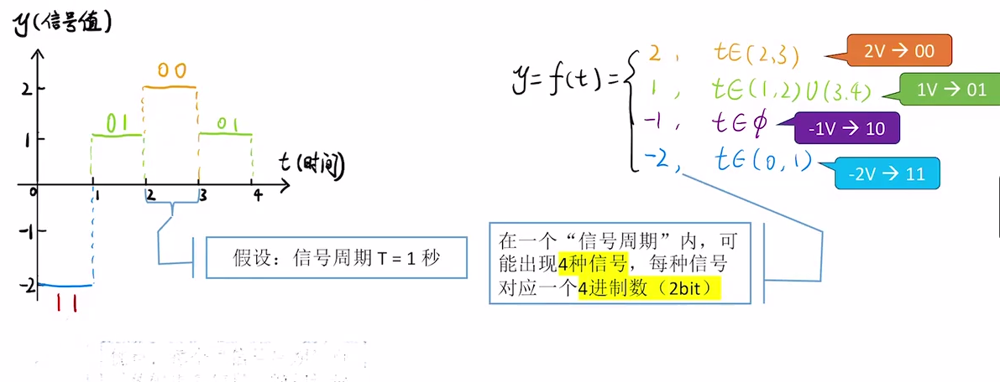
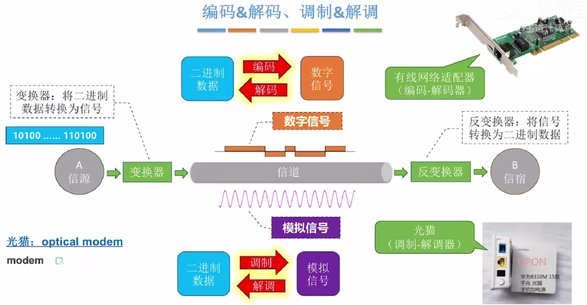
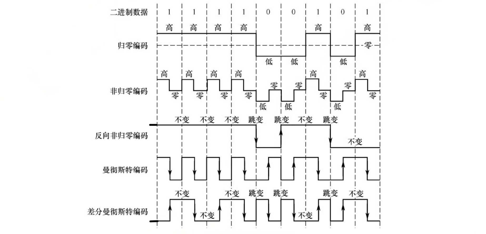
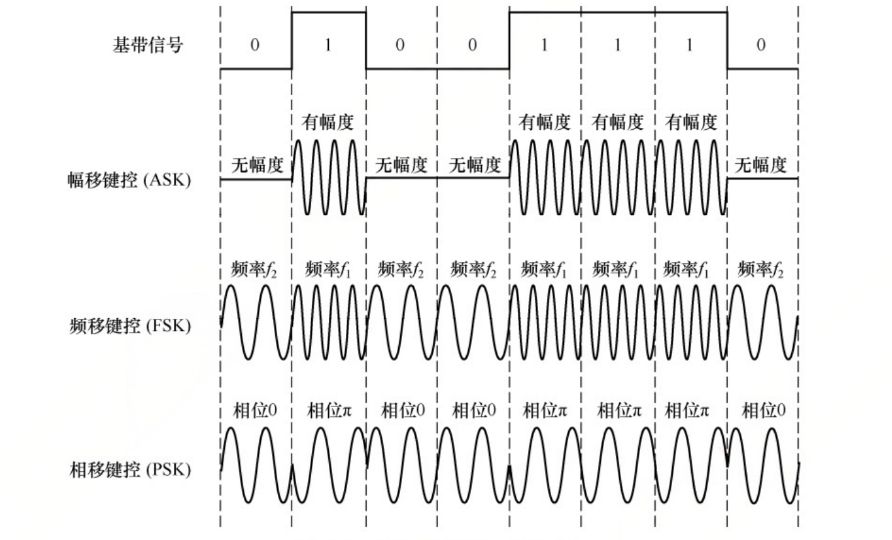

> 物理层的任务: 实现相邻节点之间比特流的传输


## 1. 信源、信宿、信号、信道

信源: 信号的来源, 即数据的发送方

信宿: 信号的归宿, 即数据的接收方

信道: 信号的通道.

信号: 数据的载体


## 2. 数字信号和模拟信号



上面数字信号的值: 要么为0, 要么为1

下面的模拟信号的值: 可以是 0到1之间任何一个值, 所以它是连续的.


## 2. 码元、速率、波特




一个单位时长的信号波形叫做一个码元.

如果一个离散信号的值可以取4种, 那么一个码元可以携带 2bit 信息.

如果离散信号的值可以去m种, 那么一个码元可以携带 log<sub>2</sub>m 信息.


每秒传递多少个码元 叫做 波特率·

每秒传递多少个bit, 教唆速率


如果 1个码元携带 n个比特, 那么速率 = Mn b/s, M是波特率.


## 3. 奈奎斯特定理

> 奈奎斯特定理描述的是 `无噪声信道的最大传输速率`


理想低通信道的极限波特率 == 2W (W是信道带宽, 单位是HZ)


理想低通信道的极限数据传输速率 = 2Wlog<sub>2</sub>V


W是信道的频率带宽, 单位是Hz， 


V是每个码元携带离散电平数量, 说人话就是离散信号的值可以取几种,  再说人话就是一个码元可以携带 log<sub>2</sub>V 比特的信息.


如果一个信号或者一个码元有8种状态, 可以称其为8进制码元. 一个8进制码元可以携带3bit信息


```cpp
1KHz = 1000 hz;

1MHz = 1000 Khz;

1GHz = 1000 Mhz;

```


## 4. 香农定理

> 香农定理 给出了有噪声信道的极限数据传输速率.


信道的极限传输速率 = $$W log_2(1+S/N) $$; 单位是 b/s


- W 是信道的频率带宽, 单位是 Hz;
- S/N 是信噪比.


信噪比有两种记法, 一种无单位记法, 一种分贝dB记法.

- 信噪比 S/N 是 1000 时, 为 30dB 即10<sup>3</sup>

- 信噪比 S/N 是 10000 时, 为 40dB 即 10<sup>4</sup>

- 以此类推


## 5. 奈奎斯特 PK 香农


奈奎斯特定理:

```cpp
极限波特率 = 2W ;// W是信道带宽，单位是Hz;
```


奈奎斯特定理说明:

- 如果波特率太高，会导致`码间串扰`，接收方无法识别码元。

- 带宽越大，信道传输码元的能力越强

- 奈奎斯特定理是从码元的角度去解释信道的极限波特率，**但是它没有对一个码元最多可以携带多少比特做出解释**

  


香农定理:

```cpp
极限传输速率 = Wlog2(1 + S/N); //W是信道带宽, 单位是Hz;
```


香农定理说明

- 提高信道带宽、加强信号功率、降低噪声功率都可以提高极限比特率。
- 一个信道传输比特的速率是有上限的。结合奈奎斯特定理，说明一个码元可以携带的比特数量是有上限的。


## 6. 编码 & 解码、调制 & 解调 

​	通过前面的内容，我们知道信源会通过信道给信宿发送信号，信号是数据的载体，数据在计算机中是以二进制(01010)的形式存储的。信号又分为数字信号(值是离散的)和模拟信号(值是连续的).那么信源中的数据是如何变成信号的来发送的呢? 信宿又是如何将接收到的信号转化成二进制数据来存储的呢?   


​	信源通过变换器将二进制数据转换成信号，可以是数字信号，也可以是模拟信号。信宿通过反变换器将信号转换成数据。


- 二进制数据 ==> 数字信号， 这个过程叫做编码.
- 数字信号 ==> 二进制数据, 这个过程叫做解码.
- 二进制数据 ==> 模拟信号, 这个过程叫做调制
- 模拟信号 ==> 二进制数据, 这个过程叫做解调


- 有线网络适配器(俗称有线网卡)它就具备编码和解码的作用.当然还有其它更复杂的功能.
- 光猫(学名叫做Modem)它就具备调制和解调的功能。





## 7. 常见的编码方法


### 7.1 编码的波形




- 归零(RZ): 低0高1中归0
- 非归零(NRZ):低0高1中不变
- 反向非归零(NRZI)：跳0不跳1，中不变，看起点
- Manchester: 跳0反跳1，看中间，中必变
- 差分曼彻斯特: 跳0不跳1，看起点，中必变


补充:

- USB2.0采用的是 NRZI编码
- 标准以太网采用的是曼彻斯特编码(默认)
- 宽带和高速网采用的是差分曼彻斯特

### 7.2 各种编码的特点


| N:Non；R:Return; Z:Zero; I:Inverted | 自同步能力                 | 是否浪费带宽     | 抗干扰能力 |
| :---------------------------------- | -------------------------- | ---------------- | ---------- |
| 不归零编码(NRZ)                     | 无                         | 不浪费           | 弱         |
| 归零编码(RZ)                        | 有                         | 浪费             | 弱         |
| 反向非归零编码(NRZI)                | 若增加冗余位，可支持自同步 | 浪费一点，但不多 | 弱         |
| 曼彻斯特编码                        | 有                         | 浪费             | 强         |
| 差分曼彻斯特编码                    | 有                         | 浪费             | 强         |


**补充**:

**1. 什么叫做浪费带宽？**

​	对于不归0编码来说，一个bit只有一个电平, 它只消耗一个Hz的带宽, 而对于曼彻斯特编码来说，它中间要跳变一次, 产生了高低电平，也就是一个bit的信息要消耗2Hz的带宽.


**2. 为什么说反向非归0编码可以支持自同步?**

​	反向非归零编码本身没有自同步的能力，但是在有的通信系统中，采用 8+1bit来支持同步，即每接收 8bit 数据后面一个数据为0, 而0必然会产生跳变, 这个跳变可以作为同步信号，接收方每接收8bit数据后，丢弃掉后一位同步信号即可.


## 8. 常见的调制技术

基础知识：对于 $y = Asin(Bx +C)$ ,

- A: 幅度，即振幅，表示正弦波的峰值大小
- B: 频率，B越大，波形在单位时间内震荡越快，周期 $T = \frac{2\pi}{B}$.
- C: 初相, C决定了正弦波在$x = 0$时刻的相位偏移.即波形在水平方向上的平移.





- 调幅AM,ASK: 有幅度为1，无幅度为0.
- 调频FM,FSK：使用两种不同的频率来表示0和1
- 调相PM,PSK： 通过改变载波的相位来表示0和1.
- 差分相移键控DPSK,通过检测当前码元与前一个码元的相位差来传输数据，相位有无变化分别表示1和0.

正交幅度调制(QAM), 在频率相同的情况下，把AM和和PM结合起来，形成叠加信号，假设波特率为B,采用m个相位, 每个相位有n种振幅。数据传输速率R为
$$
R = Blog_2(mn)
$$


解释: m种相位,每个相位又有n种振幅, 说明有mn种不同状态, 表示mn种不同状态只需要$log_2(mn)$比特就足够了.

- QAM-16： 即mn = 16
- QAM-64:  即mn = 64  
- QAM-128: 即mn = 128


