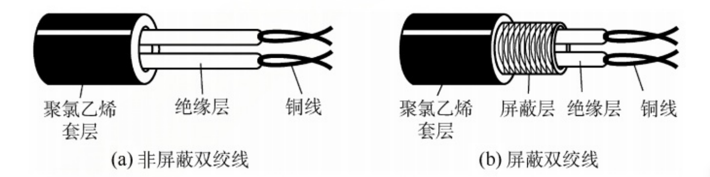
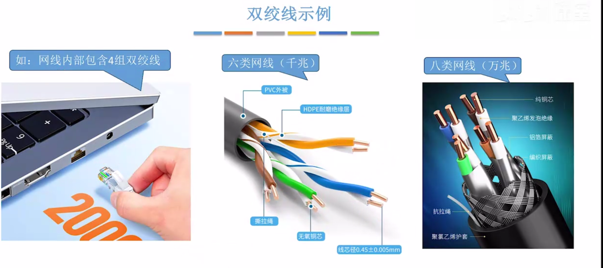
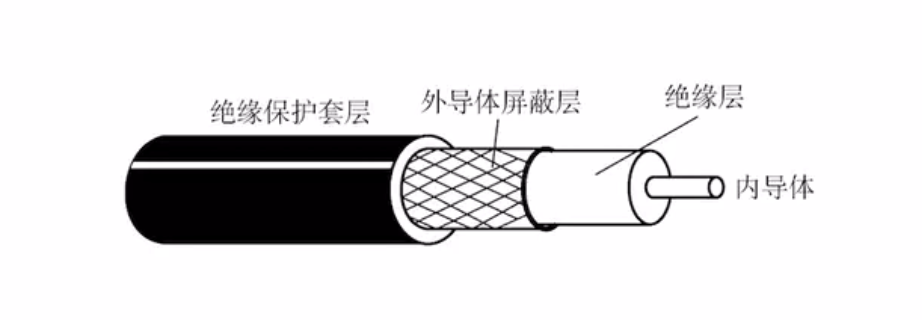
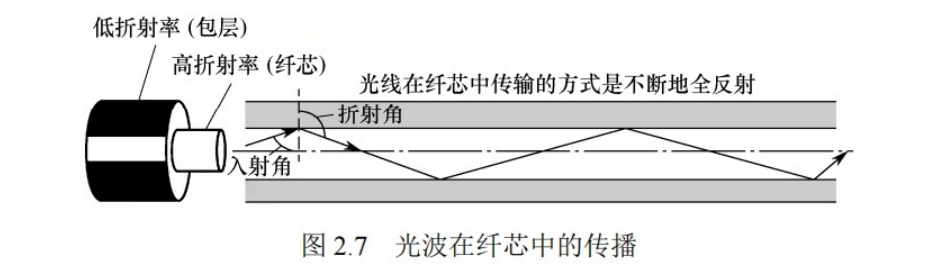

## 1. 传输介质

Transmission Medium: 传输介质，又或者叫传输媒体.

- 导向型

  - 双绞线
  - 同轴电缆
  - 光纤

- 非导向型:信号朝四面八方传播

  - 无线传输介质

    

## 2. 双绞线

双绞线在局域网和传统电话网中普遍使用.绞合是为了对抗电磁干扰，减少噪声.

局域网中的网线其实就是双绞线.

双绞线: TP： Twisted Pair

屏蔽双绞线: STP: Shielded Twisted Pair

非屏蔽双绞线: UTP : Unshielded

## 3. 同轴电缆

- 主要构成: 内导体(用于传输信号) + 外导体屏蔽层(用于对抗电磁干扰)
- 抗干扰能力: 好, 屏蔽层具有良好的抗干扰性
- 代表应用: 早期局域网, 早期有线电视.

内导体通常用铜线作为材料.

内导体越粗，电阻越低，传输过程中信号衰减越少，传输距离越长.

## 4. 光纤

- 主要构成: 
  - 纤芯(高折射率) + 包层(低折射率)
  - 利用光的全反射特性，在纤芯内传输光脉冲信号.
- 分类:
  - 单模光纤：只有一条光线在一个光纤中传输，适合长距离传输，信号传输损耗小
  - 多模光纤: 多条光线在一条光纤中传输，适合近距离传输，远距离传输会导致光信号失真.
- 抗干扰能力: 非常好，光信号对电磁干扰不敏感。
- 其它有点: 信号传输损耗小，长距离传输中继器少，很细很省布线空间

​					 

## 5. 以太网对有线传输介质的命名规则

速度 + Base + 介质信息

- Base: Baseband, 基带传输，即传输的是数字信号，采用曼彻斯特编码.
- 10Base5:  10Mbps, 同轴电缆，最远传输距离500m
- 10Base2:  10Mbps, 同轴电缆，最远传输距离200m(实际是185m)
- 10BaseF*: 10Mbps, 光纤(Fiber), *可以是其它信息, 如10BaseFL, 10BaseFB, 10BaseFP.
- 10BaseT*: 10Mbps,双绞线, *可以是其它信息, 如10BaseT1S, 10BaseT1L

- 1000BaseT1: 1000Mpbs, 双绞线
- 2.5GBaseT: 2.5Gbps, 双绞线

## 6. 无线传输介质

- 无线电波
  - 特点： 穿透能力强、传输距离长、信号指向性弱
  - 如: 手机信号、WIFI
- 微波通信
  - 特点: 频率带宽高、信号指向性强、保密性差(容易被窃听)
- 其它: 红外线通信、激光通信， 信号指向性强

## 7. 物理层接口特性

- 机械特性：指明接口所用接线器的形状和尺寸、引脚数目和排列、固定和锁定装置
- 电气特性: 指明在接口电缆的各条线上出现的电压的范围、传输速率、距离限制等
- 功能特性: 指明某条线上出现的某一电平的电压的意义.
- 过程特性(规程特性): 指明对于不同功能的各种可能事件的出现顺序.
  - 比如: 拔掉网线会出现什么? 插上网线会有什么反应?

## 8. 物理层设备

### 8.1 中继器(Repeater)

​	中继器的功能是放大、整形并转发数字信号，以消除信号经过一段长电缆后产生的失真和衰减，使信号的波形和强度达到所需的要求

中继器的原理是`信号再生`,并不是简单的放大衰减的信号。

中继器有两个端口，数据从一个端口进来，从另一个端口出去，端口只作用于信号的电气部分，并不管数据是否有错误。

同过中继器分隔开的两端属于同一个局域网。中继器如果出现故障，对相邻的两个网段工作都会出现影响

​	理论上，一条线路可以有无限个中继器，网络线路就可以无限长，但是网络标准对信号的延迟范围有要求，所以中继器只能在这个范围里面工作。

在10Base5中，串联的中继器不能超过4个，4个中继器划分了5段通信介质，只有3段可以挂接计算机，其余2段只能作为链路段。

### 8.2 放大器

放大器和中继器相似，只不过放大器放大的是模拟信号，而中继器放大的是数字信号。

### 8.3 集线器(Hub)

集线器的本质是多端口的中继器。一般只有中继器只有两个端口，数据从一边进来从另一边出去。集线器可以把数据向多个端口进行传输。

特点:

- 集线器不能分隔冲突域，所有端口都属于一个冲突域
- 一个集线器连接多台计算机时，容易导致冲突。比如带宽为10Mbps的集线器连接了8台计算机，实际每台计算机的带宽是1.25Mbps.

