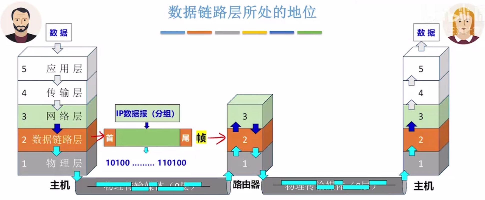

## 1. 数据链路层所处的地位

主机需要实现第一层到第五层的功能.

路由器只需要实现第一层到第三层的功能.

数据链路层需要使用物理层提供的**比特传输**服务.

数据链路层为网络层提供服务 , **将网络层的 IP数据报(分组)封装成帧**, 传输给下一个相邻节点.

- 物理链路: 传输介质 (0层) + 物理链路(1层)实现了相邻节点之间的`"物理链路"`
- 逻辑链路: 数据链路层需要基于物理链路 ，实现相邻结点之间逻辑上无差错的`数据链路(逻辑链路)`

- 一条物理链路受到环境噪声的干扰,可能发生比特跳变,  数据链路层需要确保这种比特错误会被发现.只有确保了帧的传输没有比特错误，才能保证第二层的实体提交给第三层实体的数据报没有错误.

## 2. 数据链路层的功能

**功能如下**:

- 封装成帧
  - 帧定界
  - 透明传输
- 差错控制
  - 检错编码
  - 纠错编码
- 可靠传输
- 流量控制
- 介质访问控制

### 2.1 封装成帧(组帧)

封装成帧就是把网络层的数据加上首部和尾部, 封装成一个帧. 它需要解决两个问题

​	首先是`帧定界`，如何让接收方确定帧的界限,从哪里开始,从哪里结束,  因为物理层只会传输0和1的比特串, 这些比特串有可能包含1一个帧, 有可能包含多个帧,

所以当接收方的物理层实体把一系列的二进制比特串交给数据链路层时, 数据链路层需要从一系列比特串中分辨出帧和帧之间的边界在哪里. 

​	其次是`透明传输`, 所谓透明传输是指接收方数据链路层要能从收到的帧内恢复原始SDU, 让网络层感受不到将IP分组封装成帧和拆帧的过程.

因为发送方的网络层将IP分组交给数据链路层后, 数据链路层会对IP分组添加首部和尾部信息, 还会IP分组内部进行改造, 当接受方数据链路层接收到帧后，会进行拆帧操作, 去掉首部和尾部信息, 将分组恢复成原样交给网络层, 所以透明传输, 即IP分组在传输的过程中, 接受方网络层是感受不到组帧和拆帧操作的.即透明的.

### 2.2 差错控制

差错控制就是接受方的数据链路层需要发现并解决一个帧内部的`位错`.

- 解决方案一: 接收方发现比特错后丢弃帧, 发送方重传帧, (仅需要采用 检错编码)
- 解决方案二: 由接收方发现并纠正比特错误 (需要采用纠错编码)

### 2.3 可靠传输

可靠传输就是要求接收方的数据链路层能够发现并解决帧错,帧错有三种情况.

- 帧丢失： 发送帧`1. 2. 3. 4`， 接收帧`1. 2. 4.`
- 帧重复:：发送帧`1. 2. 3. 4` ,接收帧`1. 2. 2. 3. 4`
- 帧失序：发送帧`1. 2. 3. 4`， 接收帧``1. 3. 2. 4`

### 2.4  流量控制

所谓流量控制就是控制发送方发送帧的速率别太快,让接收方来得及接受.

### 2.5 介质访问控制

​	这里的介质指的是物理传输介质， 一般来说`广播信道`就需要实现介质访问控制的功能. 因为广播信道在逻辑上是总线型拓扑，会出现多个节点需要争抢传输介质的使用权. 此时需要数据链路层的协议来决定此时信道的使用权到底要先分配给哪个节点.

​	点对点的信道不需要介质访问控制功能, 因为点对点信道意味着两个节点之间有专属的传输介质, 不需要争抢.

