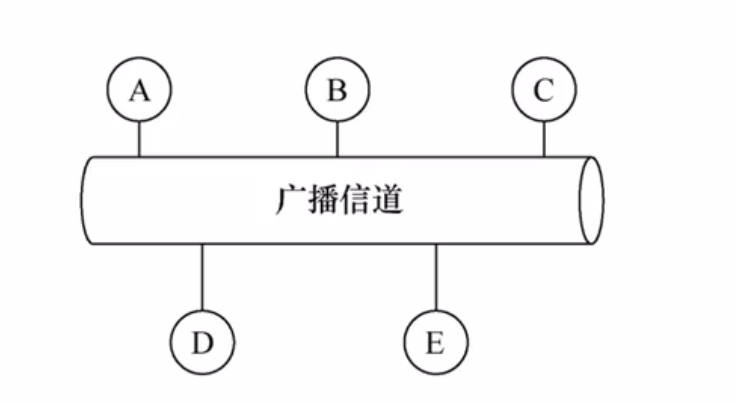
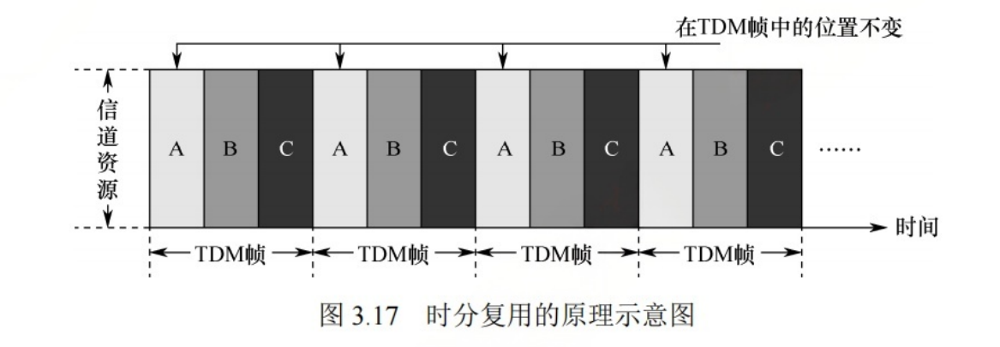
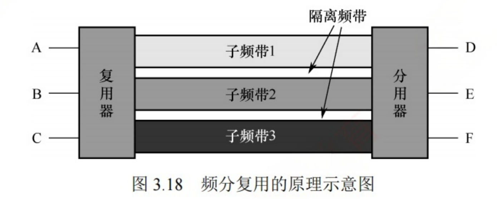
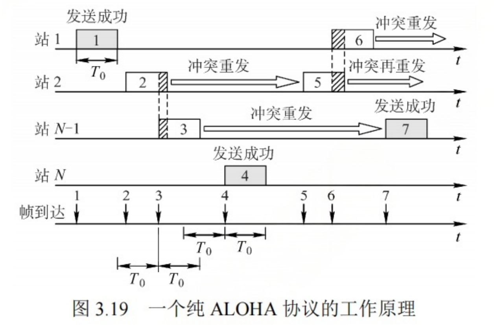
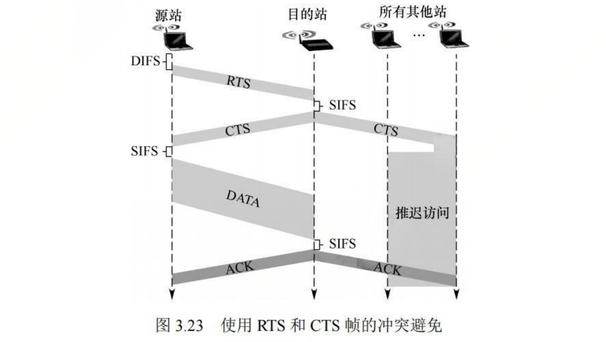

## 0. 前言

**什么是介质访问控制? 为什么需要介质访问控制?**

介质访问控制是 Medium Access Control(**MAC**)的缩写, 多个节点共享同一个“总线型”广播信道时，可能会发生信号冲突.所以**介质访问控制完成的任务是为使用介质的每个节点隔离来自同一信道上其它节点所传送的信号**.


产生信号冲突情景:

- 早期的网络，一根同轴电缆连接多个节点
- 用集线器连接多个节点
- WIFI、5G等无线通信.多个设备连接同一个WIFI




## 1. 信道划分介质访问控制

### 1.1 时分复用

时分复用是 Time Division Multiplexing(TDM) 的缩写.


主要原理是将信道的传输时间划分成一段等长的时间片, 叫做`TDM帧`, 每个节点平均分配这个时间片，形成一个个等长的时隙。节点只有在属于自己的时隙内才可以传输数据




时分复用的缺陷: 当某个节点没有数据传输时，仍然会占用这个时隙，其它节点无法使用，导致信道利用率低.

统计时分复用(Statistic TDM, STDM)是对TDM 改进, STDM会将TDM帧中的时隙进行按需动态分配,只有节点有数据要传输时，才会得到时隙.


### 1.2 频分复用

频分复用是 Frequency Division Multiplexing(FDM) 的缩写. 

主要原理是将信道的总频带划分成一个个子频带，每个字频带作为一个子信道，每对用户使用一个个子信道进行通信.

同时，为了防止子频带之间相互干扰，还需要在子频带之间加入隔离频带.





### 1.3 波分复用

波分复用是光的频分复用, 因为一个光纤中可以传输多种不同波长(频率)的光信号, 因为波长不同，所以各路光信号互不干扰.


### 1.4 码分复用


## 2. ALOHA协议

### 2.1 纯Aloha协议

​	基本思想是总线型网络中任何一个节点要发送数据时，不需要进行任何检测就立即发送数据，如果一段时间内没有收到确认帧，就认为发生了冲突，等待一段随机时间后，再重发数据，直到发送成功.




### 2.2 时隙Aloha协议


## 3. CSMA协议

CSMA: Carrier Sense Multiple Access； 载波监听多路访问

## 4. CSMA/CD协议

Carrrier Sense Multiple Access / Collision Detection：载波监听多路访问 / 冲突检测.


特点:

- 该协议适用于总线型网络，或者半双工环境.(因为全双工采用两条信道，分别用来发送和接收，不会产生冲突)
- 发送数据之前，先监听信道，没有冲突才发送。
- 发送数据过程中，不断监听信道，有冲突就立即停止发送.
- 检测到冲突后，采用二进制指数退避算法来确定重传数据的时机.

- 该协议没有ACK机制，若发送过程中没有检测到冲突，就认为帧发送成功.


### 4.1信道冲突的最短和最长时间分析

### 4.2 CD协议的最短帧长

```cpp
最短帧长 = 最大单向传播时延 * 数据传输速率 * 2；
```

以太网规定`51.2us`是争用期的长度。 对于 10Mbps的以太网， 争用期内可以发送 512bit数据，即 64Byte.

若前64Byte没有发生冲突，则后续数据也不会发生冲突，表示已经成功抢占信道.

若需要发送小于64Byte的帧，则需要填充到64Byte.

**补充:以太网最长帧长为1518Byte**

### 4.3 二进制指数退避算法

如果CSMA/CD协议检测到冲突, 会选择使用二进制指数退避算法来确定退避的时间，然后重传数据.


- 确定基本退避时间, 一般取2倍总线端到端的传播时延, 即2$\tau$(信道争用期).
- 从离散的集合[0, 1, ... , 2<sup>k</sup>-1]中随机取出一个整数, 记作r. 推迟的时间就是 2r$\tau$.
  - 参数K等于重传次数, k<= 10; 
  - 当重传次数超过10次时, k就不再增加.
- 当重传16次还不成功时，就会认为网络拥堵，并放弃传输. 向高层报告出错.


**例题: 已知10BaseT以太网的信道争用期为51.2us, 若某网卡在传输某帧时连续发生了四次冲突，则到下一次重传时，最长等待多久?**

离散集合为[0,1,2,3,....., 2<sup>4</sup>-1];

最长时间为 15 * 51.2 = 768us.


## 5. CSMA/CA协议

Carrrier Sense Multiple Access / Collision Avoid：载波监听多路访问 / 冲突避免.; 下面用CA来简称该协议;

CA的特点如下:

- 与CD不同, 发送过程中不会检测冲突,而是发送前尽可能避免冲突
- CA采用链路层确认-重传ARQ方案, 站点每发送完一帧都要等待AP的ACK, 只有等到了ACK，才会去发送下一帧.
- 802.11标准无线局域网采用CA协议, 并且确认-重传机制使用的是停止-等待协议.
- CA协议在发送较大的数据帧时，可以采用预约机制.


关于CA协议中涉及到的名词解释如下:

- AP: Access Point缩写; 接入点, 可以理解成Wifi热点, 或者家里的路由器
- 家用路由器 = 路由器 + 交换机 + AP
- 校园网 = 路由器 + n个交换机 + n*m个AP
- RST帧: RST是Request to send的缩写, 该帧用于信道预约机制
- CTS帧: CTS是Clear to send的缩写, 该帧用于信道预约机制
- NAV值

### 5.1 CA协议的工作流程

1. 若站点最初有数据要发送(不是发送失败重传),且检测到信号空闲，在等待DIFS后，就会发送整个数据帧.

2. 否则站点执行CA退避算法，期间一直监听信道，一旦检测到信道忙，退避计时器就保持不变，只要信道空闲，退避计时器就进行倒计时。
3. 退避计时器减到0时，站点就发送整个帧，并等待ACK.
4. 若站点收到ACK,表示发送成功，接下来发送第2帧，从步骤2开始，执行CA退避算法


### 5.2 CA协议的退避算法

仅当检测到信道为空闲，且要发送的数据帧是第一个帧，才不用退避算法，其它所有情况都必须使用退避算法.具体情况如下:

- 在发送第一个帧之前检测到信道忙.
- 未收到ACK,要重传数据帧
- 收到ACK,继续发送下一帧


### 5.3 CA协议的信道预约机制


 





具体过程如下:

1. 源站发送数据前, 监听信道, 若信道空闲, 等待DIFS后, 广播一个请求发送的`RTS帧`, 该帧中包括源地址、目的地址和此次通信所需的持续时间.
2. 若AP收到RST帧，且信道空闲, 等待SIFS后, 广播一个允许发送的`CTS帧`, 该帧也包括了此次通信所需的持续时间.
3. 源站收到CTS帧后, 再等待SIFS, 就可以发送数据. 其它站接收到CTS帧后, 在此期间抑制发送.
4. 若AP正确接收到了源站发来的数据,则等待SIFS后就向源站发送ACK.


### 5.4 NAV值的分析


