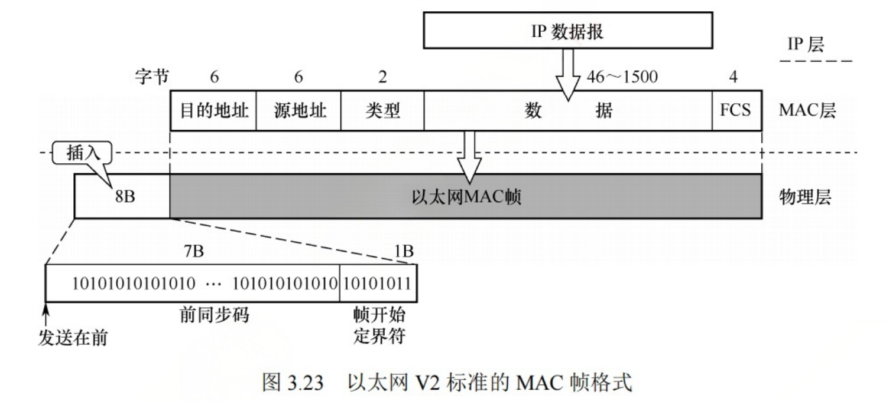
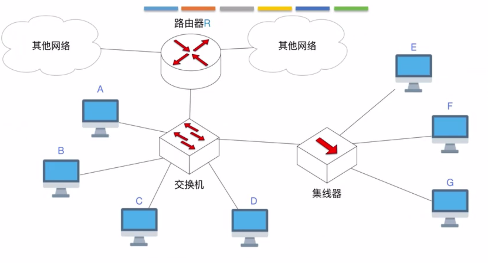

## 1. 局域网

  局域网是指在一个较小的范围内,将各种计算机、外部设备与数据库系统通过双绞线、同轴电缆等连接介质连接起来,组成资源和信息共享的计算机互联网络.局域网的特性由三个要素决定。

- 拓扑结构
- 传输介质
- 介质访问控制

最重要的是介质访问控制,它决定了局域网的技术特性.

## 2. 以太网

以太网是最流行的有线局域网技术, 以太网遵循IEEE802.3标准, 通常把802.3就叫做以太网, 它的特点如下:

- 采用无连接方式, 不会对发送的数据帧编号, 也不会要求数据接收方发送ACK.
- 以太网提供的是不可靠服务, 对数据的差错纠正由上层完成.
- 发送的数据使用曼彻斯特编码.

​    计算机与外界局域网的连接是通过主板上的网络适配器(Adapter)[也叫网络接口卡(Network Interface Card, NIC)]实现的, 适配器上有存储器和处理器工作在数据链路层, 适配器和局域网的通信是通过电缆或双绞线以串行的方式进行的,但是适配器与计算机的通信是通过计算机IO总线并行的方式进行的.适配器要完成的功能如下:

- 帧的发送与接收
- 组帧和拆帧
- 介质访问控制
- 数据的编码和解码
- 数据缓存

### 2.1 以太网MAC帧

以太网MAC帧格式有两种:

- DIX Ethernet V2 标准 (事实上的标准)
- IEEE802.3 标准

- 目的地址: 6Byte, 帧在局域网上目的适配器的MAC地址.
- 源地址: 6Byte, 传输到局域网上的源适配器的MAC地址.
- 类型: 2Byte, 指出数据应该交给哪个上层协议处理.
- 数据: 46~1500 字节, 承接了上层协议的PDU.
- 校验码FCS: 4字节, 采用32位的CRC校验码.检验的是目的地址+源地址+类型+数据, 不包括前导码.

  注意,会在帧前面插入8字节的前导码, 其中前7个字节是前同步码`10101010....`,类似于滴答滴答滴答滴答, 它的作用是用来实现MAC帧的比特同步, 后1个字节是帧开始定界符`10101011`,它的作用是表示后面的数据就是MAC帧了.

  以太网帧有帧开始定界符，但是没有帧结束定界符, 因为以太网标准规定以太网帧间最小间隔为9.6us, 就是两个MAC帧之间至少有9.6us的时间差, 只要找到了帧开始定界符, 后面连续到达的比特流都是属于同一个帧的.接收方接收完一帧后,接口上的电压将不会变化，这样就找到了帧结束的位置.

### 2.2 以太网传输介质

以太网的传输介质有同轴电缆(粗缆、细缆)、双绞线和光纤.适用情况如下表:

| 标准名称     | 10BASE5        | 10BASE2        | 10BASE-T     | 10BASE-F |
| ------------ | :------------- | :------------- | ------------ | -------- |
| 传输介质     | 同轴电缆(粗缆) | 同轴电缆(细缆) | 非屏蔽双绞线 | 光纤对   |
| 编码         | 曼彻斯特       | 曼彻斯特       | 曼彻斯特     | 曼彻斯特 |
| 拓扑结构     | 总线型         | 总线型         | 星型         | 点对点   |
| 最大段长     | 500            | 185            | 100          | 2000     |
| 最多节点数量 | 100            | 30             | 2            | 2        |

 

还有几种高速以太网, 速率达到或超过100Mb/s的以太网称为高速以太网.

| 标准名称     | 100BASE-T 以太网        | 吉比特以太网            | 10吉比特以太网 |
| ------------ | ----------------------- | ----------------------- | -------------- |
| 传输速率     | 100 Mbps                | 1Gbps                   | 10Gbps         |
| 传输介质     | 双绞线                  | 双绞线、光纤            | 双绞线、光纤   |
| 通信方式     | 半双工、全双工          | 半双工、全双工          | 仅全双工       |
| 介质访问控制 | 仅在半双工下使用CSMA/CD | 仅在半双工下使用CSMA/CD | 无             |
|              |                         |                         |                |

## 3. 单播、广播、多播

上面说到以太网MAC帧的前6个字节是接收方MAC地址,如果它的是48比特`11111111`，全是1, 则表示它是广播帧.

**那么单播帧和广播帧在一个局域网内是如何传输的呢**?

首先补充和复习一下几个知识点:

- MAC地址是数据链路层的概念, 路由器和交换机都有MAC地址, 但是集线器没有MAC地址(因为它是工作在物理层的).
- 交换机需要实现物理层和数据链路层的功能
- 路由器需要实现物理层、数据链路层和网络层的概念.
- 一个交换机可能有多个MAC地址.

**1. A给C发送单播帧 **

只有C能收到.

**2. A给F发送单播帧**

E、F、G都能收到, 因为集线器只会无脑广播自己收到的帧.但是只有F会接收

**3. E给A发送单播帧**

F、G、A都能收到, 但是只有A会接收, 还是因为集线器只会无脑广播自己收到的曼彻斯特编码的信号, 但是交换机在收到集线器发送传播的MAC帧后, 会根据第一个MAC地址传递给A.

**4. E给G发送单播帧**

F和G都能收到MAC帧,但是只有G会接收

**5. A发送一个广播帧**

BCDEFG还有路由器R都会收到A发送的广播帧, **但是路由器R不会再将此帧广播到其它网络, 因为只有一个局域网内的节点才属于同一个广播域.**

这里解释几个名词:

- 冲突域: 如果两个节点同时发送数据会导致冲突, 则两者处于一个同一个冲突域内
- 广播域: 如果一个节点发送广播帧,另一个节点会收到, 则两者处于同一个广播域内.

