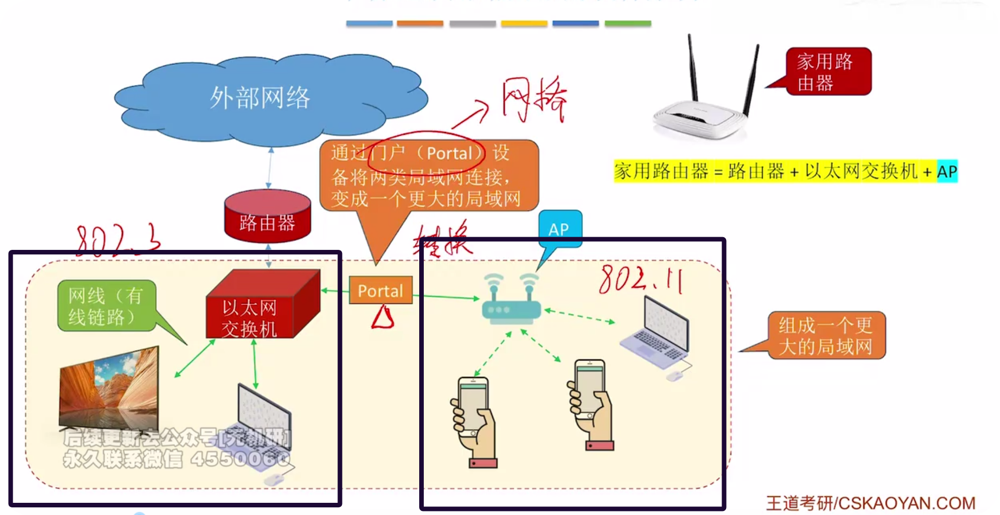
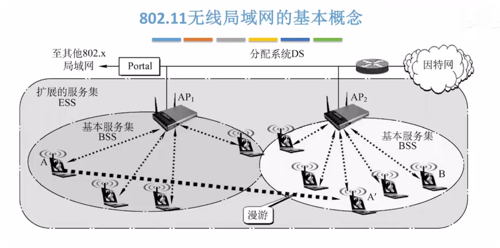
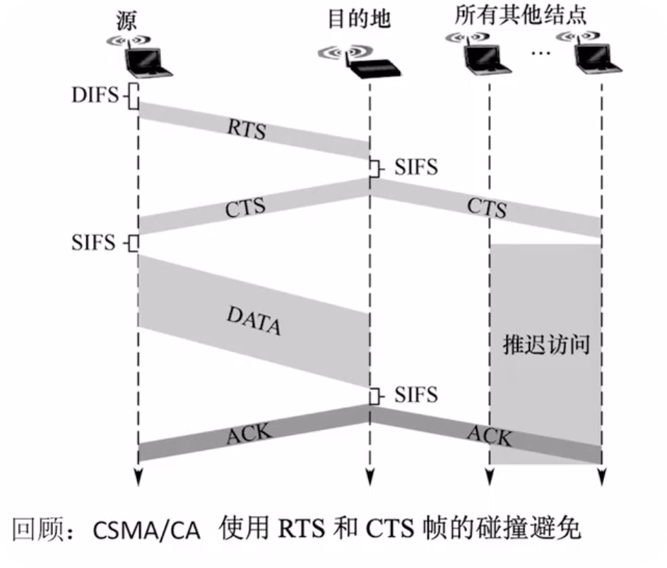
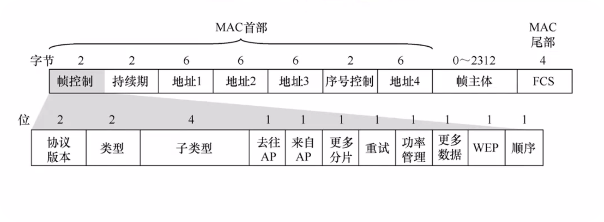
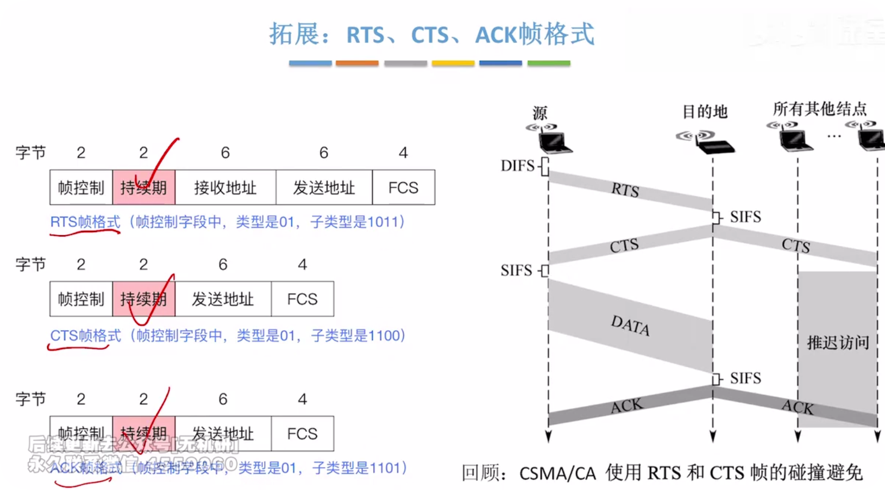

## 1. 前言

无线局域网有2类:

- 有固定设施的无线局域网: 如802.11无线局域网(WIFI)

- 无固定基础设施的移动自组织网络: 比如苹果隔空投送，华为分享.(不经过路由器)


## 2. 无线局域网




​	上图中，左边方框内属于802.3标准的以太网, 右边方框内属于802.11标准的无线局域网.

以太网交换机和无线局域网的AP之间通过门户Portal连接, 组成了一个更大的局域网,此时手机和电视之间属于同一一个局域网, 因此可以使用电视投屏功能.

门户Potal可以将802.3标准的MAC帧和802.11标准的MAC帧相互转换.





- 802.11无线局域网是星型拓扑, 中心叫做接入点(Access Point, AP), 也叫做无线接入点(Wireless Access Point, WAP).
- 基本服务集BSS: 1个基站(AP) + 多个移动站; 说人话就是1个Wifi热点连接了很多台手机电脑
  - 服务集标识符SSID: Service Set IDentifier; 无线局域网名称; 说人话就是WIFI热点的名字
  - 基本服务区BSA：基本服务集地理范围;   说人话就是站在哪儿可以搜到WIFI.
- 门户Portal： 可以将802.11无线局域网接入到802.3有线以太网.


上图中,AP1组成的服务集和AP2组成的服务集组成了一个拓展服务集ESS(Extend Service Set);

- 扩展服务集ESS: 将多个AP连接到同一个分配系统,组成一个更大的服务集,说人话就是全屋WIFI.

- 漫游: 一个移动站从一个基本服务集切换到另一个基本服务集,仍然可以保持通信; 说人话就是丝滑切换Wifi热点.

AP1和AP2使用的都是ESS的SSID.


## 3. 802.11帧分类



有三种帧类型

- 数据帧
- 控制帧: 如ACK、RTS、CTS帧
- 管理帧: 如探测请求、探测响应帧

 


## 4. 802.11帧格式



- 数据帧首部: 30字节.
- 帧主体: 0 ~ 2312字节.
- 尾部: 4字节的 CRC校验码.


802.11 MAC帧首部一共有30字节 , 下面详细介绍MAC首部每个字段含义.


- 帧控制: 2字节
  - 协议版本: 2bit
  - 类型: 2bit
    - 00: 管理帧
    - 01: 控制帧
    - 10: 数据帧
  - 子类型: 4bit
    - 0000: 数据帧
    - 1011: RTS
    - 1100: CTS
    - 1101: ACK
  - 去往AP & 来自AP: 2bit
    - 10: 发送给AP的
    - 01: AP发过来的
- 持续期: 2字节
- 地址1: 6字节
- 地址2: 6字节
- 地址3: 6字节
- 序号控制: 2字节
- 地址4: 6字节： 不用管


三个地址是MAC地址, 它们的值由帧控制中去往AP和来自AP两个bit的值来决定.

```cpp
去往AP: 中起止;
来自AP：止中起;
```


## 5. 拓展: RTS、CTS、ACK帧格式



