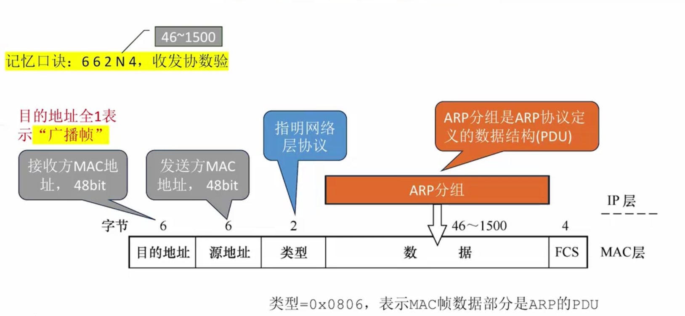

## 1. ARP要点总结





当MAC帧的类型字段=0x0806时, 表示MAC帧数据部分时ARP的PDU.


- 回顾

  - MAC地址48bit, 是网络适配器出厂时分配好的,全球唯一
  - 一台主机至少有一个网络适配器(网线插口背后的芯片), 因此一个主机至少有一个MAC地址
  - 一台路由器有多个转发接口,每个接口背后都是一个网络适配器, 因此路由器有多个MAC地址

- ARP

  - 作用: 用于查询同一局域网内IP地址与MAC地址之间的映射关系

  - ARP表(ARP缓存)

    - 记录IP地址与MAC地址之间的映射
    - 一个数据结构,每台主机每台路由器都有自己的ARP表
    - 需要定期更新ARP表项
  
- 过程

  - ARP请求分组 
    - 我的IP地址是x.x.x.x， 我的MAC地址是Y
    - 我想查询IP地址是Z.Z.Z.Z的MAC地址
    - 封装进MAC帧, MAC帧目的地址=全1, 源地址=Y
  - ARP响应分组
    - 我就是你要找的那个IP地址为Z.Z.Z.Z的主机, 我的MAC地址是V
    - 封装进入MAC帧, MAC帧目的地址=Y,源地址=V
  - 总结: 广播找人,单播回复

  


## 2. ARP报文格式


```Tex
 0                   15 16                  31
+----------------------+----------------------+
| Hardware Type(2 Byte)| Protocol Type(2Byte) |
+----------------------+----------------------+
| HLen     | PLen      | OPCode (2Byte)       |
+----------------------+----------------------+
| Sender MAC Address (6 Bytes)                |
+---------------------------------------------+
| Sender IP Address  (4 Bytes)                |
+---------------------------------------------+
| Target MAC Address (6 Bytes)                |
+---------------------------------------------+
| Target IP Address  (4 Bytes)                |
+---------------------------------------------+
```


- Hardware Type

  - 硬件类型(或者叫做底层网络类型)
  - 这个值通常是0x0001, 表示底层网络类型是以太网.

- Protocol Type

  - 上层协议类型
  - 这个值通常是 0x0800, 表示上层协议是IPv4; (注意, ARP协议不会用于IPv6)

- HLen

  - Hardware Address length: 硬件地址长度
  - MAC地址的长度, 这个值通常是6. 即MAC地址长度是48比特

- PLen

  - Protocol Address length; 
  - IP地址长度, 因为ARP一般用于IPv4, 所以这个值一般是0x04,即4个字节,32比特.

- OPCode

  - 操作码；指明ARP报文是请求报文还是答复报文
  - 值为0x0001: ARP Request
  - 值为0x0002: ARP Reply

- Sender MAC Address

  - 发送方的MAC地址

- Sender IP Address

  - 发送方的IP地址

- Target MAC Address

  - 目的MAC地址

- Target IP Address

  - 目的IP地址

  


几个问题:

一个ARP分组只有28字节, 但是一个以太网帧最小长度是64字节, 这里面如何填充?

