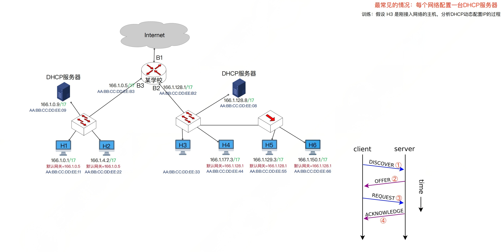
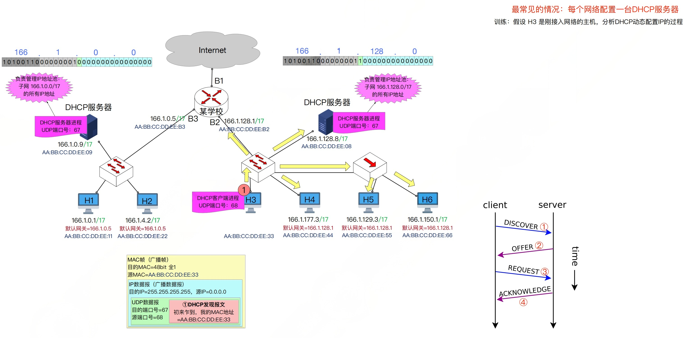
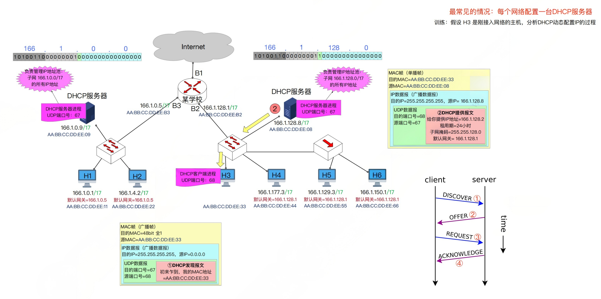
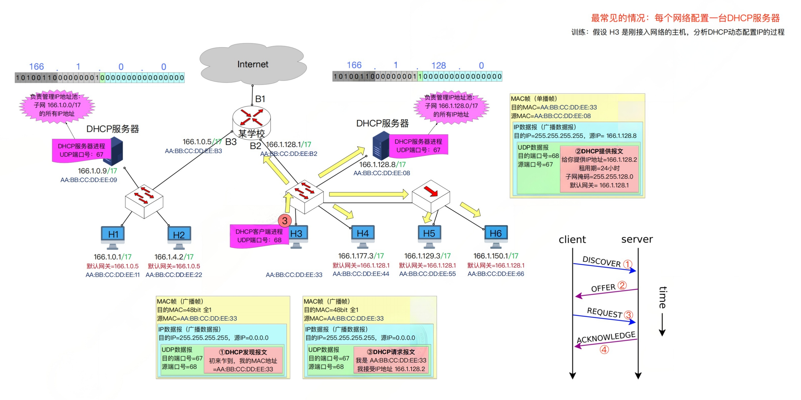
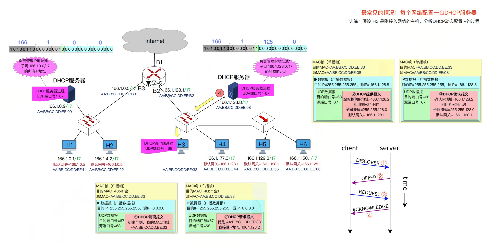

## 1. 基本概念

- DHCP的作用: 给刚接入网络的主机动态分配IP地址、配置默认网关、子网掩码
- DHCP使用C/S模型
  - DHCP客户: 就是新接入网络的主机(希望获得IP地址等配置)
  - DHCP服务器
    - 就是负责分配IP地址那台主机, 管理一系列IP地址池
    - 注: 家庭网络中, 通常用家庭路由器兼职DHCP服务器
    - 在一个大型网络中可以有多台DHCP服务器
- DHCP是应用层协议,基于UDP, 客户端端口号=68，服务端端口号=67

## 2. 演示

H3是一个刚接入互联网的主机, 此时它还没有自己的IP地址, 也没有默认网关和子网掩码.

H3需要向DHCP服务器申请这些东西, 流程如下

H3是Client, DHCP服务器是Server

- Client 向 Server 广播 Discover 报文
- Server 向 Client 广播 Offer 报文
- Client 向 Server 广播 Request 报文
- Server 向 Client 广播 Acknowledge 报文

### 2.1 Client广播Discover报文

注意DHCP客户的报文格式，

- MAC帧层面: 目的MAC = 48bit 全1; 源MAC = 自己的MAC;
- IP数据报层面: 
  - 目的IP = 255.255.255.255; 32位全1，表示有限广播地址，只在本网络上进行广播.
  - 源IP = 0.0.0.0; 表示本网络上的本主机
- UDP层面：
  - 目的端口 = 67
  - 源端口 = 68
  - 数据：DHCP发现报文

无论是MAC帧层面还是IP分组层面, 目的地址都是广播地址, 但是只有DHCP服务器会接收.因为只有DHCP服务器才会有67号端口的进程, 其它普通主机不可能占用67端口, 这是互联网标准规定的.

### 2.2 Server 发送 Offer报文

Offer报文在网络层是一个广播数据报, 但是在链路层是一个单播帧, 格式如下:

- DHCP提供报文
  - 提供的IP地址
  - 租用期
  - 子网掩码和默认网关
- UDP层面
  - 目的端口68
  - 源端口67
- IP数据报层面
  - 源IP: DHCP服务器IP
  - 目的IP: 255.255.255.255; 表明这也是个广播地址
- MAC帧层面:
  - 源MAC: DHCP的MAC;
  - 目的MAC: H3的MAC

几个问题:

- 为什么MAC层面不是用的广播地址?

  - 因为DHCP客户端先广播了发现报文, 服务器可以从报文中提取出客户端的MAC地址

    

- 为什么IP层面的目的地址还是用的广播地址?
  - 因为此时H3主机还没有自己的IP地址, IP地址还在申请中.

- 如何保证只有H3主机会接收DHCP服务器的Offer报文?
  - 虽然IP地址是广播地址，但是根据目的MAC地址, 只有H3会接收.

### 2.3 Client 发送 Request 报文

- DHCP请求报文
  - 在该报文中说明接受的IP地址
  - 此IP地址是 Offer报文中提供的IP地址
- UDP层面
  - 目的端口
  - 源端口
- IP层面
  - 目的IP仍然是 255.255.255.255
  - 源IP还是 0.0.0.0
- MAC帧层面
  - 目的MAC地址: 48比特全1
  - 源MAC： H3的MAC

几个问题:

- 为什么IP层面的源IP还是0.0.0.0
  - 因为此时H3还没有配置好, 也就没有自己的IP地址
- 为什么IP层面的目的IP还是255.255.255.255 即广播数据报?
- 为什么MAC帧层面的目的MAC 还是48bit的全1? 按理说此时H3已经知道了DHCP服务器的MAC地址, 直接点对点通信不好吗?
  - 上面两个问题是同一个答案.
  - 因为在一个大型局域网内，可能有几千台主机，然后有多台DHCP服务器.
  - 第一步发送Discover报文的时候, 多台DHCP服务器都会收到该报文
  - 第二步，多台DHCP服务器都会向H3返回offer报文
  - 第三步, H3会收到多台DHCP的Offer， 但是只能选择一个. 所以H3需要广而告之, 自己最后接受的是哪一个IP地址(哪一个Offer).

### 2.4 Server发送ACK报文

 

ACK报文里面的内容和Request报文里面的内容差不多.

仍然包含下面东西

- 确认IP地址
- 租用期
- 子网掩码
- 默认网关

就是确认了，这些东西将会分配给你.

一个问题:

- 为什么IP层面，目的IP还是255.255.255.255?
  - 因为H3是在走IP申请流程, 流程还没有走完, H3自然暂时就没有属于自己的IP地址.

### 2.5 总结

- DHCP发现报文
  - 携带信息: Client的MAC地址， 好可以提出对IP地址租用期的要求
  - 网络层: 源IP = 0.0.0.0, 目的IP = 255.255.255.255 (广播IP数据报)
  - 链路层: 源MAC = 客户MAC, 目的MAC= 全1(广播帧)
- DHCP提供报文
  - 携带信息: 给客户分配的IP地址、租用期、子网掩码和默认网关
  - 网络层: 源IP=服务器IP， 目的IP=255.255.255.255(广播IP数据报)
  - 链路层: 源MAC= 服务器MAC, 目的MAC = 客户MAC(单播帧)
- DHCP请求报文
  - 携带信息: 客户机确认要使用的IP地址
  - 网络层: 源IP=0.0.0.0, 目的IP=255.255.255.255(广播IP数据报)
  - 链路层: 源MAC=客户MAC, 目的MAC=全1(广播帧)
- DHCP确认报文
  - 携带信息: 与提供报文类似
  - 网络层: 源IP=服务器IP, 目的IP=255.255.255.255(广播IP数据报)
  - 链路层: 源MAC= 服务器MAC, 目的MAC=客户MAC(单播帧)
