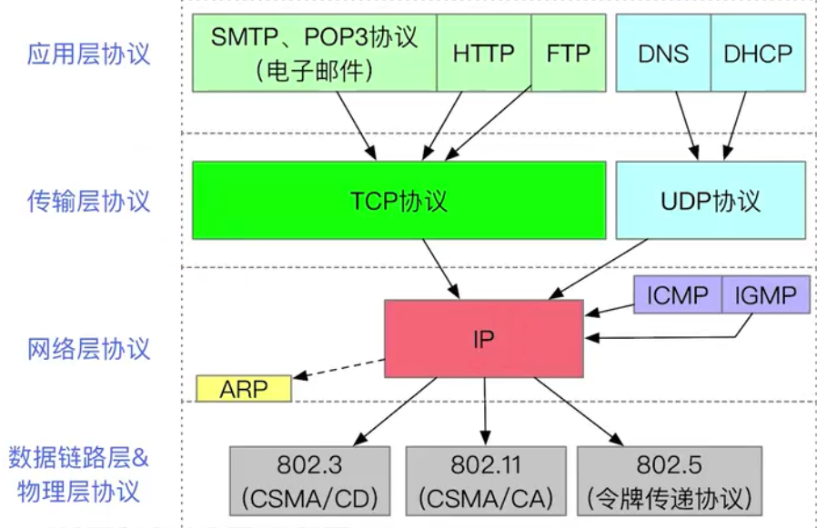
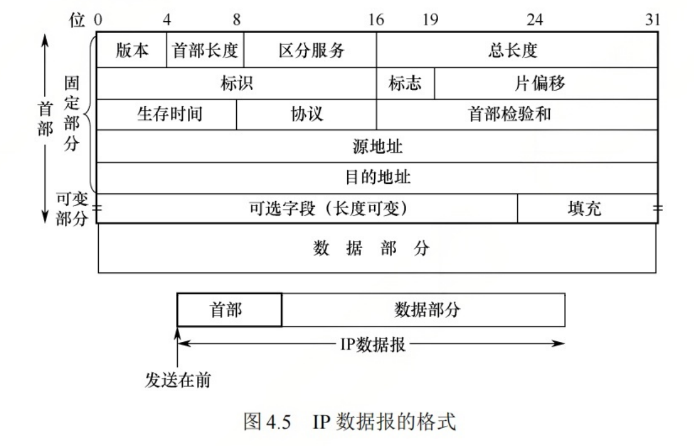
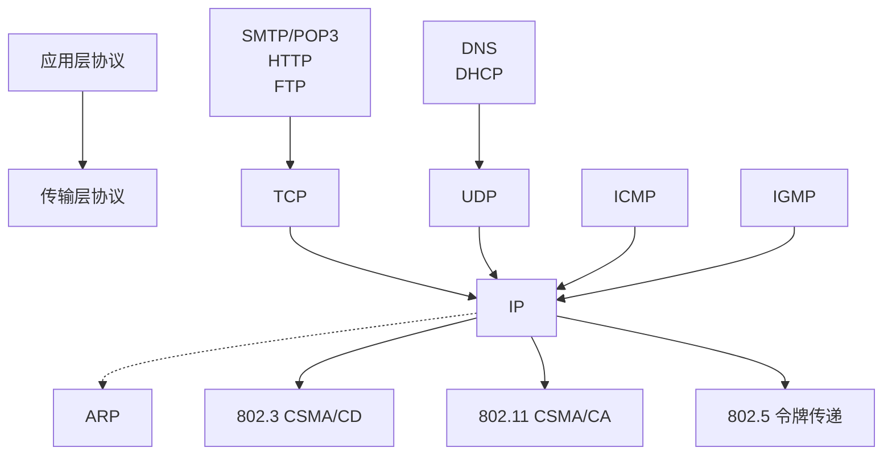

## 1. 网络层的功能

 

网络层提供`主机到主机的通信服务`,主要任务是将分组从源主机经过多个网络和多段链路传输到目的主机.

- 异构网络互联
  - 如何理解"异构"?
    - 每个网络的拓扑结构不同,物理层和链路层的实现不同, 主机类型也各不相同.
  - 重要的设备:路由器 Router
  - 注: 在TCP/IP文献中, **路由器也叫做网关(GateWay)**
- 路由与转发
  - 路由
    - 各个路由之间相互配合, 规划IP数据报(分组)的最佳转发路径(**注: 网络层中IP数据报和IP分组等价**)
    - 注: 各个路由需要运行路由协议,最终生成各自的路由表.
  - 转发
    - 一台路由器根据自己的转发表, 将接收到的IP数据报从合适的接口转发出去
    - 注: 转发表 =精简版路由表. 更精简的数据结构有助于快速检索
- 拥塞控制
  - 拥塞
    - 原因: 网络上出现过量分组, 超负荷,引起网络性能下降.
    - 现象: 网络上的分组数量增加, 但吞吐量反而降低
  - 拥塞控制方法
    - 开环控制(静态方法): 在部署网络时,就要提前设计好预防拥塞孔塞的方法,一旦网络开始运行,就不再修改
    - 闭环控制(动态方法): 相关路由器及时调整路由表.

## 2. 各层协议之间的服务关系

- ARP协议用于查询同一网络中的**主机IP地址与MAC地址之间的映射关系**.
- ICMP协议用于网络层实体之间相互通知异常事件
- IGMP协议用于实现IP组播

## 3. IP数据报格式

一个IP数据报由`首部 + 数据部分`组成, 首部的长度可变, 最小是20字节, 最大是60字节. 整个数据报的最大长度为65535字节.

- 版本: 4bit
  - IPv4: 4
- 首部长度: 4bit
  - 以4Byte为单位, 表示IPv4数据报的首部长度.
  - 假如该值为5，则首部长度为 5 * 4B = 20Byte.
- 区分服务: 8bit
  - 考研里面不重要
- 总长度: 16bit
  - 表示首部和数据部分的总长度。
  - 数据报的最大长度为 2^16^ -1 = 65535 Byte.
- 标识: 16bit
  - 一个计数器, 每当产生一个数据报就+1,赋值给标识字段. 它不是序号.
  - 当一个数据报的长度超过链路层MTU时, 就要分片, 分片会复制这个标识, 这样的同一个数据报的很多分片会共用这个标识, 接收方可以把相同标识的分片重新组合成一个完整的数据报.
- 标志: 3bit
  - 第0位: 保留, 必须为0
  - 第一位: DF(Don't Fragment)
    - DF = 1; 不允许分片; 若数据报长度超过MTU, 路由器会丢弃并向源主机发送ICMP错误.
    - DF = 0; 允许分片
  - 第二位: MF(More Fragments)
    - MF = 1; 后面还有分片
    - MF = 0; 这是最后一个分片(或者没有分片)
- 片偏移: 13bit
  - 表示当前分片在原始数据报中的相对位置, 单位是8Byte
  - 例如: 偏移量是100, 表示该分片的数据起始位置在原始数据的第800字节处(100 * 8);
  - 注意: 除了最后一个分片外, 每个分片的数据长度必须是8字节的整数倍
- 生存时间(TTL, Time to Live)
  - 表示数据报在网络中最多可以经过的路由器跳数. 
  - 每经过一个路由器, TTL就减1(先减后发).当TTL为0时, 路由器丢弃数据报,并向源地址发送ICMP消息
- 协议: 8bit
  - 表示此数据报携带的数据使用哪种协议
    - 1: ICMP
    - 6: TCP
    - 17: UDP
    - 89: OSPF
  - 接收端根据该字段将数据交给对应的传输层或网络层模块
- 首部校验和(Header Checksum): 16bit
  - 仅仅对IP首部进行校验, 不校验数据部分.
- 源IP地址: 32bit
- 目的IP地址: 32bit
- 首部可选部分: 0 ~ 40 BYTE

