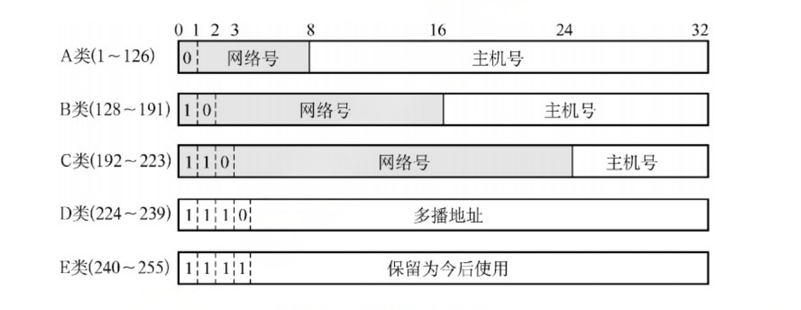
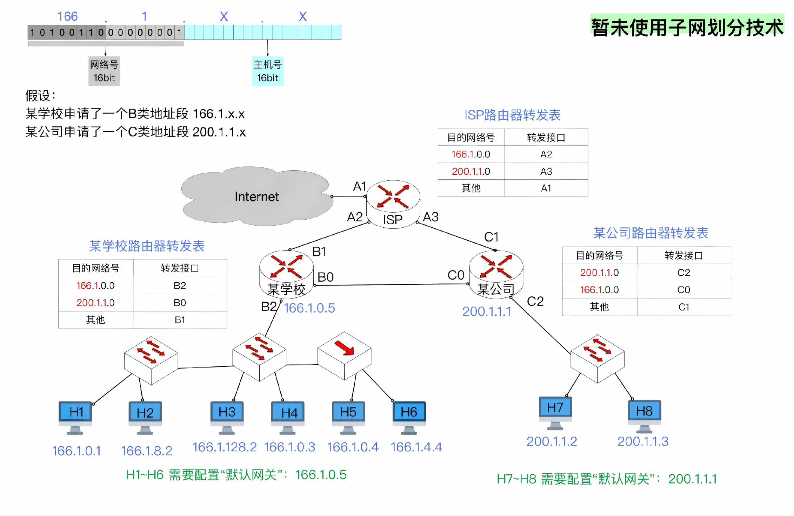

## 1. ABCDE类网络

IP地址分类经过下面的演化.

1. 最初分类ABCDE
2. 子网划分
3. CIDR
4. NAT

IP地址最初被分为ABCDE一共5类,  ABC为单播地址, D为多播地址, E是保留。多播地址是为了实现ID多播,或者IP组播.

无论哪类IP地址, 都由网络号和主机号构成, `IP地址 = {<网络号>, <主机号>}`.

- 网络号标志主机或路由器连接到的网络
- 主机号标志该主机或路由器.

一个网络号在互联网范围内必须唯一, 一个主机号必须在网络号指明的范围内唯一.

##  2. 一些特殊用途的IP地址

| 网络号 | 主机号 | 含义                                     | 作为分组源地址?      | 作为分组目的地址? |
| ------ | ------ | ---------------------------------------- | -------------------- | ----------------- |
| Y      | 全0    | 表示整个网络本身, 只能用于路由表或转发表 | 不能                 | 不能              |
| Y      | 全1    | 表示本网络的广播地址                     | 不能                 | 可以              |
| 0      | Y      | 表示本网络中主机号为Y的主机              |                      |                   |
| 0      | 0      | 表示本网络上的本主机                     | 能，DCHP协议中用到了 | 不能              |
| 全1    | 全1    | 向本网络广播IP分组                       | 不能                 | 可以              |
|        |        |                                          |                      |                   |

上面这些特殊IP地址不能指派给网络中的主机或者路由器.

总结一下:

- 主机号全部为0, 表示本网络本身
- 主机号全部为1, 表示本网络的广播地址

所以每个网络中最大主机数要-2.

- 127.x.x.x 表示保留作为本地软件的环回测试
- 网络号不能全部为0.

所以A类最大可用网络数-2

- 32位全部位1, 即255.255.255.255, 表示受限广播地址, 只在本网络上进行广播
- 32位全部为0, 0.0.0.0, 表示本网络上的本主机

一个问题: **32位全为1和主机号全位1但是网络号为Y的广播地址有什么区别?**

有限广播: 32位全为1，即255.255.255.255, 表示只在本网络上进行广播, 交换机会广播，但是路由器不会广播

子网广播: 主机号全为1，网络号为Y. 路由器可以广播到特定子网内所有主机(但是通常不会，需要配置).

| 网络类别 | 最大可用网络数 | 第一个可用网络数 | 最后一个可用网络数 | 每个网络中最大主机数 |
| :------: | :------------: | :--------------: | :----------------: | :------------------: |
|    A     |    2^7^ -2     |        1         |        126         |       2^24^-2        |
|    B     |     2^14^      |      128.0       |      191.255       |       2^16^-2        |
|    C     |     2^21^      |     192.0.0      |    223.255.255     |        2^8^-2        |

## 3. IP分组的转发

首先要明白几件事情:

- 路由器和路由器之间的连接,可以不分配IP地址.
- 路由器和其它节点连接的接口必须分配IP地址
- 默认网关是通往外部世界的第一跳路由器, 当设备不知道如何到达目的IP时, 就把IP分组丢给默认网关处理.

**1. H1给H7发送IP数据报**

- H1封装IP数据报, {<H1的IP地址>, <H7的IP地址>, <数据部分>}
- H1组帧
  - H1先判断H7的IP的网络号是否和自己相同,这里不相同
    - 相同则说明在同一个局域网内，不需要经过默认网关处理
    - 不相同则不在同一个局域网，IP数据报就要丢给默认网关处理.
  
  - H1的默认网关是B2, 即H1要发送的IP数据报的第一跳路由器是B2.
  - 帧内容 {<B2的MAC地址>, <H1的MAC地址>, <H1的IP地址>, <H7的IP地址>, <数据部分>}.
  
- B2接收到H1的以太网帧. 
  - 首先检查目的地址, 即H7的IP地址. 得到H7的网络号
  - B2查询路由器转发表, H7所在的网络要从B0接口转发出去.
  - B2修改帧内容, {<C0的MAC地址>, <B0的MAC地址>,< H1的IP地址>，<H7的IP地址>, <数据部分>}
- C0收到帧后
  - 查询H7的网络号和MAC地址.
  - 修改帧 {<H7的MAC地址>, <C2的MAC地址>, <H1的IP地址>, <H7的IP地址>, <数据部分>}
  - 从C2接口把帧转发出去.
- H7接收到帧.

上面的过程中, IP数据报一直没有变化, 但是以太网帧的两个MAC地址每经过一个路由器就要改变一次.

**2. H1给H6发送IP分组**

- H1构造IP数据报, {<H1的IP地址>, <H6的IP地址>, <数据部分>}
- H1组帧
  - 先判断H6的网络号是否和自己相同
  - 发现在网络号相同, 说明在同一个局域网里面. 那么就不需要发送给默认网关了, 直接查询H6的MAC地址
  - 帧内容{<H6的MAC地址>, <H1的MAC地址>, <H1的IP地址>, <H6的IP地址>, <数据部分>}
- 帧通过交换机进行传输
- 最后传输到集线器上
  - H5和H6都会收到H1的以太网帧
  - 通过比对MAC地址, 只有H6会接收这个帧, H5会直接丢弃

