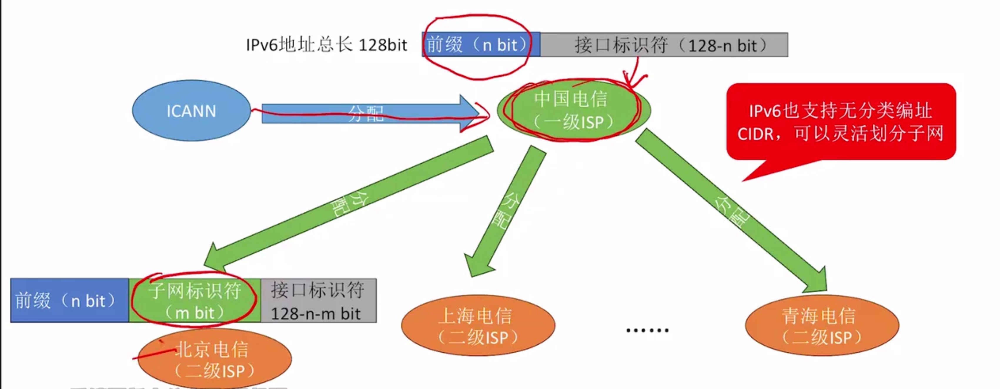

## 1. IPv6记法

- IPv4是点分十进制记法: 

  - 总共32bit, 8bit为一段, 记录为十进制, 段间以小数点分隔

  - 11000000 10101000 00000001 00000001  --> 192.168.1.1


- IPv6的冒号十六进制记法: 
  - 总共128bit, 16bit为一段, 记录为16进制, 段间以冒号分隔
  - 0010 0000 0000 0001 0000 1101 1011 1000
  - 1000 0101 1010 0011 0000 0000 0000 0000
  - 0000 0000 0000 0000 1000 1010 0010 1110
  - 0000 0011 0111 0000 0111 0011 0011 0100
  - 冒号十六进制记法:
    - 2001:0db8:85a3:0000:0000:8a2e:0370:7334
  - IPv6地址的压缩记法
    - 先去除每个分段的前导0
      - 2001:db8:85a3:0:0:8a2e:370:7334
    - 再用双冒号"::"代替连续出现的多个0
      - 2001:db8:85a3::8a2e:370:7334
      - 注意一个地址中只能出现一次双冒号, 否则会产生歧义


**练习: 下面哪一个压缩地址是非法的IPv6表达形式?**

- A. 2001:db8:1:2:3:4:5:6
- B. 2001:db8:0:0:0::1
- C. 2001:db8::1
- D. ::1
- E. 2001:db8::
- F. ::


C项错误, 一个IPv6地址中不允许出现两次::

- A项, 2001:0db8:0001:0002:0003:0004:0005:0006
- B项, 2001:0db8:0000:0000:0000:0000:0000:0001
- D项, 0000:0000:0000:0000:0000:0000:0000:0001 
- E项, 2001:0db8:0000:0000:0000:0000:0000:0000

- F项, 0000:0000:0000:0000:0000:0000:0000:0000.   表示未指明地址.


## 2. IPv6地址的分类

- 未指明地址
  - 0000.....0000(128位全0)， 可记为::/128
  - 表示"无地址", 一台主机刚接入网络的时候,此时还没有IP地址, 就可以记作全0
  - 类似于IPv4的0.0.0.0
- 环回地址
  - 0000.....0001(最后一位是1), 可记为::1/128
  - 自己和自己通信的地址.
  - 类似于IPv4的127.0.0.1
- 多播地址
  - 11111111(前8位全是1), 可记为FF00:/8
  - 前8位全是1的地址是多播地址，
- 本地链路单播地址
  - 1111111010(10位), 可记为FE80::/10
  - 局域网内通信, 不会被路由器转发
  - 类似于IPv4的192.168.x.x
- 全球单播地址
  - 除上述四种外的其它所有IPv6地址.


IPv6数据报的目的地址有以下三种基本类型:

- 单播(unicast): 传统的点对点通信
- 多播(muticast): 一对多点的通信, 数据报发送到一组计算机中的每一台
- 任播(anycast): IPv6增加的一种类型, 任播的终点是一组计算机, 但是数据报只交付其中一台计算机, 通常是距离最近的一台计算机
  - 应用: 多个DNS服务器共享一个任播地址.

## 3. IPV6地址资源的分配




中国电信向ICANN申请一个IPv6地址块，前面n bit不可以动.

- IPv6同样支持CIDR无分类编址,划分子网
- 二级ISP，在后面 128-n 比特中,抠出m比特来划分子网
- 这样就剩下了128-n-m 比特. 叫做接口标识符, 类似于IPv4中的主机号.


## 4. IPv6报文格式

### 4.1 整体报文格式

```tex
+------------------------+
| IPv6 Basic Header      |  固定 40BYTE
+------------------------+
| Extension Header(s)    |  可选
+------------------------+
| Upper-Layer Payload    |  TCP/UDP/ICMPv6 等
+------------------------+
```


相较于IPv4, IPv6特点如下:

- 基本首部长度固定 40 字节
- 取消了ARP协议.
- IPv6可以不使用DHCP协议.


### 4.2 基本首部格式


```tex
                                                             
    0      4              12       16             24               31
   +-+-+-+-+-+-+-+-+-+-+-+-+-+-+-+-+-+-+-+-+-+-+-+-+-+-+-+-+-+-+-+-+
   |Version| Traffic Class |           Flow Label                  |
   +-+-+-+-+-+-+-+-+-+-+-+-+-+-+-+-+-+-+-+-+-+-+-+-+-+-+-+-+-+-+-+-+
   |         Payload Length        |  Next Header  |   Hop Limit   |
   +-+-+-+-+-+-+-+-+-+-+-+-+-+-+-+-+-+-+-+-+-+-+-+-+-+-+-+-+-+-+-+-+
   |                                                               |
   |                     Source Address (128 bits)                  |
   |                                                               |
   |                                                               |
   +-+-+-+-+-+-+-+-+-+-+-+-+-+-+-+-+-+-+-+-+-+-+-+-+-+-+-+-+-+-+-+-+
   |                                                               |
   |                  Destination Address (128 bits)               |
   |                                                               |
   |                                                               |
   +-+-+-+-+-+-+-+-+-+-+-+-+-+-+-+-+-+-+-+-+-+-+-+-+-+-+-+-+-+-+-+-+
```


下面是各个字段的详细解释


| 字段                | 位宽    | 作用                                        |
| ------------------- | ------- | ------------------------------------------- |
| Version             | 4 bit   | 协议版本，IPv6固定为 `0x6`                  |
| Traffic Class       | 8 bit   | 流量类别（DSCP+ECN，用于 QoS）              |
| Flow Label          | 20 bit  | 流标签，标识特定数据流                      |
| Payload Length      | 16 bit  | 载荷长度（扩展头 + 上层数据）               |
| Next Header         | 8 bit   | 下一个头部类型（扩展头 / 传输层协议）       |
| Hop Limit           | 8 bit   | 跳数限制(防止环路，与IPv4 的 TTL作用差不多) |
| Source Address      | 128 bit | 源 IPv6 地址                                |
| Destination Address | 128 bit | 目的 IPv6 地址                              |


-  Payload Length
  - 载荷长度, 指的是 扩展首部加上数据部分的总长度是多少字节
  - 16bit, 意味着理论上一个IPv6分组一次性最多携带 2^16^ =65535 字节数据
- Next Header

​	

- Hop Limit
  - 跳数限制，和IPv4的TTL作用相同
  - 每到达一个路由器-1.


