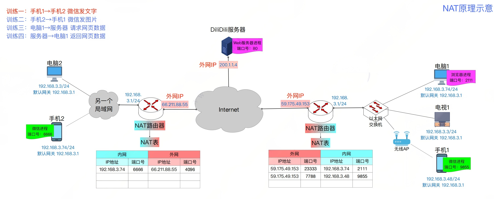

## 1. NAT要点总结

网络地址转换: Network Address Translation 简称NAT. 是指通过专用网络地址转换为公用网络地址，从而对外隐藏内部管理的IP地址，它使得整个专用网只需要一个全球IP地址就可以与互联网连通。

- 私有IP地址(内网IP)
  - 10.0.0.0 ~ 10.255.255.255
  - 176.16.0.0 ~ 172.31.255.255
  - 192.168.0.0 ~ 192.168.255.255
  - 上述地址只允许分配给局域网内部节点，不允许分配给互联网上的节点。
- 全球IP地址(外网IP)
  - 通常由ISP提供, 全球唯一
  - 外网IP是一个局域网与外界通信时所需要使用的IP地址
- NAT路由器
  - 作用: 转发IP数据报时, 进行内网IP、外网IP的相互转换。
  - NAT表, 记录地址转换关系 , {内网IP:端口号} <==> {外网IP:端口号} 之间的映射关系.
  - NAT路由器包含传输层的功能(因为端口号是传输层的概念).

一个问题: 为什么NAT技术缓解了IP地址资源耗尽的问题?

因为在传统网络中，每个主机都有一个唯一的IP地址, 不够用.

但是NAT技术可以让局域网内的很多主机共享一个IP地址, 只要保证主机IP地址在本局域网里面唯一就可以了.

## 2. 示例练习

**1. 手机1给手机2微信发送文字**

- 手机1传输层封装数据报
  - TCP源端口: 9855
  - TCP目的端口: 4096
- 手机1网络层封装
  - 源IP: 192.168.3.1
  - 目的IP: 66.211.88.55
- 手机1的NAT路由器根据NAT表修改端口和源IP并转发1的数据报
  - TCP源端口 ==> 7788
  - 源IP ==>59.175.49.153
  - 目的端口和目的IP地址不变
- 手机2的NAT路由器接收到数据报, 修改目的端口和目的IP地址,并转发到自己的内网
  - TCP目的端口  ==> 6666
  - 目的IP ==> 192.168.3.74

- 最后,手机2成功接收到手机1发送的信息

**2. 总结**

- NAT路由器会把内网发往外网的数据包, 根据NAT表里面的映射关系进行修改, 修改了源IP和源端口。

- NAT路由器在把从外网接收到的数据报转发到内网之前，也会根据NAT表修改目的IP和目的端口.