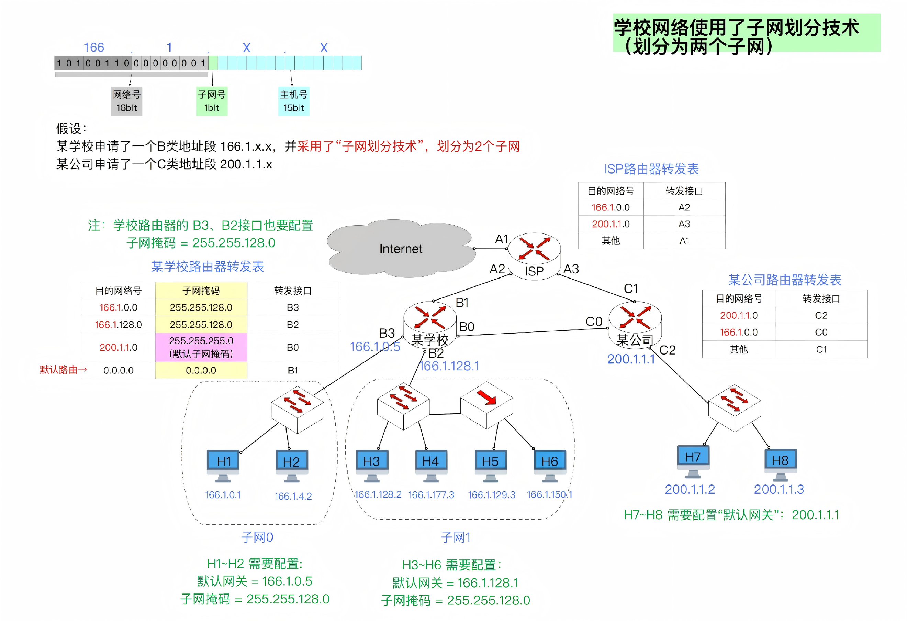
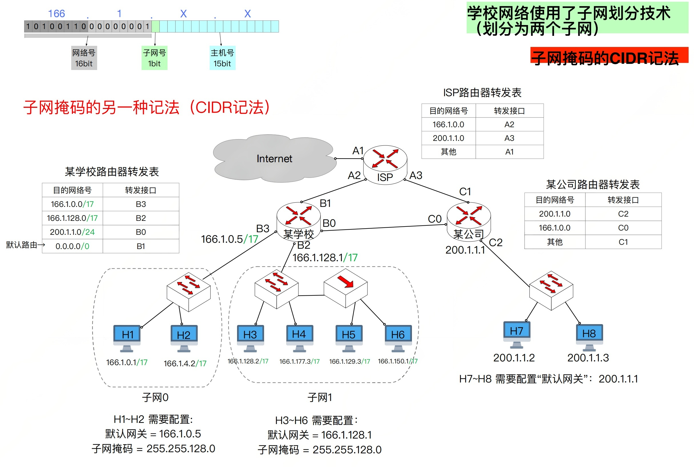

## 1. 子网划分技术

- 子网划分

  - 原理: 假设某单位租用了一个IP地址段, 原本主机号占用n bit, 可以前k bit抠出来作为子网号,用剩余的n-k bit作为主机号, 这样就划分出2^k^个子网，每个子网包含的IP地址块大小相等
  - 子网划分前, IP地址为两级结构， {<网络号>， <主机号>}
  - 子网划分后, IP地址为三级结构, {<网络号>, <子网号>, <主机号>}
  - 注意, 每个子网中,主机号不能全部为0或者全部为1;  全0表示子网本身, 全1为子网广播地址 

- 子网掩码

  - 作用: 用子网掩码、IP地址进行按位与操作, 计算出<网络号>,<子网号>; 可以合称为网络前缀.

- 默认子网掩码

  - 如果一个传统网络(ABC类)内部没有进行子网划分,可以将对应此网络的转发表项设置为默认子网掩码
  - A类默认: 255.0.0.0
  - B类默认: 255.255.0.0
  - C类默认: 255.255.255.0

- 默认路由

  

示例: 将一个C类网络 208.115.21.0 划分成四个子网. 每个子网的网络地址是多少?

分析如下:

- C类网络前三个字节是网络号, 即 208.115.21.xx 不用管
- 四个子网，需要2bit表示, 也就是要从主机号中抠出两比特来表示子网号
- 00xx xxxx, 01xx xxxx, 10xx xxxx, 11xx xxxx
- 子网中，主机号全部为0的地址表示的是子网地址.
- 0000 0000, 0100 0000, 1000 0000, 1100 0000
- 四个子网如下:
  - 208.115.21.0
  - 208.115.21.64
  - 208.115.21.128
  - 208.115.21.192

## 2. 子网划分下的IP分组传输过程

**1. 假设H3给H6发送IP数据报**

- 构造IP分组: {<H3的IP>, <H6的IP>, <数据部分>}
- 构造MAC帧
  - 将自己的IP与自己的子网掩码进行按位与
  - 将H6的IP与自己的子网掩码进行按位与
  - 比较两个网络前缀，发现相等,说明在同一个局域网内, 不需要发给默认网关处理
  - MAC帧: <H6的MAC地址><H3的MAC地址><H3的IP><H6的IP><数据部分>

- 交换机接收到MAC帧后发送给集线器
- 集线器继续发送MAC帧
  - H5和H6都会接收到MAC帧
  - H6会接收, H5会丢弃

**2. 假设H1给H3发送IP分组**

- 构造IP分组: {H1的IP地址, H3的IP地址, 数据}
- 构造MAC帧
  - 将自己的IP与自己的子网掩码进行按位与
  - 将H6的IP与自己的子网掩码进行按位与
  - 比较两个网络前缀，发现不相等,说明不是同一个局域网内, 发给默认网关处理
  - MAC帧: <B3的MAC地址><H1的MAC地址><H1的IP><H3的IP><数据部分>

- 学校路由器接收到H1的MAC帧
  - 提取出H3的IP地址
  - 将H3的IP地址与路由器转发表中的子网掩码逐一进行按位操作,得到网络前缀
  - 将网络前缀与目的网络号进行匹配
  - 匹配到166.1.128.0; 转发接口为B2
- 经过层层转发，H3接收到MAC帧.

**3. H1给H7发送IP分组**

一个进行了子网划分的网络如何给一个没有进行子网划分的网络发送IP数据报?

- 构造IP数据报 {<H1的IP地址>,<H7的IP地址>,<数据部分>}
- 构造MAC帧
  - 将H7的IP和自己的子网掩码进行按位与，得到网络前缀
  - 发现H7和自己不属于同一个局域网
  - IP数据报交给默认网关处理, MAC帧中填入B3的MAC地址
- B3接收到H1的MAC帧
  - 提取出H7的IP地址
  - 将H7的IP与路由转发表中的子网掩码逐一按位与, 得到发现和200.1.1.0 匹配;
  - 从B0接口转发出去, 当然同时要修改MAC帧中的相关MAC地址
- C0接收到MAC帧,检查目的IP地址的网络号, 从C2接口转发出去.

## 3. 子网掩码的CIDR记法

如上图, H1: 166.1.0.1/17

- H1的IP地址是166.1.0.1/17
- 17表示前17个比特是1, 后面全是0. 即H1的子网掩码是 255.255.128.0

## 4. 无分类编址CIDR

**传统的IP地址分类方案的缺陷?**

- 一个A类IP地址块: 最多有 2^24^ == 16777216 个IP地址
- 一个B类地址块: 最多有 2^16^ == 65536 个IP地址
- 一个C类地址块: 最多有 2^8^ == 256 个IP地址

假设某单位有2000台主机需要联网, 就不得不申请一个B类地址块. 造成IP地址严重浪费.

