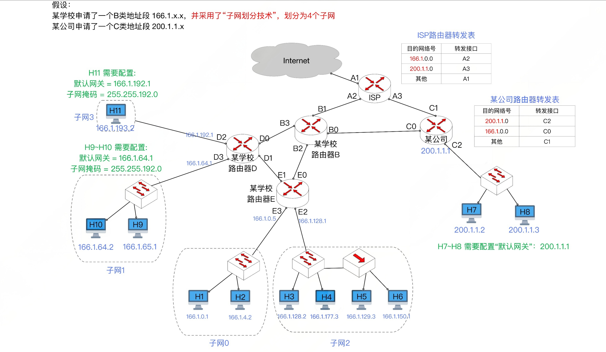
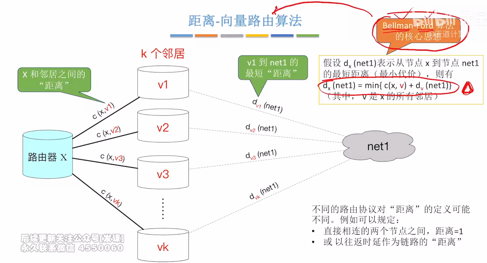
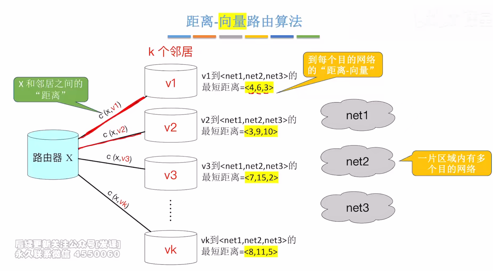
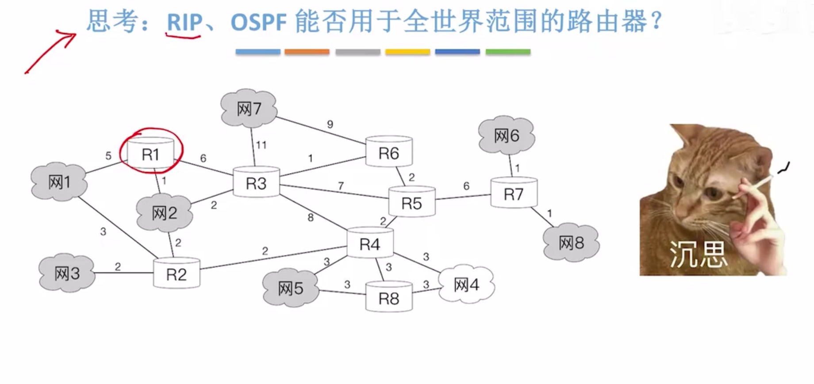
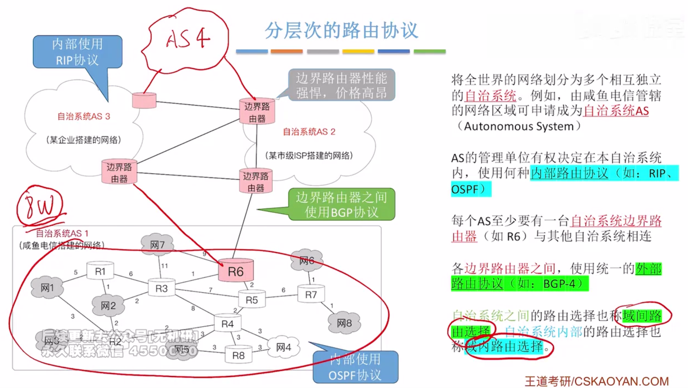

## 1.前言

路由协议和路由算法要解决的问题是**如何让路由器和路由器之间相互配合，自动的生成路由表和转发表.**

路由算法的目标是找到转发IP分组的最佳路径.

- 静态路由: 管理员手工配置路由转发表
- 动态路由: 
  - 距离-向量路由算法
    - RIP路由协议
    - 特点: 路由器不必关心完整的网络拓扑结构. 只需关心和邻居之间的距离、各个邻居和目的网络之间的最短距离.
  - 链路状态路由算法
    - OSPF路由协议
    - 特点: 路由器需要知道完整的网络拓扑结构,在使用迪杰斯特拉算法找到完整路径
  - 路径-向量路路由算法
    - BGP路由协议

- RIP和OSPF路由协议是用在自治系统内部的路由协议.

- BGP路由协议: 用在不同自治系统之间的路由协议

- 某学校内部的网络，包括路由器BDE,还有这些主机, 属于一个自治系统
- 每一个自治系统至少有一个路由器和外部网络相连, 上图中是路由器B与外部网络连接， 因此B叫做边界网关(网关和路由器是一个意思).
- 路由器DE不和外部网络直接相连, 叫做内部网关.

## 2. 距离-向量路由算法

如上图所示

- 路由器X的邻居路由器分别是 V1,V2,V3,,,,,VK
- X到邻居的距离分别是 C(X,V1), C(X,V2), C(X,V3),,,,C(X,VK).
- X的K个邻居到Net1的最短距离分别是 d~v1~(net1), d~v2~(net2), d~v3~(net3),,,,,d~vk~(net1).
- 那么X到Net1的最短路径d~x~(net1) = min{c(x,v) + d~v~(net1)}

不同路由协议对距离的定义可能不同

- RIP协议中, 直接相连的两个节点之间, 距离=1
- 某些协议则以往返时延作为链路的距离.

上面的示例中，只是解释了距离的概念.

那么距离-向量路由算法中的"向量"该怎么解释呢?

- 一片区域有多个网络，Net1,net2,net3
- 路由器V1到这些网络的最短距离就可以用一个向量表示<4,6,3>
- 同理,其它路由器V2,v3,,,,Vk也可以用一个三维向量来表示最短距离
- 这时, 路由器X是一个新接入网络的路由器，它还不知道自己和Net123的距离
- X的邻居可以把向量发送给X, X就可以计算出自己和net123的最短距离了

## 3. 分层次的路由协议

先思考一个问题, 能不能让全世界的路由器都统一运行RIP路由协议或者OSPF路由协议呢?

答案是不能, 以RIP路由协议为例, 它是基于距离-向量路由算法的, 路由器要把自身的距离向量告诉邻居, 网络数量越多,距离向量的维度就越高.

以上图为例, 一共有8个网络，那么距离向量就是8维的, 放眼全球，总共划分了几亿个网络, 使用RIP路由协议不现实.

同样, OSPF路由协议基于链路状态路由算法,要求每一台路由器都要建立整个网络的拓扑图, 在全世界的网络中, 这也是不现实的.

- 将全世界的网络划分成多个相互独立的自治系统AS(Autonomus System)。
- AS的管理单位有权决定在本自治系统内部使用何种路由协议(如RIP, OSPF)
- 每个AS至少有一台自治系统边界路由器(上图中是R6)与其它自治系统相连.
- 各个边界路由器之间使用同一的外部路由协议, 现在是BGP4
- 在自治系统之间选择IP数据报的转发路径,被称作域间路由选择.
- 在自治系统内部选择IP数据报的转发路径, 被称作域内路由选择.

扩展:

- 全世界目前有8W个自治系统
- 每个自治系统拥有全球唯一的AS编号(编号需要向互联网管理机构申请)
- 自治系统之间是平级关系, 不存在包含关系, 就是一个自治系统内部不可能再包好另一个自治系统
- 一个自治系统通常包含一个或多个CIDR地址块(方便路由聚合)

互联网把路由协议划分成两大类

- 内部网关协议: 用于AS内部的路由选择,RIP, OSPF
- 外部网关协议：用于AS之间的路由选择, BGP

如何理解分层次的路由协议?

- 路由协议被分成了2层
- 自治系统AS内部的路由协议和AS之间的路由协议, 就这么简单。

## 4. RIP路由协议

RIP: Routing Information Protocol

RIP是应用层协议, 采用UDP传输, 端口号520.

路由器刚开始工作时, 只知道自己到直接相连的几个网络的距离为1. 每个路由器仅仅和相邻路由器周期性(一般为30s)地交换并更新路由信息, 经过若干次交换和更新后, 所有的路由器最终都会知道到达本自治系统任何网络的最短距离和下一跳路由器的地址, 这个过程叫做收敛.

下面是RIP的相关规定:

- RIP协议中, 每个路由表项有三个字段 <目的网络N, 距离d, 下一跳路由器地址X>

- RIP允许一条路径最多15个路由器, 距离=16表示网络不可达. 距离向量可能会出现环路的情况, 规定最高跳数的目的是防止分组不断的在环路上循环,减少网络拥塞.

  

对于每个相邻路由器发送来的RIP报文, 执行下面步骤:

- 对地址为X的相邻路由器发来的RIP报文, 先修改报文中的所有项目:
  - 把下一跳字段中的地址都改为X.
  - 把所有距离字段的值都加1
- 对于修改后的RIP报文中的每个项目,执行下面步骤:
  - 如果原来的路由表中没有目的网络N
    - 则把该项目添加到路由表中(表明这是新的目的网络)
  - 如果原来的目的网络中有N, 且下一跳路由器是X
    - 用收到的项目去替换原路由表中的项目(要以更新的消息为准)
  - 如果原来的路由表中有N, 但是下一跳地址不是X
    - - 若收到的项目中的距离d小于路由表中的距离,则进行更新
  - 其它情况, 什么也不做.
- 若180秒(RIP协议默认超时时间)还没有收到相邻路由器的更新路由表,则把相邻路由表记为不可达路由器,距离为16

RIP的优点:

- 实现简单, 开销小,收敛速度块
- 若一个路由器发现了更短的路由,这种更新消息传播很快, 在较短时间内就可以传播到所有路由器, 俗称好消息传得快.

RIP的缺点:

- RIP限制了网络的规模, 最大距离为15.
- 路由器之间交换的是完整的路由表, 网络规模越大, 开销越大
- 网络出现故障时,路由器之间需要反复多次交换信息才能完成收敛,要经过较长时间才能将故障消息传递到所有路由器(俗称坏消息传得慢).

## 5. OSPF协议

OSPF: Open Shortest Path First; 开放最短路径优先协议

特点:

- OSPF属于网络层, IP首部协议字段为89时, 表示数据部分是OSPF
- OSPF的PDU叫做OSPF分组或者OSPF数据报

