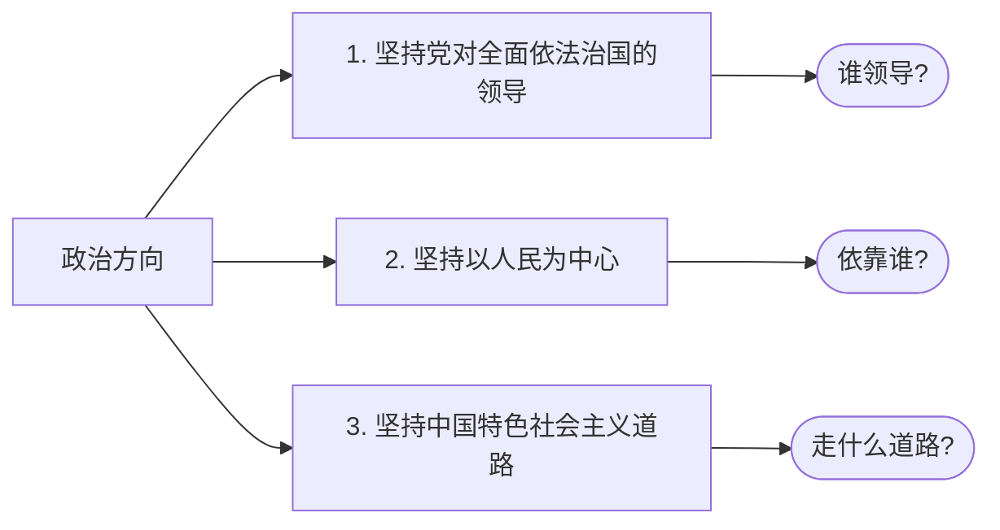
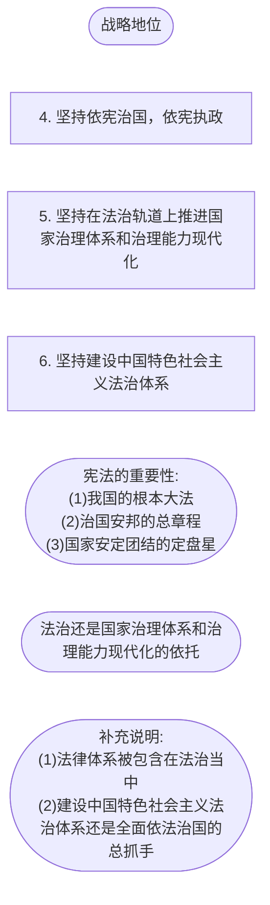

# 思想道德与法律基础

> 一共15分， 一道单选， 两道多选， 一道分析 

## 0. 绪论

### 0.1 大纲

- 

  
  

### 0.2 思想道德和法律的关系

思想道德都是调节人的思想行为、协调人机关系，维护社会秩序的重要手段，它们在调节领域、调节方式、调节目标等方面存在很大不同，但是二者都是上层建筑的重要组成部分，共同服务一定的经济基础

- 思想道德为法治建设提供思想指引和价值基础
- 法治建设为思想道德建设提供制度支撑和法律保障

## 1. 领悟人生真谛，把握人生方向

#### 1.1 个人与社会的辩证关系🦁🦁🦁

人的本质：人的本质不是单个人所固有的抽象物，在其现实性上，它是一切社会关系的总和，**社会属性是人的本质属性**

--------

个人与社会的辩证关系：

- 第一，个人与社会是对立统一的关系， 二者相互依存，相互制约、相互促进。社会是由一个个具体的人组成的，离开了人就没有社会。同时人是社会的人，离开了社会，人也无法生活，社会是人的存在形式。社会成员素质的不断提高是社会发展的重要基础，推动和实现人的全面发展是社会发展的根本目标。
- 第二，个人与社会的关系，最根本的是个人利益与社会利益的关系。社会需要是个人需要的集中体现，是社会全体成员带有根本性、全局性、长远性需要的反映。个人利益的满足只能在一定的社会条件下、通过一定的社会方式来实现。在社会主义社会中，个人利益与社会利益在根本上是一致的。社会利益来不开个人利益，个人利益也来不开社会利益。社会利益不是个人利益的简单相加，而是所有人利益的有机统一。社会利益体现了作为社会成员的个人的根本利益和长远利益，是个人利益得以实现的前提和基础，同时它也保障着个人利益的实现。

#### 1.2人生观的主要内容

人生观有三个方面:

- 人生目的：人为什么活着（人生观的核心）
- 人生态度：人应当如何活着
- 人生价值：什么样的人生才有价值

-----------------

人生目的作用：

- 首先，人生目的决定人生道路，人生目的规定了人生的方向，对人们所从事的具体活动起着定向的作用。为实现人生目的，人们注重培养能力、磨练意志、奋发进取、努力拼搏。
- 其次，人生目的决定人生态度，人生道路上有时会一帆风顺，有时会崎岖不平，面对各种各样的矛盾和斗争，不同的人生目的会使人持有不同的人生态度。
- 最后，人生目的决定人生价值选择，正确的人生目的会使人懂得人生的价值首先在于奉献，从而在工作中尽心尽力尽责

----

人生态度的作用:

---------

人生价值:人生价值是指人的生命及其实践活动对于社会和个人所具有的作用和意义。

- 自我价值: 个体的生活对自己的生存和发展所具有的价值，主要表现为对自身物质和精神需要的满足程度
- 社会价值：个体的实践活动对社会、他人所具有的价值

自我价值和社会价值的辩证关系:二者既相区别，又相联系，相互依存。

- 一方面，人生的自我价值是个体生存和发展的必要条件，人生的自我价值的实现是个体为社会创造更大价值的前提。个体的人生活动不仅具有满足自我需要的价值属性，还必然地包含着满足社会需要的价值属性。个体通过努力提高自我价值的过程，也是其创造社会价值的过程。
- 另一方面，人生的社会价值是社会存在和发展的重要条件，人生社会价值的实现是个体自我完善、全面发展的保障。没有社会价值，人生的自我价值就无法存在。人是社会的人，这不仅意味着个体物质和精神的需要必须在社会中才能得到满足，还意味着以怎样的方式和在多大程度上得到满足也是由社会决定的。

#### 1.3 人生价值的评价与实现 🦁🦁🦁

评价人生价值的根本尺度: 是看一个人的实践活动是否符合社会发展的客观规律，是否促进了历史的进步。在今天，衡量人生价值的标准，最重要的就是看一个人是否用自己的劳动和聪明才智为国家和社会真诚奉献，为人民群众尽心尽力服务。

评价人生价值的方法:

- 第一，既要看贡献的大小，也要看尽力程度。每个人的职业不同，能力大小不同，对社会贡献大小自然也不同，但是不能简单地认为能力大的人人生价值就大，能力小的人人生价值就小。考察一个人的人生价值，既要看他的社会贡献的大小，也要看他所对应的职责和尽力的程度，任何人不论从事何种劳动，只要在自己的岗位上尽职尽责、兢兢业业、积极为社会进步做贡献，就应该对其人生价值给予积极肯定的评价。
- 第二，既要尊重物质贡献，也要尊重精神贡献。 人的生产劳动是物质生产劳动和精神生产劳动的统一，一定条件下，两种生产劳动成果可以相互转化。社会的发展与进步是物质文明和精神文明的共同发展与进步。评价人生价值，既要看一个人对社会做出的物质贡献，也要看对社会做出的精神贡献
- 第三，既要注重社会贡献，也要注重自身完善。人生的社会价值是实现人生自我价值的基础，评价一个人的人生价值主要是看一个人对社会所做贡献的大小，但这并不意味着要否认人生的自我价值。推动和实现人的全面发展是社会发展的根本目标，人的全面发展和提升离不开人的自我完善。人生自我完善的过程，既是人生自我价值实现的过程，也是为社会创造价值的过程，因此，衡量人生价值，既要看他对社会贡献的大小，也要看他自身的完善程度。

## 2. 追求远大理想，坚定崇高信念

### 2.1 理想信念的内涵及其重要性

理想的内涵:理想是人们在实践中形成的、有实现可能的、对未来社会和自身发展目标的向往和追求，是人的世界观、人生观和价值观在奋斗目标上的集中体现。

理想的分类:

- 根据主体划分：个人理想和社会理想
- 根据阶段划分：近期理想和远期理想
- 根据内容划分：生活理想、职业理想、道德理想、和政治理想
- 根据层次划分：崇高理想和一般理想

理想的特征:

- 超越性：理想超越现实
- 实践性：理想在实践中产生，也要通过实践来实现
- 时代性：时代不同，理想不同

---------

信念的内涵：

信念的特征：

- 执着性：信念一旦形成，就不会轻易改变
- 支撑性：信念是一个人经受实践考研而始终坚守理想的精神力量
- 多样性：信念体系中，高层次的信念决定低层次的信念，信仰是最高层次的信念

理想和信念的关系：

理想和信念总是相互依存。理想是信念所指的对象，信念则是理想实现的保障。离开了理想这个人们确信和追求的目标，信念无从产生；离开信念这种对奋斗目标的执着向往和追求，理想寸步难行。在此意义上，理想和信念难以分割地紧密联系在一起。

--------

理想信念的作用：

- 理想指引方向，信念决定成败：
- 理想信念昭示奋斗目标：
- 理想信念催生前进动力：
- 理想信念提供精神支柱：
- 理想信念提高精神境界：

---

为什么要树立马克思主义信仰？

- 马克思主义是我们认识世界、改造世界的强大武器
- 马克思主义是科学的理论，创造性的揭示了人类社会发展规律
- 马克思主义是人民的理论，第一次创立了人民实现自身解放的思想体系
- 马克思主义是实践的理论，
- 马克思主义是不断发展的开放的理论，始终站在时代最前沿

实践证明，马克思主义著有同中国具体实际相结合、同中华优秀传统文化相结合，才能焕发出强大的生命力、创造力和感召力。

（备注：上面其实是马克思主义的四个特征，科学性，人民性，实践性，发展性，按照这个来记忆）

----------

理想与现实的辩证关系：理想和现实是对立的，二者属于应然和实然的矛盾

- 一方面，现实中包含着理想的因素，孕育着理想的发展
- 另一方面，理想中也包含着现实，既包含着现实中必然发展的因素，又包含着由理想转化为现实的条件，在一定条件下，理想就可以转化为未来的现实。脱离现实而谈理想，理想就会转化为空想。

------

个人理想与社会理想的辩证关系

个人理想：指处在一定历史条件下和社会关系中的个体对于自己未来的物质生活和精神生活所产生的向往和追求。

社会理想：指社会集体乃至社会全体成员的共同理想，即在全社会占主导地位的共同奋斗目标

个人理想与社会理想是相互联系、相互影响、相互制约的。

- 一方面，个人理想以社会理想为指引。追求个人理想的实践活动都是在社会中进行的，正确的个人理想不是依个人主观愿望随意确定的，从根本上说，它是由正确的社会理想规定的。同时个人理想的实现，必须以社会理想的实现为前提和基础。因此在整个理想体系中，社会理想是最根本、最重要的，而个人理想从属于社会理想
- 另一方面，社会理想是个人理想的凝聚和升华。社会是个人的联合体，社会理想与个人理想密不可分。社会理想不是凭空产生的，也不是由外在力量强加的，而是建立在广大社会成员的个人理想基础上的。强调个人理想要符合社会理想，并不是要排斥和抹杀个人理想，而是要摆正个人理想同社会理想的关系。

------

## 3. 继承优良传统，弘扬中国精神

## 4. 明确价值要求 践行价值准则

## 6. 学习法治思想 提升法治素养

### 6.1 社会主义法律的特征和运行

#### 6.1.2 社会主义法律的运行

- 法律制定
- 法律执行
- 法律适用
- 法律遵守

## 6.2 坚持全面依法治国

### 6.2.1 全面依法治国的根本遵循 🧋🧋🧋

习近平法治思想的意义:

​	习近平法治思想凝聚着中国共产党人在法治建设长期探索中形成的经验积累和智慧结晶，标志着我们党对共产党执政规律、社会主义建设规律、人类社会发展规律的认识达到了新高度，开辟了21世纪马克思主义法治理论和实践的新境界。习近平法治思想是习近平新时代中国特色社会主义思想的重要组成部分，**是全面依法治国的根本遵循和行动指南**.

----

习近平法治思想的主要内容: 十一个坚持

# 整理

### 共产党的会议

中共一大

中共二大

中共三大

中共四大