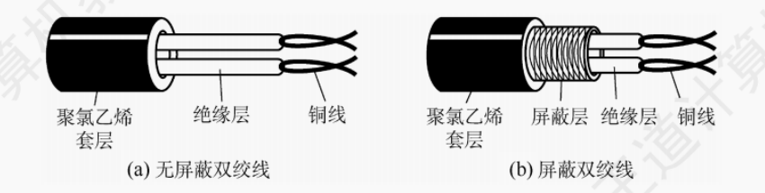

**1. 双绞线**

屏蔽双绞线 STP

非屏蔽双绞线 UTP

TP: Twisted Pair

U: Unshielded

S: Shielded

双绞线在局域网和传统电话网中普遍使用。模拟传输和数字传输都可以使用双绞线。传输距离一般为几千米到数十千米。

距离太远时，对于模拟传输，需要用**放大器放大衰减的信号**

对于数字传输，需要用**中继器来对失真的信号进行整形**

**2. 同轴电缆**

同轴电缆由 内导体、绝缘层、外导体屏蔽层和绝缘保护套构成。

**3. 光纤**

**4. 无线传输介质**

**5. 物理层的接口特性**

物理层的主要任务是确定与传输介质的接口有关的一些特性

-  机械特性：指明接线器的形状和尺寸、引脚数量和排列、固定和锁定装置
-  电气特性：指明在接口电缆的各条线上的电压范围、传输速率和距离限制
-  功能特性 :指明某条线上出现的某一电平的电压的意义，以及每条线的功能

**6. 有限介质的命名规则**

速度 + Base + 介质信息

- 10Base5 : 10Mbps, 同轴电缆， 最远传输距离 500m
- 10Base2: 10Mbps， 同轴电缆， 最远传输距离 200m
- 10BaseF* : 10Mbps, 光纤， *可以是其它介质信息， 如 10BaseFL
- 10BaseT*: 10Mbps, 双绞线， *可以是其它信息， 如10BaseT1S
- 100BaseT: 100mbps，双绞线
- 2.5GBaseT1: 2.5 Gbps, 双绞线

